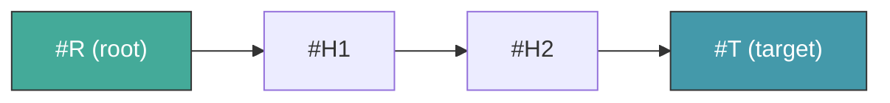
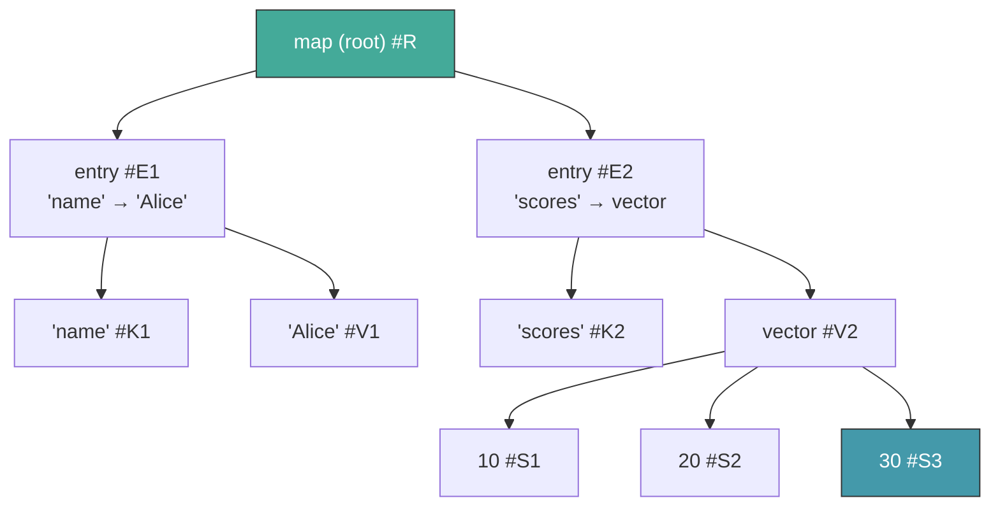
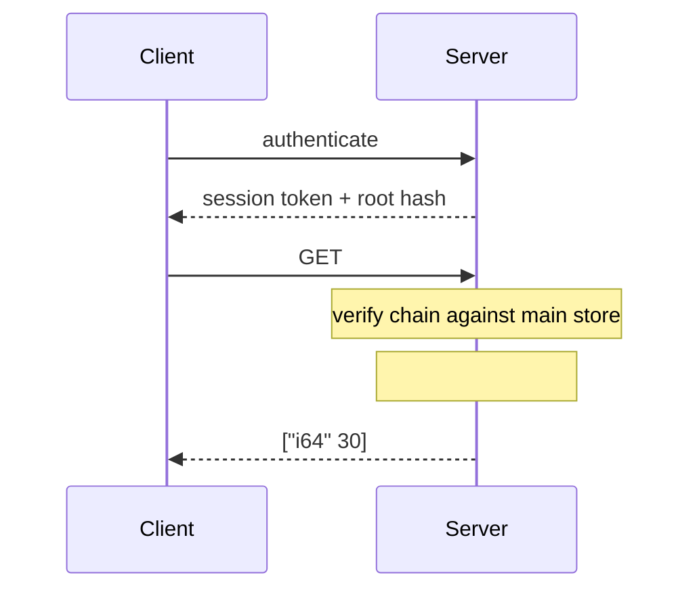
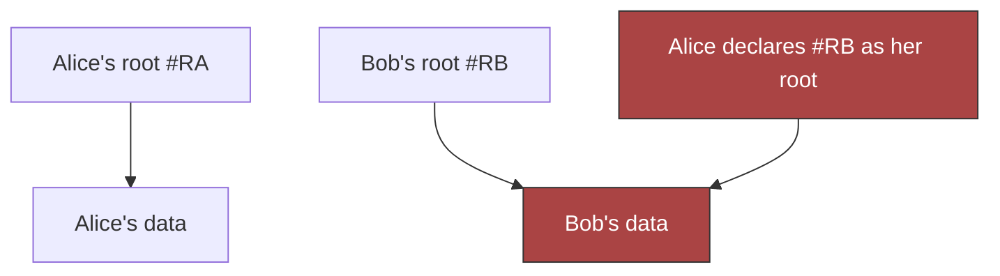
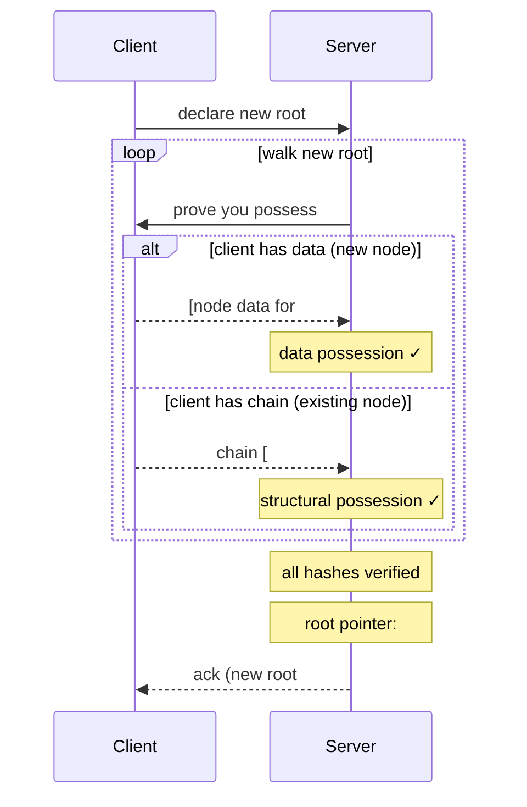
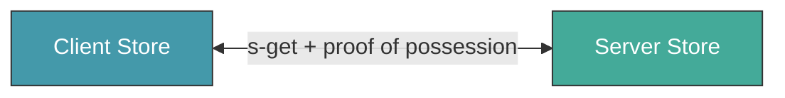
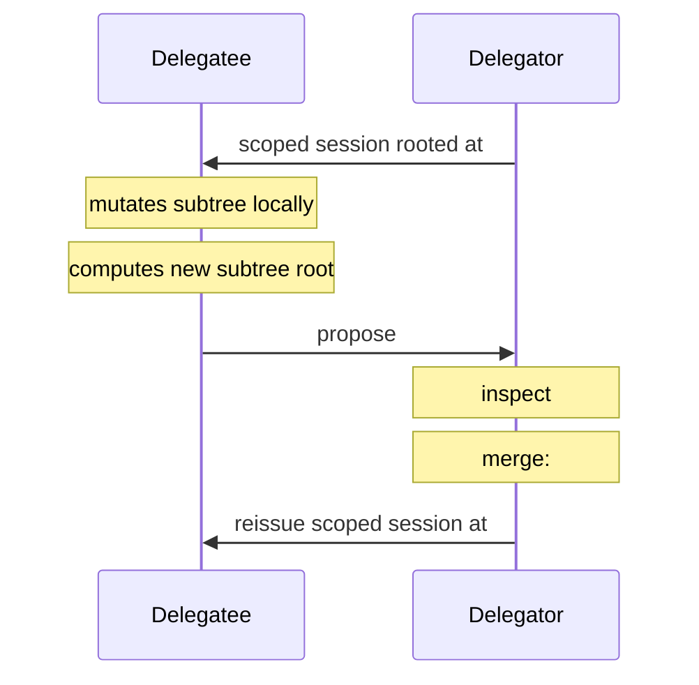
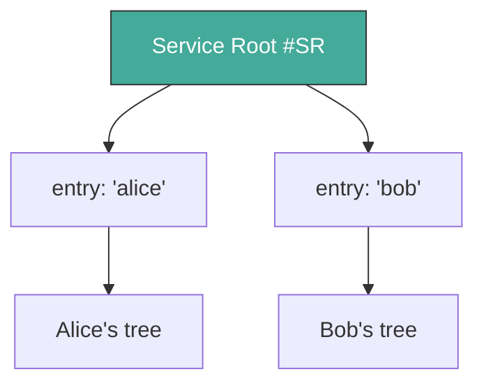
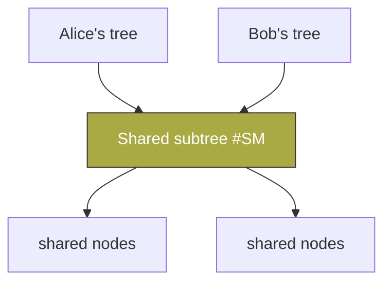

# Authorization Design — Store Access Control

*Draft: 2026-03-19. From discussion between Jonathan, Gorm, and
[Chouser](https://github.com/chouser).*

## 1. Core Principle

**Knowing a hash does not authorize access to its value.**

Content-addressed systems tempt you into treating hash-knowledge as a
capability. Dacite rejects this. Authorization is structural: you prove
you *possess* the data, not merely that you know its address.

## 2. Proof of Possession

Proof of Possession is Dacite's single authorization concept. Every
access — read or write — requires the requester to prove they legitimately
possess the data in question. There are exactly two forms:

### 2.1 Data Possession

You have the actual value. You can produce the bytes, and they hash to the
claimed address. This is the strongest form of proof — if you can hand
someone the data, you obviously possess it.

### 2.2 Structural Possession

You can prove the hash is **reachable** from a root you're authorized to
access. This is proven via a **proof chain**: an ordered sequence of hashes
from root to target where each step is a parent→child relationship in the
DAG.

The server verifies each link: the node at `h_n` must contain a reference
to `h_{n+1}`. If every link checks out, the requester has proven structural
possession of the target.

### 2.3 Proof Chains

A proof chain is a Dacite vector of hashes `[root, h1, h2, ..., target]`.
Consider a map `{"name" "Alice", "scores" [10, 20, 30]}`:

To prove possession of `30` (#S3), the proof chain is `[#R, #E2, #V2, #S3]`.
Verification:

| Link | Check | Result |
|------|-------|--------|
| #R → #E2 | #R contains #E2? | ✓ (entry child of map root) |
| #E2 → #V2 | #E2 contains #V2? | ✓ (val-ref of "scores" entry) |
| #V2 → #S3 | #V2 contains #S3? | ✓ (element of the vector) |

## 3. Two Kinds of Stores

Dacite distinguishes two kinds of stores based on their authentication
and mutation requirements:

### 3.1 Unauthenticated, Read-Only Stores

- **No identity required** — any party with access can read
- **Immutable** — values are written once, never modified
- **Limited scope** — hold proof chains, session metadata, coordination data
- **Purpose** — facilitate authorization without circular dependencies

These stores exist because proof chains themselves need to be exchanged,
and requiring proof chains to access proof chains would be circular.
An unauthenticated store breaks this cycle.

### 3.2 Authenticated, Modifiable Stores

- **Identity required** — bound to an authenticated session
- **Root-managed** — a service layer maintains root hash pointers
- **General purpose** — hold all user data (Dacite values)
- **Purpose** — the primary data store

Every read requires proof of structural possession (proof chain from the
user's root). Every write requires full proof of possession (data or
structural).

### 3.3 How They Compose

In a typical client-server session:

| Store | Auth Level | Contents |
|-------|-----------|----------|
| Session store | Unauthenticated, read-only | Proof chains, metadata |
| Main store | Authenticated, modifiable | User data |

The session store holds the authorization data itself. The main store holds
the data being authorized. This separation is what makes the system
non-circular.

## 4. Reading (GET)

Reading requires **structural possession only** — a proof chain from the
reader's authorized root to the target hash.

The server verifies each link in the proof chain against its own main
store. If valid, it serves the requested node.

### 4.1 Properties

- **Stateless verification.** The server needs no per-session state beyond
  the user's root hash. Any server with access to the main store can verify
  any proof chain.
- **Scoped by construction.** A proof chain can only reach nodes that are
  structurally below the root. No ACLs needed — the DAG structure *is* the
  access control.

## 5. Writing (PUT)

Writing requires **full proof of possession** — both forms. This is
strictly stronger than reading, because the writer must account for every
hash referenced by the new root.

### 5.1 The Problem: Hash Capture

Without PUT-side authorization, a malicious user can exploit a shared store.

In the simplest case, if Alice learns Bob's root hash `#RB`, she declares
it as her own root. The server accepts — it has all the nodes. Alice now
has a structurally valid proof chain from "her" root to everything in
Bob's tree. **Knowing a hash has become a capability.**

### 5.2 The Solution: Prove You Had It

When a client declares a new root, every referenced hash must be
**legitimately possessed**. The server walks the new root and, for each
hash it encounters, issues a uniform challenge:

**"Prove you possess #H."**

The server does not reveal whether it already has the data. The client
responds with whichever form of proof it has:

- **Data possession** — send the node value. The server verifies it
  hashes correctly.
- **Structural possession** — send a proof chain from the old root.
  The server verifies each link.

The client's choice is natural: if it created the node fresh, it has no
proof chain and sends the data. If the node existed in its previous tree,
it sends a chain (cheaper than retransmitting).

### 5.3 Root Transition Protocol

The old root remains valid until the new root is fully verified. The
transition is atomic.

The server never discloses its internal state. The client cannot deduce
which hashes the server already has.

### 5.4 The Server Always Has Structurally-Proven Data

A subtle but critical property: if the client sends a structural proof
chain (from old root to #H), the server is **guaranteed to already have
the data at #H**.

Why? The proof chain proves #H is reachable from the client's old root.
The server stored the client's old root and its entire reachable tree —
that's what previous PUT verification ensured. So every hash reachable
from the old root is already in the server's store.

This means the two proof forms partition cleanly:

| Client sends | What it means | Server's state |
|---|---|---|
| Node data | Client created this node | Server didn't have it; now it does |
| Proof chain | Node existed in client's previous tree | Server already has it |

There is no degenerate case where the client sends a valid proof chain
for data the server lacks. The invariant is maintained inductively: each
verified PUT ensures the server has all reachable data, which makes the
next PUT's structural proofs sound.

### 5.5 Why Hash Capture Fails

When Alice pushes a root referencing Bob's hash `#BD`:

1. The server challenges: "prove you possess `#BD`"
2. Alice cannot provide the data (she doesn't have Bob's node contents)
3. Alice cannot provide a proof chain (no path from her old root `#RA` to `#BD`)
4. **Put rejected.**

Alice never learns whether the server had `#BD` or not. The challenge is
the same either way.

### 5.6 Why Structural Sharing Works

When Alice mutates her own data (e.g., `assoc "key" new-value`), the new
root shares most subtrees with the old root. For shared subtrees, Alice
proves reachability from her old root — trivially valid, since she built
it. For new nodes, she provides the data. No re-transmission of unchanged
subtrees.

### 5.7 GET vs PUT

| | GET (Read) | PUT (Write) |
|---|---|---|
| **Proves** | Structural possession only | Full possession (both forms) |
| **Mechanism** | Proof chain from current root | Value provision OR proof chain from old root |
| **Prevents** | Reading outside your tree | Capturing data outside your tree |

GET is a subset of PUT. Both are applications of proof of possession.

## 6. Peer-to-Peer Store Model

Client and server are both stores. Data flows via `s-get` + proof of
possession in both directions.

### 6.1 Reads: Client Fetches from Server

1. Client builds proof chain from root to target
2. Client stores chain in session store (if large) or sends inline
3. Server verifies chain, returns the node

### 6.2 Writes: Server Fetches from Client

1. Client declares new root
2. Server walks from new root, requesting nodes it needs
3. Client verifies server's proof chains against its own store
4. Client serves requested nodes
5. Server verifies possession, updates root pointer

Both directions use proof chains. Both use `s-get`. The only asymmetry
is policy: who declares roots and under what conditions.

### 6.3 Implications

- One protocol pattern for both directions
- Unauthenticated stores handle proof chain exchange without circular auth
- The `IStore` protocol remains the universal interface
- Topologies compose: peers in a network, each with their own session stores

## 7. Delegation

A root hash *is* an authorization. Whoever holds a root hash and a
session scoped to it can access everything reachable from that root —
nothing more, nothing less. Delegation is simply issuing a session scoped
to a subtree root.

This means **identity and authorization are decoupled**. Authentication
establishes *who you are*. A root hash establishes *what you can reach*.
These are bound together by a session, but the binding is a policy choice:

- One identity can hold multiple sessions with different scopes
- Multiple identities can be granted sessions to the same subtree
- A session's scope can be narrowed (delegated) but never widened

The root hash is the authorization token. Identity is just how you get
handed one.

### 7.1 Read-Only Delegation

The delegator issues a scoped session rooted at a subtree hash. The
delegatee reads anything reachable from that subtree root via proof
chains.

Proof of possession on the PUT side ensures the delegatee cannot capture
hashes outside the subtree — they can only reference data reachable from
their scoped root.

### 7.2 Write-Back via Proposed Roots (PR Model)

For read-write delegation, the delegatee mutates the subtree locally and
proposes a new subtree root. The delegator reviews and merges.

The delegatee never sees or modifies the delegator's full root. The
delegator retains full control over whether and how the proposed subtree
is integrated.

### 7.3 Revocation by Restructuring

Dacite does not support blacklisting subtrees under a root. There are no
negative permissions — no "grant access to everything except this subtree."

Instead, revocation is achieved by **building a new root with the undesired
subtrees already removed.** The delegator constructs a new tree (e.g., via
`dissoc`) and issues a new scoped session rooted at the trimmed subtree.

This is simpler and avoids a subtle hygiene problem: a blacklist would
require sharing the *hashes* of forbidden subtrees, even if the values
aren't shared. The hash itself is a reference, and leaking references to
data you're trying to restrict access to feels unhygienic — it gives the
restricted party information about the structure of what they can't see.

By restructuring instead of blacklisting:
- No forbidden-hash metadata to maintain or transmit
- No risk of leaking structural information about restricted data
- The delegatee's view is exactly the tree they receive — nothing hidden,
  nothing excluded

### 7.4 Properties

- **Scoped by construction.** The delegatee's session root bounds what they
  can see and reference. No ACLs needed.
- **Write-back is explicit.** The delegator decides when to merge.
- **Composable.** Delegation can be nested — the delegatee can further
  delegate a sub-subtree with the same scoping guarantees.
- **Revocable.** The delegator builds a new root without the revoked
  subtree and stops reissuing the old scoped session.

## 8. Service Root Management

The service layer applies delegation to manage multiple users. This is
a **policy decision**, not a fundamental of the authorization model.

### 8.1 Single Root Map

The service maintains a single root hash pointing to a Dacite map of
`{username → user-subtree}`. Each user is delegated their subtree.
User writes are `assoc` operations into the root map.

When Alice authenticates, the service looks up her entry in the root map
and issues a session scoped to her subtree. This is delegation — the
service is the delegator, each user is a delegatee.

### 8.2 Service-Layer Concern

Root hash pointers are managed by the service layer, not the store layer.
The `IStore` protocol remains purely content-addressed. Root management —
binding identities to root hashes, updating root pointers, persisting
roots — belongs to the service protocol.

### 8.3 Structural Sharing Across Users

Two users may share identical subtrees (by content identity). Each proves
access through their own root — independent authorization paths, same
underlying data. Neither can access the other's unshared data.

## 9. Audit Trail

The sequence of proof chains submitted during a session forms a natural
audit trail: the server knows exactly which paths the client walked.
Proof chains are Dacite values (immutable, content-addressed) and can be
retained as access records.

---

## Acknowledgments

[Chouser](https://github.com/chouser) contributed key insights during a
collaboration session on 2026-03-06:

- Stateless server verification (§4.1) — the observation that proof chains
  eliminate the need for per-session server state
- GC equivalence (Appendix A) — recognizing that color marking and store
  migration are equivalent semi-space collection strategies
- Decoupling identity and authorization (§7) — the distinction between
  who you are and what you can reach

---

## Appendix A: Garbage Collection

Content-addressed stores are append-only. Mutations leave orphaned nodes —
subtrees no longer reachable from the service root.

Authorization defines what's "live": a node is live if and only if it's
reachable from the service root. Everything else is garbage. This makes
GC a direct consequence of the authorization model.

Dacite GC is a **semi-space collector** with two equivalent strategies:

### Store Migration (Copying Collection)

The mark is **presence in the new store.**

1. Create a new empty store B
2. Walk from the service root, copying reachable nodes from A to B
3. Swap B in for A; discard A

### Color Marking (Mark-and-Sweep)

The mark is **a color bit** on each node (red or green).

1. Walk from the service root, marking reachable nodes with the current
   color. New writes also use the current color.
2. Cull all nodes with the previous color.
3. Alternate colors each cycle.

### Equivalence

| | Store Migration | Color Marking |
|---|---|---|
| Mark live | Copy to new store | Set to current color |
| Identify dead | Absent from new store | Previous color |
| Reclaim | Discard old store | Delete previous-color nodes |
| Two spaces | Store A / Store B | Red / Green |

Both support online collection without pausing writes. Store migration
routes reads through both stores during the copy; color marking uses the
live color for new writes while the background walk proceeds.

### Properties

- **No reference counting.** No per-node bookkeeping during normal operations.
- **Cost proportional to live data.** You pay for what you keep.
- **Structural sharing preserved.** Shared subtrees are visited once.
- **Single walk.** One service root means one walk covers all users' data.

## Appendix B: Rejected Alternative — Frontier Model

An intermediate design used a **frontier model**. Each `s-get` response
implicitly authorized the next level down via a per-session frontier set.
This eliminated proof chains but required server-side state per session,
complicating scaling and failover. Proof chains + unauthenticated stores
achieve the same isolation statelessly.

## Appendix C: Design Evolution

1. **Proof chains only.** Problem: what scopes the server's access to
   client data when fetching proof chains?
2. **Frontier model.** Solved scoping but added per-session server state.
3. **Proof chains + dedicated stores.** Stateless, client controls
   surface area.
4. **Session store / main store split.** Recognized that proof chain
   data needs a different auth level. Session store (unauthenticated)
   holds proof chains; main store (authenticated) holds data.
5. **Proof of Possession as unifying concept.** GET and PUT are both
   applications of the same principle. Two forms (data, structural)
   cover all cases.
