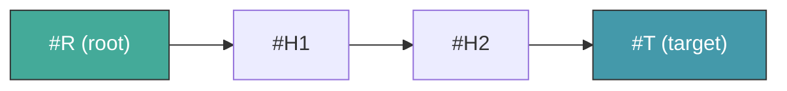
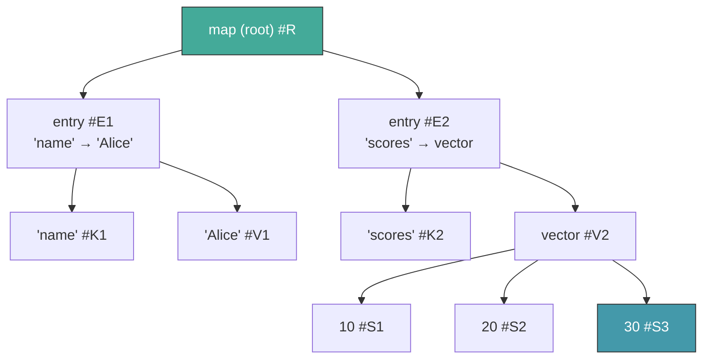
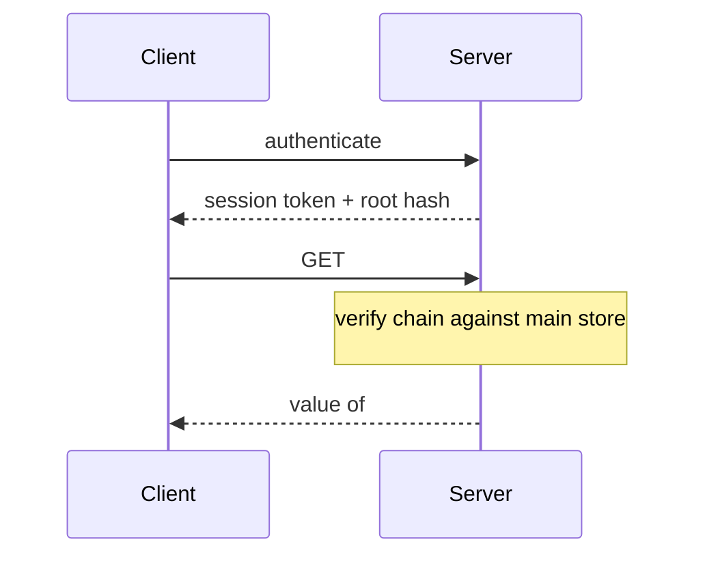
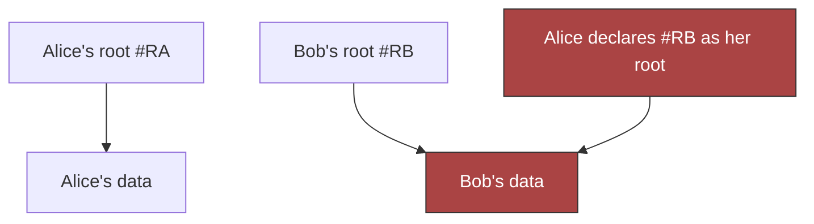
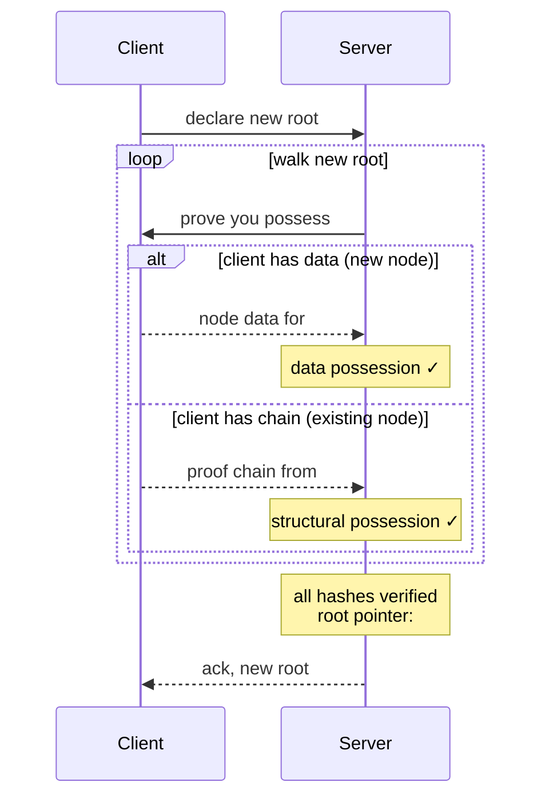
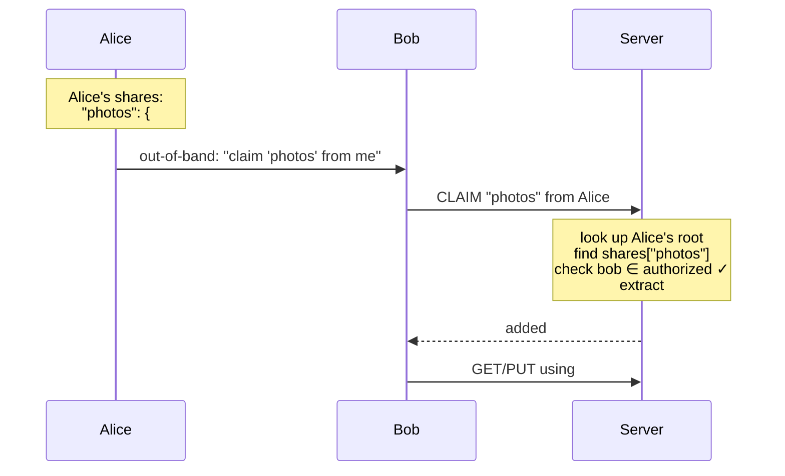
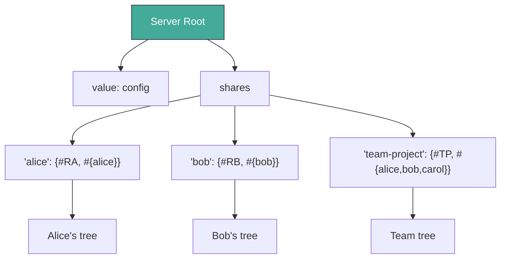
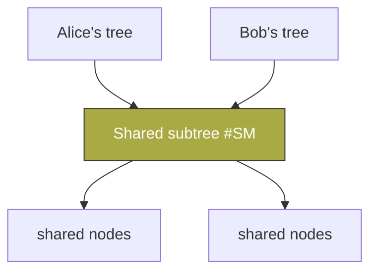

# Authorization Design — Store Access Control

*Draft: 2026-03-19. From discussion between Jonathan, Gorm, and
[Chouser](https://github.com/chouser).*

## 1. Core Principle

**Knowing a hash does not authorize access to its value.**

Content-addressed systems tempt you into treating hash-knowledge as a
capability. Dacite rejects this. Authorization is structural: you prove
you *possess* the data, not merely that you know its address.

## 2. Proof of Possession

Proof of Possession is Dacite's single authorization concept. Every
access — read or write — requires the requester to prove they legitimately
possess the data in question. There are exactly two forms:

### 2.1 Data Possession

You have the actual value. You can produce the bytes, and they hash to the
claimed address. This is the strongest form of proof — if you can hand
someone the data, you obviously possess it.

### 2.2 Structural Possession

You can prove the hash is **reachable** from a root you're authorized to
access. This is proven via a **proof chain**: an ordered sequence of hashes
from root to target where each step is a parent→child relationship in the
DAG.



The server verifies each link: the node at `h_n` must contain a reference
to `h_{n+1}`. If every link checks out, the requester has proven structural
possession of the target.

### 2.3 Proof Chains

A proof chain is a Dacite vector of hashes `[root, h1, h2, ..., target]`.
Consider a map `{"name" "Alice", "scores" [10, 20, 30]}`:



To prove possession of `30` (#S3), the proof chain is `[#R, #E2, #V2, #S3]`.
Verification:

| Link | Check | Result |
|------|-------|--------|
| #R → #E2 | #R contains #E2? | ✓ (entry child of map root) |
| #E2 → #V2 | #E2 contains #V2? | ✓ (val-ref of "scores" entry) |
| #V2 → #S3 | #V2 contains #S3? | ✓ (element of the vector) |

## 3. Two Kinds of Stores

Dacite distinguishes two kinds of stores based on their authentication
and mutation requirements:

### 3.1 Unauthenticated, Read-Only Stores

- **No identity required** — any party with access can read
- **Immutable** — values are written once, never modified
- **Limited scope** — hold proof chains, session metadata, coordination data
- **Purpose** — facilitate authorization without circular dependencies

These stores exist because proof chains themselves need to be exchanged,
and requiring proof chains to access proof chains would be circular.
An unauthenticated store breaks this cycle.

### 3.2 Authenticated, Modifiable Stores

- **Identity required** — bound to an authenticated session
- **Root-managed** — a service layer maintains root hash pointers
- **General purpose** — hold all user data (Dacite values)
- **Purpose** — the primary data store

Every read requires proof of structural possession (proof chain from the
user's root). Every write requires full proof of possession (data or
structural).

### 3.3 How They Compose

In a typical client-server session:

| Store | Auth Level | Contents |
|-------|-----------|----------|
| Session store | Unauthenticated, read-only | Proof chains, metadata |
| Main store | Authenticated, modifiable | User data |

The session store holds the authorization data itself. The main store holds
the data being authorized. This separation is what makes the system
non-circular.

## 4. Reading (GET)

Reading requires **structural possession only** — a proof chain from the
reader's authorized root to the target hash.



The server verifies each link in the proof chain against its own main
store. If valid, it serves the requested node.

### 4.1 Properties

- **Stateless verification.** The server needs no per-session state beyond
  the user's root hash. Any server with access to the main store can verify
  any proof chain.
- **Scoped by construction.** A proof chain can only reach nodes that are
  structurally below the root. No ACLs needed — the DAG structure *is* the
  access control.

## 5. Writing (PUT)

Writing requires **full proof of possession** — both forms. This is
strictly stronger than reading, because the writer must account for every
hash referenced by the new root.

### 5.1 The Problem: Hash Capture

Without PUT-side authorization, a malicious user can exploit a shared store.



In the simplest case, if Alice learns Bob's root hash `#RB`, she declares
it as her own root. The server accepts — it has all the nodes. Alice now
has a structurally valid proof chain from "her" root to everything in
Bob's tree. **Knowing a hash has become a capability.**

### 5.2 The Solution: Prove You Had It

When a client declares a new root, every referenced hash must be
**legitimately possessed**. The server walks the new root and, for each
hash it encounters, issues a uniform challenge:

**"Prove you possess #H."**

The server does not reveal whether it already has the data. The client
responds with whichever form of proof it has:

- **Data possession** — send the node value. The server verifies it
  hashes correctly.
- **Structural possession** — send a proof chain from the old root.
  The server verifies each link.

The client's choice is natural: if it created the node fresh, it has no
proof chain and sends the data. If the node existed in its previous tree,
it sends a chain (cheaper than retransmitting).

### 5.3 Root Transition Protocol

The old root remains valid until the new root is fully verified. The
transition is atomic.



The server never discloses its internal state. The client cannot deduce
which hashes the server already has.

### 5.4 The Server Always Has Structurally-Proven Data

A subtle but critical property: if the client sends a structural proof
chain (from old root to #H), the server is **guaranteed to already have
the data at #H**.

Why? The proof chain proves #H is reachable from the client's old root.
The server stored the client's old root and its entire reachable tree —
that's what previous PUT verification ensured. So every hash reachable
from the old root is already in the server's store.

This means the two proof forms partition cleanly:

| Client sends | What it means | Server's state |
|---|---|---|
| Node data | Client created this node | Server didn't have it; now it does |
| Proof chain | Node existed in client's previous tree | Server already has it |

There is no degenerate case where the client sends a valid proof chain
for data the server lacks. The invariant is maintained inductively: each
verified PUT ensures the server has all reachable data, which makes the
next PUT's structural proofs sound.

### 5.5 Why Hash Capture Fails

When Alice pushes a root referencing Bob's hash `#BD`:

1. The server challenges: "prove you possess `#BD`"
2. Alice cannot provide the data (she doesn't have Bob's node contents)
3. Alice cannot provide a proof chain (no path from her old root `#RA` to `#BD`)
4. **Put rejected.**

Alice never learns whether the server had `#BD` or not. The challenge is
the same either way.

### 5.6 Why Structural Sharing Works

When Alice mutates her own data (e.g., `assoc "key" new-value`), the new
root shares most subtrees with the old root. For shared subtrees, Alice
proves reachability from her old root — trivially valid, since she built
it. For new nodes, she provides the data. No re-transmission of unchanged
subtrees.

### 5.7 GET vs PUT

| | GET (Read) | PUT (Write) |
|---|---|---|
| **Proves** | Structural possession only | Full possession (both forms) |
| **Mechanism** | Proof chain from current root | Value provision OR proof chain from old root |
| **Prevents** | Reading outside your tree | Capturing data outside your tree |

GET is a subset of PUT. Both are applications of proof of possession.

## 6. Peer-to-Peer Store Model

Client and server are both stores. Data flows via `s-get` + proof of
possession in both directions.


### 6.1 Reads: Client Fetches from Server

1. Client builds proof chain from root to target
2. Client stores chain in session store (if large) or sends inline
3. Server verifies chain, returns the node

### 6.2 Writes: Server Fetches from Client

1. Client declares new root
2. Server walks from new root, requesting nodes it needs
3. Client verifies server's proof chains against its own store
4. Client serves requested nodes
5. Server verifies possession, updates root pointer

Both directions use proof chains. Both use `s-get`. The only asymmetry
is policy: who declares roots and under what conditions.

### 6.3 Implications

- One protocol pattern for both directions
- Unauthenticated stores handle proof chain exchange without circular auth
- The `IStore` protocol remains the universal interface
- Topologies compose: peers in a network, each with their own session stores

## 7. Sharing — The Shares Map

Sharing in Dacite uses a **shares map**: a conventional key in every
participant's root that maps named references to shared subtrees with
authorized user sets.

This design emerged through several iterations (see Appendix D). Earlier
models — grants with lifecycle management, scoped delegation sessions,
PR-based giving, proof chain tokens — each smuggled complexity back into
the system. The shares map avoids protocol-level mutability by placing
named references entirely within the participant's own data, managed
through normal PUTs.

### 7.1 Root Structure Convention

Every participant (user or server) has the same root structure:

```
root: {
  "value":  <the participant's own data>
  "shares": {<name>: {target: #hash, authorized: #{...}}, ...}
}
```

- **`"value"`** — the participant's application data. The sharing
  mechanism never touches this.
- **`"shares"`** — a map of named share entries. Each entry has:
  - **`target`** — the hash of the shared subtree
  - **`authorized`** — the set of identities who can claim this share

### 7.2 The Claim Protocol

Sharing requires two things: a share entry in the sharer's root, and
an out-of-band exchange of the share name.



**Steps:**

1. **Alice** creates a share entry in her root via normal PUT:
   `shares["photos"] = {target: #T, authorized: #{bob}}`
2. **Alice → Bob** (out-of-band): the share name `"photos"` and
   Alice's identity. A text message, QR code, email — anything.
3. **Bob → Server**: `CLAIM "photos" from Alice`.
4. **Server**:
   - Looks up Alice's root in the server's own shares map.
   - Navigates to Alice's `shares["photos"]`.
   - Checks that Bob is in the `authorized` set.
   - Extracts the target hash `#T`.
   - Adds `#T` to Bob's set of valid roots.
   - Responds with `#T`.
5. **Bob**: uses `#T` as a proof root for GET (read shared data) and
   PUT (incorporate into his own tree via structural proofs from `#T`).
6. **Bob** (optional): after incorporating `#T` into his own root,
   requests removal of `#T` from his valid roots set.

### 7.3 The Server Uses Shares Too

The server is not a special entity. It uses the same shares map to
manage user access:

```
Server's root: {
  "value":  <server config/metadata>
  "shares": {
    "alice":        {target: #RA, authorized: #{alice}}
    "bob":          {target: #RB, authorized: #{bob}}
    "team-project": {target: #TP, authorized: #{alice, bob, carol}}
  }
}
```

User authentication is simply **claiming your share from the server.**
There is no separate concept of a "user table" or "service root map."
The server is a participant that shares subtrees with its users using
the exact same mechanism.



### 7.4 Shares Are Read-Only

A claimed share grants **read access only**. The claimant can GET data
under the shared target hash and can use it as a proof root to
incorporate data into their own tree via PUT. But the claimant cannot
modify the sharer's tree — writes go to the claimant's own root.

To propose changes back, the claimant creates their own share entry
pointing to their modified version (see §7.6, "Bob edits Alice's
document"). This keeps the sharing model simple: shares flow one
direction, and the sharer retains full control.

### 7.5 Share Types

The authorized set naturally distinguishes different sharing patterns.
Since authorized sets are Dacite sets, they support both positive
(enumerated) and negative (cofinite) forms:

| Pattern | Authorized set | Example |
|---------|---------------|---------|
| **Private space** | `#{alice}` | Alice's personal data |
| **Direct share** | `#{alice, bob}` | Alice shares photos with Bob |
| **Shared space** | `#{alice, bob, carol}` | Team project |
| **Public** | `#{neg}` (negative empty set) | Open data, anyone can claim |
| **Public with exceptions** | `#{neg, eve}` | Everyone except Eve |

A **negative set** (see SPEC.md §Negative Sets) represents "everyone
except these elements." The empty negative set `#{neg}` — a map
containing only the `neg` sentinel — means "everyone is authorized."
This enables public sharing without enumerating all possible users.

All patterns use the same mechanism. No special cases.

### 7.6 Named References

Share names are chosen by the sharer and serve as **named references**
under the sharer's control. Alice can:

- **Update the target**: point `"photos"` at a new hash on her next
  PUT. Bob claims again and gets the latest version. This gives
  "living shared folder" behavior naturally, without any protocol
  concept of mutable references — Alice is simply updating her own
  map via normal PUTs.
- **Revoke access**: remove Bob from the authorized set, or remove
  the share entry entirely. Bob retains whatever he already
  incorporated into his own root (the data is immutable), but can
  no longer claim updates.
- **Share with additional people**: add Carol to the authorized set.

### 7.7 Common Sharing Patterns

**Alice shares photos with Bob:**
Alice adds `shares["photos"] = {#T, #{bob}}`. Tells Bob the name.
Bob claims, gets #T, reads the photos. Alice updates the target hash
when she adds new photos. Bob re-claims to see updates.

**Bob edits Alice's document:**
Alice shares the doc subtree with Bob. Bob claims, incorporates it
into his tree, edits it. Bob creates a share entry in *his* shares
pointing to the edited version, authorized for Alice. Alice claims
Bob's share and reviews the changes. Two participants, same mechanism.

**Team shared space:**
Server creates `shares["team-project"] = {#TP, #{alice, bob, carol}}`.
All three can claim and work with the shared subtree. Conflict
resolution (simultaneous PUTs) is a policy concern, not a protocol one.

**Public data:**
Alice adds `shares["open-data"] = {#T, #{neg}}`. Anyone can claim it.
No enumeration of users needed — the negative empty set authorizes
everyone.

**Revoking access:**
Alice removes Bob from the authorized set via normal PUT. Bob can
no longer claim. No blacklists, no negative permissions — Alice
simply updated her own data.

### 7.8 What This Eliminates

The shares map replaces several concepts from earlier designs:

| Eliminated | Replaced by |
|------------|------------|
| Grants (with lifecycle management) | Share entries in participant data |
| Scoped sessions | Not needed — claimant gets a valid root |
| Delegation as a distinct concept | Two-way shares |
| Hash-pinned vs path-pinned debate | Named refs in participant's own map |
| Server-side gift tables or PR queues | Sharer's root read at claim time |
| Service root map as special concept | Server's own shares map |
| Session model changes | Valid roots set (temporary, per-claim) |

### 7.9 Properties

- **One mechanism everywhere.** Users share with users. The server
  shares with users. The same root structure, the same claim protocol.
- **No new authorization concepts.** Claim checks set membership,
  then uses existing proof of possession for GET/PUT.
- **No protocol-level mutable references.** Named references live in
  participant data, managed via normal PUTs.
- **Sharer controls lifecycle.** Create, update, revoke — all `assoc`
  and `dissoc` operations on the sharer's own root.
- **No server state for sharing.** The server reads the sharer's root
  at claim time. Nothing to store, no gift tables, no queues.
- **Composable.** Bob can re-share received data by creating his own
  share entry. If he has it under his root, he can share it.
- **Turtles all the way down.** Server, users, and any future peer
  topology all use the same structure.

## 8. Structural Sharing Across Users



When Alice shares a subtree with Bob and Bob incorporates it into his
tree, both roots reference the same underlying nodes. This is natural
content-addressed deduplication — no special sharing mechanism needed.
Each user proves access through their own root. Neither can access the
other's unshared data.

## 9. Audit Trail

The sequence of proof chains submitted during a session forms a natural
audit trail: the server knows exactly which paths the client walked.
Proof chains are Dacite values (immutable, content-addressed) and can be
retained as access records.

---

## Acknowledgments

[Chouser](https://github.com/chouser) contributed key insights during a
collaboration session on 2026-03-06:

- Stateless server verification (§4.1) — the observation that proof chains
  eliminate the need for per-session server state
- GC equivalence (Appendix A) — recognizing that color marking and store
  migration are equivalent semi-space collection strategies
- Decoupling identity and authorization — the distinction between who you
  are and what you can reach

§7 was redesigned across 2026-03-26 and 2026-03-27 through several
iterations (see Appendix D). The final shares map model unified user
sharing and server user-management into a single mechanism.

---

## Appendix A: Garbage Collection

Content-addressed stores are append-only. Mutations leave orphaned nodes —
subtrees no longer reachable from any participant's root.

Authorization defines what's "live": a node is live if and only if it's
reachable from some participant's root. Everything else is garbage. This
makes GC a direct consequence of the authorization model.

Dacite GC is a **semi-space collector** with two equivalent strategies:

### Store Migration (Copying Collection)

The mark is **presence in the new store.**

1. Create a new empty store B
2. Walk from all live roots, copying reachable nodes from A to B
3. Swap B in for A; discard A

### Color Marking (Mark-and-Sweep)

The mark is **a color bit** on each node (red or green).

1. Walk from all live roots, marking reachable nodes with the current
   color. New writes also use the current color.
2. Cull all nodes with the previous color.
3. Alternate colors each cycle.

### Equivalence

| | Store Migration | Color Marking |
|---|---|---|
| Mark live | Copy to new store | Set to current color |
| Identify dead | Absent from new store | Previous color |
| Reclaim | Discard old store | Delete previous-color nodes |
| Two spaces | Store A / Store B | Red / Green |

Both support online collection without pausing writes. Store migration
routes reads through both stores during the copy; color marking uses the
live color for new writes while the background walk proceeds.

### Properties

- **No reference counting.** No per-node bookkeeping during normal operations.
- **Cost proportional to live data.** You pay for what you keep.
- **Structural sharing preserved.** Shared subtrees are visited once.

## Appendix B: Rejected Alternative — Frontier Model

An intermediate design used a **frontier model**. Each `s-get` response
implicitly authorized the next level down via a per-session frontier set.
This eliminated proof chains but required server-side state per session,
complicating scaling and failover. Proof chains + unauthenticated stores
achieve the same isolation statelessly.

## Appendix C: Design Evolution — Authorization Model

1. **Proof chains only.** Problem: what scopes the server's access to
   client data when fetching proof chains?
2. **Frontier model.** Solved scoping but added per-session server state.
3. **Proof chains + dedicated stores.** Stateless, client controls
   surface area.
4. **Session store / main store split.** Recognized that proof chain
   data needs a different auth level. Session store (unauthenticated)
   holds proof chains; main store (authenticated) holds data.
5. **Proof of Possession as unifying concept.** GET and PUT are both
   applications of the same principle. Two forms (data, structural)
   cover all cases.

## Appendix D: Design Evolution — Sharing Model

1. **Delegation with scoped sessions (original §7).** Delegator issues
   sessions scoped to subtree roots. Problem: lifecycle management of
   scoped sessions, hash-pinned vs path-pinned references — smuggling
   mutability into a content-addressed system.
2. **Grants with authorized sets.** Generalized delegation but added
   grant lifecycle complexity (creation, expiry, storage, indexing).
3. **PR-as-giving.** Sharing as discrete acts of giving. Eliminated
   ongoing authorization relationships. Problem: server needed to
   route PRs, creating server state (queues, delivery policy).
4. **Proof chain tokens.** Alice stores proof chain vector, shares its
   hash. Bob claims via hash. Problem: Alice frozen until Bob claims
   (proof chain tied to specific root).
5. **Outbox convention.** Alice maintains outbox in her root with
   `{random-key → target-hash}`. Problem: bearer token (anyone with
   the key can claim), no authorization check.
6. **Shares map (current).** Outbox entries gain authorized sets and
   meaningful names. Server adopts the same model for user management.
   One mechanism everywhere. No protocol-level mutability. Sharer
   controls lifecycle via normal PUTs.
