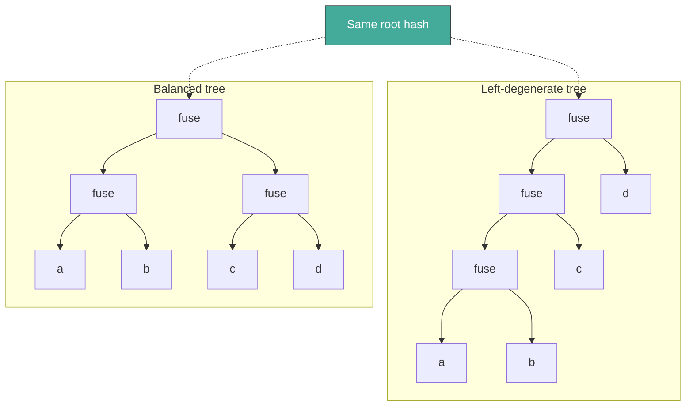
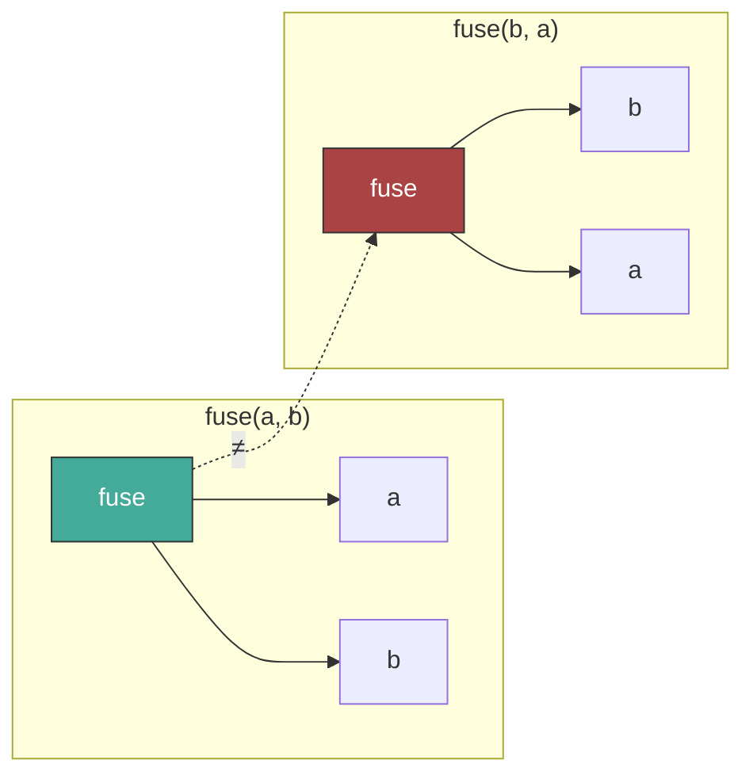
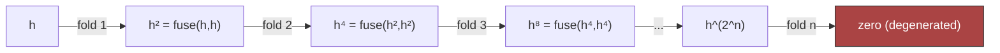

# Chapter 2: Hash Fusion

Chapter 1 introduced **stores** — a map from content hashes to serialized
bytes, plus a mutable root. Every node in that map is keyed by its hash.
This chapter defines how those hashes are formed.

Everything in Dacite's composite structures is built on a single
operation: **fuse**. It combines two 256-bit hashes into a new 256-bit
hash using nothing more than integer arithmetic. No SHA-256 at runtime,
no hash function calls in the critical path — just six additions and a
multiplication.

The idea originates from an HP Labs white paper on using upper
triangular matrix multiplication to combine hashes associatively:

> Haber, S. et al. (2017). *Efficient and Secure Hash-Based Timestamps.*
> HPE-2017-08. https://www.labs.hpe.com/techreports/2017/HPE-2017-08.pdf

The paper proposes representing hashes as upper triangular matrices and
multiplying them. Matrix multiplication is associative but not
commutative — exactly the properties needed for tree-shape-independent
hashing. Dacite's contribution is the specific 4×4 matrix over 64-bit
cells, chosen based on empirical testing of degeneration behavior (see
§2.8).

This chapter introduces fuse, its algebraic properties, and how it
turns raw bytes into content addresses. Chapter 3 applies these ideas to
the value model: scalars, plus the vectors, strings, blobs, maps, and
sets built on them.

## 2.1 Hashes as Four Words

A Dacite hash is 256 bits, represented as four 64-bit unsigned integers
in big-endian word order:

```
hash = [c0, c1, c2, c3]
```

Word `c0` holds the most mixed bits (from fuse) and is used first for
HAMT navigation. Word `c3` holds the least mixed bits.

## 2.2 The Fuse Operation

Fuse takes two hashes and produces a third:

```
Input:  a = [a0, a1, a2, a3]
        b = [b0, b1, b2, b3]

Output: c = [c0, c1, c2, c3]

c0 = a0 + a3*b2 + b0    ← most bit mixing (single multiply)
c1 = a1 + b1
c2 = a2 + b2
c3 = a3 + b3             ← least bit mixing (simple addition)
```

All arithmetic wraps at 2^64. The total cost: 6 additions, 1
multiplication.

### Properties

These properties are not incidental — the entire system depends on them:

- **Associative** — `fuse(a, fuse(b, c)) = fuse(fuse(a, b), c)`.
  This means tree shape doesn't affect the hash. A balanced tree and
  a left-degenerate tree over the same leaf sequence produce the same
  root hash.
- **Non-commutative** — `fuse(a, b) ≠ fuse(b, a)` (for a ≠ b).
  Order matters. `[x, y]` and `[y, x]` have different hashes.
- **Identity** — `[0, 0, 0, 0]` is a two-sided identity.
  `fuse(a, 0) = fuse(0, a) = a`. Empty sequences hash to the identity.
- **Fast** — no hash function calls, just integer arithmetic. This
  matters when every node in a tree computes a fuse on construction.

### Why Associativity Matters

Associativity is the foundation of structural sharing. Consider a
sequence `[a, b, c, d]`. Its hash is:

```
fuse(fuse(fuse(a, b), c), d)
```

But because fuse is associative, any parenthesization gives the same
result:

```
fuse(fuse(a, b), fuse(c, d))    — balanced tree
fuse(a, fuse(b, fuse(c, d)))    — right-degenerate tree
```

This means two stores can organize the same data differently (different
tree shapes for performance) and still agree on the root hash.



Different tree shapes, same root hash. This is what makes finger trees
possible — internal rebalancing never changes the identity of the
sequence.

### Why Non-Commutativity Matters

If fuse were commutative, `[a, b]` and `[b, a]` would hash the same.
Sequences would be indistinguishable from sets. Order-sensitive data
structures (vectors, strings) require that `fuse(a, b) ≠ fuse(b, a)`.



Order matters: `[a, b]` and `[b, a]` produce different hashes.

## 2.3 Group Structure

Fuse forms a **group** over (ℤ/2^64)^4. Every hash has a unique
inverse:

```
inv([a0, a1, a2, a3]) = [a3*a2 - a0, -a1, -a2, -a3]
```

Such that `fuse(inv(a), a) = fuse(a, inv(a)) = [0, 0, 0, 0]`.

Cost: 1 multiply + 4 negations.

### Unfuse

Given `fused = fuse(a, b)`, if you know `b`, you can recover `a`:

```
unfuse(fused, b) = fuse(fused, inv(b)) = a
```

Strip from the left: `fuse(inv(a), fused) = b`.

### What the Group Enables

- **Cross-type equality** — strip a type hash to compare the underlying
  content (see Chapter 3, Cross-Type Equality).
- **Hash recovery** — recover one component of a fused pair when the
  other is known.
- **Incremental re-hashing** — update a fused chain without recomputing
  from scratch. Replace an element by unfusing the old and fusing the new.

## 2.4 The Byte Hash Table

Dacite doesn't hash bytes directly with fuse. Instead, it uses a
precomputed lookup table mapping each byte value (0–255) to a 256-bit
hash:

```
byte_hash: byte → Hash    (256 entries)
```

The default table is seeded using SHA-256:
`byte_hash[i] = sha256(byte_array([i]))`. But any set of 256 distinct,
high-quality 32-byte values works. This decouples Dacite from any
specific hash function at runtime — SHA-256 is used once at build time
to generate the table, never again.

### Hashing Bytes and Strings

All data hashing reduces to table lookups and fuses:

```
fuse_bytes(bs) = reduce(unchecked_fuse, [0,0,0,0], map(byte_hash, bs))
fuse_str(s)    = fuse_bytes(utf8_bytes(s))
```

Because fuse is associative:
`fuse(fuse_str(a), fuse_str(b)) = fuse_str(a ++ b)`

Composing fused results is equivalent to fusing the concatenation.
This is both a feature (tree nodes can combine child hashes) and a
constraint (a domain separator is needed between a value's type and its
data — see Chapter 3).

## 2.5 Protocol ID

The byte hash table is a **build-time constant**, not stored inside the
content-addressed space. The table's own hash serves as a protocol
identifier:

```
protocol_id = fuse_bytes(concat(table[0], table[1], ..., table[255]))
```

The table hashes itself: each row is 32 bytes, concatenated into 8,192
bytes, and `fuse_bytes` (which uses the table) produces the ID.

Two stores are compatible if and only if they share the same protocol
ID. Implementations check this on first contact.

## 2.6 Low-Entropy Rejection

Fuse must reject inputs and outputs where the lower 32 bits are zero
in all four words:

```
low_entropy?(h) =
  (h[0] & 0xFFFFFFFF) == 0 AND
  (h[1] & 0xFFFFFFFF) == 0 AND
  (h[2] & 0xFFFFFFFF) == 0 AND
  (h[3] & 0xFFFFFFFF) == 0
```

The checked fuse:

```
fuse(a, b):
  REJECT if low_entropy?(a)
  REJECT if low_entropy?(b)
  result = unchecked_fuse(a, b)
  REJECT if low_entropy?(result)
  return result
```

An unchecked variant exists for internal use where inputs are known
valid.

## 2.7 Why 4×4 with 64-bit Cells

The HP paper describes hash fusing using upper triangular matrices
in general terms. The same 256-bit hash can be packed into matrices
of different sizes depending on cell width:

| Cell size | Matrix size | Cells above diagonal |
|-----------|-------------|---------------------|
| 8-bit     | 9×9         | 36 (of which 32 used) |
| 16-bit    | 7×7         | 21 (of which 16 used) |
| 32-bit    | 5×5         | 10 (of which 8 used)  |
| 64-bit    | 4×4         | 6 (of which 4 used)   |

The HP paper's specific implementation used **8-bit cells in a 9×9
matrix**. Larger cells mean fewer cells in the matrix, but each cell
participates in more bit-mixing per multiply. This tradeoff matters
for degeneration resistance — and as the experiments below show, the
8-bit choice degenerates surprisingly quickly.

### The Folding Experiment

Empirical testing (published at
[Clojure Civitas](https://clojurecivitas.org/math/hashing/hashfusing.html))
revealed a critical difference between cell sizes. The test: take a
hash h, fuse it with itself ("fold"), then fold the result with itself,
and repeat. Each fold *squares* the hash: fold 1 = h², fold 2 = h⁴,
fold n = h^(2^n). This measures resistance to the worst case — long
runs of identical values.

| Cell size | Folds to zero (approx.) | Equivalent repeated fuses |
|-----------|------------------------|--------------------------|
| 8-bit     | ~8                     | ~2^8 = 256               |
| 16-bit    | ~16                    | ~2^16 = 65,536           |
| 32-bit    | ~32                    | ~2^32 ≈ 4.3 billion      |
| 64-bit    | ~64                    | ~2^64 ≈ 1.8 × 10^19     |

The exact fold count varies with the starting hash, but the
relationship is statistical: folds to zero tracks the cell size in
bits. Smaller samples showed values within a few folds of the cell
size; a larger sample would pin down the distribution more precisely.

With 8-bit cells — the HP paper's implementation choice — repeating
the same hash roughly 256 times causes complete degeneration. With
64-bit cells, you'd need approximately 2^64 repetitions — far beyond
any realistic data.



A separate experiment with **random fuses** (alternating between two
random hashes) showed zero collisions across millions of fuses for all
cell sizes. Degeneration is specific to low-entropy data — repeated
fusing of the same value.

### The Decision

The 4×4 matrix with 64-bit cells won on all axes:

- **Degeneration resistance** — ~2^64 repeated fuses vs ~2^8 for
  the HP paper's 8-bit cells
- **Performance** — smallest matrix means fewest operations per fuse
  (6 additions + 1 multiplication vs. dozens for 9×9)
- **Simplicity** — 4 words map naturally to 256 bits; no packing tricks
- **Hardware fit** — 64-bit integers are native on modern CPUs

The low-entropy rejection check (§2.6) checks the lower 32 bits of
each word. This means fuse rejects degenerate hashes after
approximately 2^32 repeated fuses of the same value — well within
the 64-bit cell's ~2^64 capacity, providing a conservative safety
margin that catches degeneration long before it reaches the
theoretical limit.

## 2.8 API Surface

### Primitives

The irreducible core — everything else derives from these:

| Function | Signature | Description |
|----------|-----------|-------------|
| `fuse` | `(Hash, Hash) → Hash` | Combine two hashes (checked) |
| `unchecked-fuse` | `(Hash, Hash) → Hash` | Combine without low-entropy check |
| `inv` | `Hash → Hash` | Compute the group inverse |
| `fuse-bytes` | `bytes → Hash` | Hash a byte sequence via table lookup |
| `byte-hash-table` | `byte → Hash` | The 256-entry lookup table |
| `low-entropy?` | `Hash → bool` | Check if lower 32 bits are all zero |

### Derived

Convenience functions that compose from the primitives:

| Function | Derivation | Description |
|----------|------------|-------------|
| `unfuse` | `fuse(a, inv(b))` | Strip right: recover left operand |
| `fuse-str` | `fuse-bytes(utf8-encode(s))` | Hash a UTF-8 string |
| `protocol-id` | `fuse-bytes(concat(table[0..255]))` | The table's self-hash |

### Properties

- `fuse(a, fuse(b, c)) = fuse(fuse(a, b), c)` — associativity
- `fuse(a, b) ≠ fuse(b, a)` for a ≠ b — non-commutativity
- `fuse(a, [0,0,0,0]) = a` — right identity
- `fuse([0,0,0,0], a) = a` — left identity
- `fuse(a, inv(a)) = [0,0,0,0]` — right inverse
- `fuse(inv(a), a) = [0,0,0,0]` — left inverse
- `fuse(a, inv(b)) = unfuse(a, b)` — unfuse is derived
- `fuse(inv(a), fuse(a, b)) = b` — left recovery
- `fuse-bytes(a ++ b) = fuse(fuse-bytes(a), fuse-bytes(b))` — composability
- `fuse` rejects when `low-entropy?` is true for input or output

**This layer has zero dependencies** — no I/O, no state, just integer
arithmetic and a lookup table. It is the natural starting point for
porting Dacite to a new language.

## 2.9 What This Layer Provides

Hash fusion gives the rest of Dacite three guarantees:

1. **Content identity** — any value, at any scale, reduces to a 256-bit
   hash. Same content → same hash, always.
2. **Tree-shape independence** — associativity means the hash captures
   *what* is stored, not *how* it's organized.
3. **Decomposability** — the group structure means hashes can be taken
   apart, not just composed. This enables typed values, incremental
   updates, and cross-type comparisons.

The next chapter builds the value model — scalars, plus the vectors,
strings, blobs, maps, and sets built on them — on this foundation.
