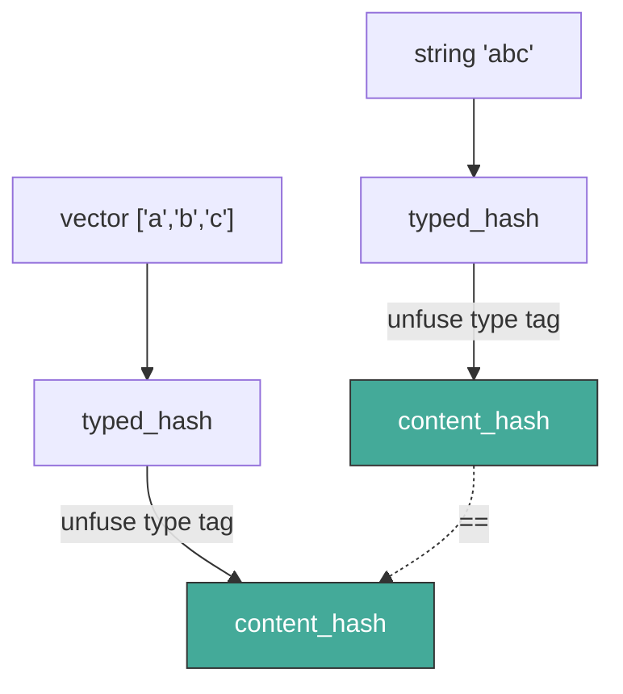
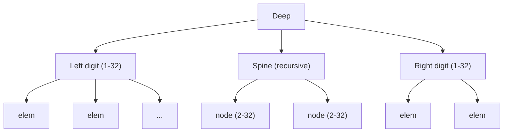

# Chapter 2: Values

Chapter 1 gave us a single operation — fuse — and three guarantees:
content identity, tree-shape independence, and decomposability. This
chapter builds an entire data model on that foundation.

Dacite has exactly **three primitives**: scalar, seq, and map.
Everything else — integers, strings, vectors, sets, even negative
sets — is a convention built from these three. The system is small
because the primitives are powerful.

## 2.1 Three Primitives

### Scalar

A **scalar** is an atomic, bounded-size value — the only primitive that
contains raw bytes rather than references to other values. Maximum
size: 255 bytes (encoded as a u8 length prefix).

```
scalar_hash = fuse_bytes(raw_bytes)
```

A scalar is untyped at the primitive level. The byte `0x61` and the
character `'a'` are the same scalar if they have the same bytes. Types
give meaning to scalars — that's §2.2.

Examples of scalar data:
- Null (0 bytes)
- A boolean (1 byte: `0x00` or `0x01`)
- A big-endian integer (1–32 bytes depending on width)
- An IEEE 754 float (4 or 8 bytes)
- A single UTF-8 character (1–4 bytes)

### Seq

A **seq** is an ordered collection of references, implemented as a
finger tree (§2.5). It is the universal building block for ordered data.

A seq's hash is its **semantic hash** — derived from fusing all
elements in order:

```
seq_hash = fuse(fuse(fuse(e0, e1), e2), ..., en)
```

Because fuse is associative, this hash is the same regardless of how
the seq is split internally. A balanced finger tree and a degenerate
one produce the same seq hash if they contain the same elements in the
same order.

### Map

A **map** is an unordered collection of key-value pairs, implemented
as a HAMT (§2.6). Each entry contributes `fuse(key_hash, value_hash)`
to the map's semantic hash:

```
map_hash = fuse(entry_0, fuse(entry_1, ...))
```

Because fuse is non-commutative, the order matters — but HAMT
traversal visits entries in ascending key-hash order, making the
fuse chain deterministic regardless of insertion order.

### That's It

Three primitives, three hash rules. Every structure in Dacite — from
a 64-bit integer to a terabyte dataset — is built from scalars
referenced by seqs and maps.

## 2.2 Typed Values

Scalars are raw bytes. A seq is just references. How do we know that
`[0x00, 0x00, 0x00, 0x2A]` is the integer 42 and not four null bytes?

**Types are data.** A typed value is a 2-element seq:

```
typed_value = seq(type_name, data)
```

Where:
- **Position 0** — the type name (itself a seq of char scalars)
- **Position 1** — the data (any primitive: scalar, seq, or map)

This is a convention, not enforced by the storage layer. The system
treats typed values as ordinary seqs. The "typed" interpretation is
applied by consumers.

### Type Names

A type name is a seq of character scalars:

```
type_name("string") = seq('s', 't', 'r', 'i', 'n', 'g')
```

Type names are self-documenting. Given any typed value, read position 0
to discover its type. No registry. No schema negotiation.

Built-in types use bare names: `"string"`, `"i64"`, `"vector"`.
User-defined types should use namespaced names (`"myapp/user"`) to
avoid collisions.

### The Null Separator

The semantic hash of a typed value uses a null byte between the type
name and data:

```
typed_hash = fuse(fuse(fuse_str(type_name), fuse_bytes([0x00])), hash(data))
```

Why the separator? Because fuse composes over concatenation
(`fuse(fuse_str(a), fuse_str(b)) = fuse_str(a ++ b)`). Without a
boundary marker, type `"i64"` with data `"2"` would collide with type
`"i6"` with data `"42"`. Since type names cannot contain null bytes,
`0x00` is an unambiguous terminator.

### Cross-Type Equality

Here's where Chapter 1's group structure pays off. Two typed values
with different type names but the same underlying data can be compared
in **O(1)**:

```
content_hash(tv) = fuse(inv(type_name_hash), typed_hash)
```

Strip the type tag, compare the remainder. If a `"string"` and a
`"vector"` of chars share the same underlying seq, their content hashes
are identical — because the data is literally the same content-addressed
structure.



## 2.3 Built-in Types

All built-in types follow the `seq(type_name, data)` convention:

| Type Name | Data | Description |
|-----------|------|-------------|
| `"null"` | null scalar (0 bytes) | Unit type |
| `"bool"` | 1-byte scalar | `0x00` = false, `0x01` = true |
| `"i8"` … `"i256"` | 1–32 byte scalar (big-endian, signed) | Signed integers |
| `"u8"` … `"u256"` | 1–32 byte scalar (big-endian, unsigned) | Unsigned integers |
| `"f32"`, `"f64"` | 4 or 8 byte scalar (IEEE 754) | Floating point |
| `"char"` | 1–4 byte scalar (UTF-8) | Unicode character |
| `"negative"` | null scalar | Sentinel for negative sets |
| `"string"` | seq of char scalars | UTF-8 string |
| `"blob"` | seq of byte scalars | Binary data |
| `"vector"` | seq of arbitrary typed values | Ordered collection |
| `"set"` | HAMT self-map | Set (positive or negative) |
| `"map"` | HAMT of key-value pairs | Associative collection |

Scalar types (`null` through `char`) wrap a single scalar in a typed
seq. Collection types (`string` through `map`) wrap a tree root — the
typed value is a thin header over the content-addressed tree.

### Strings and Blobs

Strings and blobs are both seqs of scalars, but with different type
names. A string is a seq of `char` scalars; a blob is a seq of `u8`
scalars. The type tag in the hash prevents collisions even when the
underlying bytes are identical — the string `"A"` (UTF-8 `0x41`) and
a 1-byte blob containing `0x41` have different hashes.

Internally, both use the same finger tree machinery. The difference
is purely semantic.

## 2.4 Sets and Negative Sets

### The Set Type

A `"set"` is a typed value wrapping a self-map — a HAMT where every
key maps to itself:

```
set({a, b, c}) = seq("set", map({a: a, b: b, c: c}))
```

Content addressing means the key and value point to the same hash —
zero additional storage for the "duplicate" reference.

Membership test: `get(set.data, x) != nil`.

### The Negative Sentinel

The built-in type `"negative"` is a sentinel value used to denote
negative (cofinite) sets — sets that represent "everything except
these elements":

```
negative = seq("negative", null)
```

A **negative set** is a `"set"` whose self-map includes the `negative`
sentinel as an element:

```
negative_set({a, b}) = seq("set", map({negative: negative, a: a, b: b}))
```

Membership is inverted: `x` is a member if `get(set.data, x) == nil`
(and `x` is not the `negative` sentinel itself).

For a thorough treatment of negative sets — including proofs that
the sentinel flows correctly through all set operations using only
map primitives — see
[Negative Sets as Data](https://clojurecivitas.org/math/sets/negative_sets.html).

### Set Operations

The `negative` sentinel flows through ordinary map operations. Because
it's just another element in the self-map, no special set machinery is
needed — only the three map primitives:

| A | B | union (A ∪ B) | intersect (A ∩ B) | difference (A \ B) |
|-----|-----|-----------------|-------------------|---------------------|
| pos | pos | merge(A, B) | keep(A, B) | remove(A, B) |
| neg | neg | keep(A, B) | merge(A, B) | remove(B, A) |
| pos | neg | remove(B, A) | remove(A, B) | keep(A, B) |
| neg | pos | remove(A, B) | remove(B, A) | merge(A, B) |

Where:
- `merge(A, B)` — add B's elements not already in A
- `keep(A, B)` — keep only A's elements that are also in B
- `remove(A, B)` — remove A's elements that are also in B

Complement is toggling the `negative` element:
`complement(A)` = add `negative` if absent, remove if present.

The `negative` sentinel participates in these operations like any other
element, which is what makes the pos/neg operation table work — the
sentinel's presence or absence propagates correctly through merge, keep,
and remove without special cases.

## 2.5 Inside Seqs: Finger Trees

Seqs are implemented as finger trees — a persistent data structure
that provides O(1) amortized access to both ends and O(log n) random
access. The key insight for Dacite: finger trees are *parameterized
by a monoid*, and fuse is a monoid (actually a group). The tree
accumulates fused hashes as its measure.

### Structure



A deep finger tree has three parts:
- **Left digit** — 1 to 32 elements, directly accessible
- **Spine** — a recursive finger tree of internal nodes
- **Right digit** — 1 to 32 elements, directly accessible

The classic finger tree uses 1–4 elements per digit and 2–3 children
per node. Dacite widens both to 1–32 and 2–32, trading the classic
amortized O(1) push/pop proof for **shallower trees**. A tree of 1M
elements is only ~4 levels deep. In a distributed setting, fewer
levels means fewer network round trips — and that's the dominant cost.

### Node Types

| Node | Description | Children |
|------|-------------|----------|
| `ft/empty` | Empty seq | 0 |
| `ft/single` | One element | 1 |
| `ft/digit` | Finger (end access) | 1–32 |
| `ft/node` | Internal node | 2–32 |
| `ft/deep` | Full tree | 3 (left, spine, right) |

Every node is stored in the content-addressed store as its own entry.
Children are hash references — no node ever contains inline data.
This means every node has **bounded size** regardless of collection
size: at most 32 × 32 = 1024 bytes of child hashes, plus ~48 bytes
of measure metadata.

### The Measure Monoid

Every node caches a **measure** of its subtree:

```
Measure = {
  count:          u64,   // number of leaf elements
  size_bytes:     u64,   // total byte size of leaf scalars
  elements_fuse:  Hash   // running fuse of all element hashes
}
```

Measures combine as a monoid:

```
combine(m1, m2) = {
  count:         m1.count + m2.count,
  size_bytes:    m1.size_bytes + m2.size_bytes,
  elements_fuse: unchecked_fuse(m1.elements_fuse, m2.elements_fuse)
}

identity = { count: 0, size_bytes: 0, elements_fuse: [0, 0, 0, 0] }
```

The `elements_fuse` uses `unchecked_fuse` because the identity
`[0, 0, 0, 0]` would fail the low-entropy check — this is safe since
measures are internal bookkeeping, not user-facing hashes.

The root's measure gives **O(1)** access to:
- `count` — how many elements
- `size_bytes` — total materialized size
- `elements_fuse` — the seq's semantic hash

### Node Hashing

Internal nodes are hashed using their type name and semantic content:

```
node_hash = fuse(fuse_str(node_type_name ++ "\0"), node.measure.elements_fuse)
```

The null byte terminates the type name (same convention as typed
values). Nodes with the same type and the same logical elements
produce the same hash — different tree shapes normalize to a single
hash in the store. This is correct because nodes with the same
elements are functionally interchangeable.

## 2.6 Inside Maps: HAMT

Maps are implemented as a Hash Array Mapped Trie — a persistent hash
map that provides O(log₃₂ n) lookup, insert, and delete.

### Hash Navigation

The key's hash is consumed 5 bits at a time, from most significant
to least:

```
Level 0: bits 255–251  (upper 5 bits of c0)
Level 1: bits 250–246
...
Level 51: bits 4–0     (lower 5 bits of c3)
```

Each 5-bit chunk selects one of 32 possible child positions.

Because `c0` has the most mixed bits (from the fuse multiply), the
first levels of the HAMT navigate using the highest-quality entropy.

### Bitmap Indexing

Internal nodes use a 32-bit bitmap to mark occupied positions:

```
child_index = popcount(bitmap & ((1 << chunk) - 1))
```

The children array is compressed — only occupied positions have
entries. A bitmap node with 5 children stores exactly 5 hashes,
not 32.

### Node Types

| Node | Description | Key Fields |
|------|-------------|------------|
| `hamt/empty` | Empty map | measure |
| `hamt/entry` | Single key-value pair | key_hash, key_ref, val_ref, measure |
| `hamt/bitmap` | Sparse internal node | bitmap, children, measure |

### Traversal Order

HAMT traversal visits children in ascending bitmap order, which
corresponds to ascending key hash order. This makes `elements_fuse`
deterministic regardless of insertion order — two maps with the same
entries always have the same semantic hash.

### HAMT Bitmap Node Hashing

Bitmap nodes include the bitmap value in their hash:

```
hamt_bitmap_hash = fuse(node_hash, fuse_bytes(bitmap_as_8_bytes))
```

This is the only exception to the "same elements → same hash" rule.
It's necessary because two bitmap nodes at different HAMT levels could
have the same elements and element fuse but different bitmaps — meaning
they route lookups differently and are **not** interchangeable. Without
the bitmap in the hash, these nodes would collide, creating
self-referential loops in the store.

## 2.7 Collision Resistance

Fuse-based hashes have ~2^96 birthday-bound collision resistance,
from the additive structure of components c1–c3. This is weaker than
SHA-256's ~2^128 but far beyond practical attack.

### Threat Model

Fuse hashes are designed for **cooperative environments** where
participants are trusted to produce honest data. In adversarial
contexts — where untrusted peers contribute data — fuse hashes alone
should not be relied upon for integrity.

For trust boundaries, pair dacite hashes with a cryptographic hash:

```
verification_pair = { dacite_hash, sha256 }
```

Verify the cryptographic hash on ingest; use the dacite hash for
internal navigation. The fuse hash gives you speed and algebraic
structure; the cryptographic hash gives you adversarial resistance.

## 2.8 API Surface

### Primitives

The irreducible core of the value layer:

**Construction**

| Function | Signature | Description |
|----------|-----------|-------------|
| `scalar` | `bytes → Scalar` | Create a scalar from raw bytes |
| `typed-value` | `(string, Primitive) → Seq` | Create `seq(type_name, data)` |
| `typed-hash` | `(string, Hash) → Hash` | Compute hash with null separator |

**Seq (Finger Tree)**

| Function | Signature | Description |
|----------|-----------|-------------|
| `ft-empty` | `→ Seq` | Empty finger tree |
| `ft-conj-right` | `(Seq, Hash) → Seq` | Append to right end |
| `ft-conj-left` | `(Hash, Seq) → Seq` | Prepend to left end |
| `ft-first` | `Seq → Hash` | Peek at left end |
| `ft-last` | `Seq → Hash` | Peek at right end |
| `ft-rest` | `Seq → Seq` | Remove from left |
| `ft-butlast` | `Seq → Seq` | Remove from right |
| `ft-nth` | `(Seq, int) → Hash` | Random access by index |
| `ft-split` | `(Seq, int) → (Seq, Seq)` | Split at index |
| `ft-concat` | `(Seq, Seq) → Seq` | Concatenate two seqs |
| `ft-measure` | `Seq → Measure` | Root measure (count, size, fuse) |

**Map (HAMT)**

| Function | Signature | Description |
|----------|-----------|-------------|
| `hamt-empty` | `→ Map` | Empty HAMT |
| `hamt-get` | `(Map, Hash) → Hash \| nil` | Lookup by key hash |
| `hamt-assoc` | `(Map, Hash, Hash) → Map` | Insert or update |
| `hamt-dissoc` | `(Map, Hash) → Map` | Remove by key hash |
| `hamt-measure` | `Map → Measure` | Root measure (count, size, fuse) |

**Measure**

| Function | Signature | Description |
|----------|-----------|-------------|
| `measure-combine` | `(Measure, Measure) → Measure` | Monoid combine |
| `measure-identity` | `→ Measure` | `{0, 0, [0,0,0,0]}` |

### Derived

Convenience functions that compose from the primitives:

**From seq primitives**

| Function | Derivation | Description |
|----------|------------|-------------|
| `ft-count` | `(ft-measure s).count` | Element count, O(1) |
| `ft-size-bytes` | `(ft-measure s).size_bytes` | Total byte size, O(1) |

**From map primitives**

| Function | Derivation | Description |
|----------|------------|-------------|
| `hamt-count` | `(hamt-measure m).count` | Entry count, O(1) |

**Built-in type constructors** — all derived from `typed-value` + `scalar`:

| Function | Derivation |
|----------|------------|
| `dac-null` | `typed-value("null", scalar([]))` |
| `dac-bool` | `typed-value("bool", scalar([0\|1]))` |
| `dac-int` | `typed-value("i64", scalar(big-endian))` etc. |
| `dac-float` | `typed-value("f32"\|"f64", scalar(ieee754))` |
| `dac-char` | `typed-value("char", scalar(utf8))` |
| `dac-negative` | `typed-value("negative", dac-null)` |
| `dac-string` | `typed-value("string", seq(chars...))` |
| `dac-blob` | `typed-value("blob", seq(bytes...))` |
| `dac-vector` | `typed-value("vector", seq(values...))` |
| `dac-set` | `typed-value("set", self-map(values...))` |
| `dac-map` | `typed-value("map", map(entries...))` |

**Set operations** — derived from HAMT primitives + `dac-negative`:

| Function | Derivation | Description |
|----------|------------|-------------|
| `set-member?` | `hamt-get` + check for `negative` | Membership (pos/neg aware) |
| `set-complement` | Toggle `negative` via `hamt-assoc`/`hamt-dissoc` | Complement |
| `set-union` | Dispatch to `merge`/`keep`/`remove` on pos/neg | Union |
| `set-intersect` | Dispatch to `merge`/`keep`/`remove` on pos/neg | Intersection |
| `set-difference` | Dispatch to `merge`/`keep`/`remove` on pos/neg | Difference |

**Cross-type**

| Function | Derivation | Description |
|----------|------------|-------------|
| `content-hash` | `fuse(inv(type-name-hash), typed-hash)` | Strip type tag |

### Properties

- All typed values round-trip: construct → hash → reconstruct yields
  same hash
- `content-hash(string("abc"))` = `content-hash(vector(['a','b','c']))`
- `count(conj-right(t, x))` = `count(t) + 1`
- `nth(conj-right(empty, x), 0)` = `x`
- `measure(concat(a, b))` = `combine(measure(a), measure(b))`
- `get(assoc(m, k, v), k)` = `v`
- `get(dissoc(m, k), k)` = `nil`
- Insertion order doesn't affect map hash (deterministic traversal)
- `union(complement(A), A)` = universal set (negative empty)
- `intersect(A, complement(A))` = empty set

**This layer depends only on Layer 1 (hash).** No I/O, no persistence,
no state beyond the values themselves. All functions are pure.

## 2.9 What This Layer Provides

The value layer gives the rest of Dacite:

1. **A complete data model** — scalars, sequences, and maps compose
   into arbitrarily complex structures, all content-addressed.
2. **Open types** — any type name is a first-class value, no registry
   needed. New types cost nothing.
3. **O(1) metadata** — count, size, and semantic hash are always
   available at the root, without traversal.
4. **Bounded nodes** — every node in every tree fits in ~1 KB. No
   node is ever "too big to fetch."
5. **Semantic equality** — two structures with the same logical
   content have the same hash, regardless of internal organization.

The next chapter adds persistence: how values move between memory,
disk, and the network.
