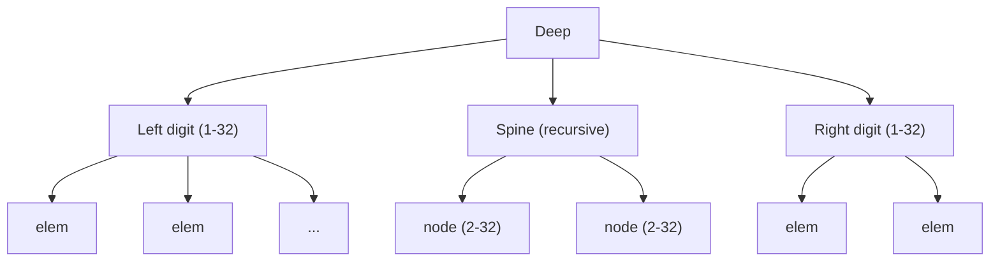

# Chapter 3: Values

Chapter 1 gave us **stores** — a content-addressed map and a mutable
root ref. Chapter 2 gave us **fuse** and three guarantees: content
identity, tree-shape independence, and decomposability. This chapter
builds the **value model** on both foundations: a closed set of six
user value kinds — scalars, vectors, strings, blobs, maps, and sets —
together with the internal primitives that implement them.

## 3.1 Values Know Their Store, Hash, Type, and Content

Every Dacite value carries four pieces of data:

- **store** — the store that created and persists it
- **hash** — its content-addressed identity (via `dacite-hash`)
- **type** — a string identifying its kind (e.g. `"i64"`, `"vector"`)
- **content** — the value itself, exposed in the host language via
  an explicit call (`realize` in the reference implementation). A
  scalar yields its native value; a collection yields a
  *lazy iterable* of realized elements (a map yields realized
  `[key value]` pairs), so sub-collections become nested lazy iterables.
  Laziness keeps access compatible with partial availability — only the
  part you consume is fetched.

```clojure
(def v (dacite/vector 1 2 3))

(dacite-hash v)
;; => [c0 c1 c2 c3]  ; the 4-long hash

(dacite-store v)
;; => #<DaciteStore ...>  ; the store that owns this value

(dacite-type v)
;; => "vector"  ; the value's type name
```

Most work happens in the context of a **current store** — a dynamic binding
(`*store*` in the reference implementation) that defaults to an in-memory
store for REPL use. Constructors such as `(dacite/vector 1 2 3)` persist
into that store; the resulting value remembers which store created it.
When you need a specific store — tests, migration, multiple stores — use
the explicit `-with-store` variants:

```clojure
(dacite/vector-with-store store 1 2 3)
```

Use `with-store` to bind an isolated store for a block of code (see §3.9).

The store reference enables transparent persistence: when you `assoc`
a Dacite map or `conj` a Dacite vector, the new value is automatically
stored in the same backing storage. You don't thread the store through
every operation — values know where they belong.

This also means **values are tied to their store**. A value created in
store A cannot be directly inserted into store B; you must first migrate
the underlying content (or use ref push — see Chapter 1).

## 3.2 A Closed Set of User Values

Dacite exposes a **closed set** of six user value kinds:

- **scalar** — an atomic, typed value: a number, character, boolean, or null
- **vector** — an ordered collection of values
- **string** — text: an ordered collection of characters
- **blob** — binary data: an ordered collection of bytes
- **map** — an associative collection of key/value pairs
- **set** — an unordered collection of distinct values

Scalars are atomic. The other five are collections, and they are not
primitive all the way down — they are assembled from **internal value
primitives**:

- **Finger-tree nodes** implement the sequence types: vector, string,
  and blob (§3.6).
- **HAMT nodes** implement the associative types: map and set (§3.7).

Internal nodes are real content-addressed values with their own type
names and hashes, but they are never handed to users directly. They
exist only to give the user types their shape and performance.

The set of user types is fixed, but it is not special-cased in the
storage layer: a type is just a string of characters (§3.3). The
vocabulary could grow in the future without changing any of the
machinery below.

## 3.3 How Every Value Is Hashed

Every Dacite value — user-facing or internal — is hashed by the same
rule:

```
value_hash = fuse(type_hash, data_hash)
```

### The Type Hash

The **type hash** identifies the kind of value. It is the fuse of the
type name's characters followed by a terminating `0x00` byte:

```
type_hash = fuse_bytes(type_name ++ [0x00])
```

Type names are ordinary character strings — `"i64"`, `"vector"`,
`"ft/node"`. Because type names never contain a null byte, the trailing
`0x00` cleanly separates the type from the data that follows. Without a
boundary marker, type `"i64"` with data `"2"` could collide with type
`"i6"` and data `"42"` (fuse composes over concatenation). The `0x00`
makes the boundary unambiguous.

This is also what makes types self-describing: given any value, read its
type name to discover its interpretation. No registry, no schema
negotiation.

### The Data Hash

The **data hash** captures the value's content. How it is computed
depends on the kind of value:

- **Scalar** — the fuse of its canonical bytes:

```
data_hash = fuse_bytes(canonical_bytes)
```

- **Collection** — the fuse of all **leaf** element hashes, in sequence
  order (vector, string, blob) or ascending key-hash order (map, set):

```
data_hash = fuse(fuse(fuse(e0, e1), e2), ..., en)
```

For collections, the data hash is built from the leaves **only**. The
internal node type hashes (`ft/node`, `hamt/bitmap`, …) never enter it.
This is deliberate — it is what makes the data hash **shape-independent**.

### Shape Independence

Because internal type hashes are excluded, two collections with the same
leaves but different internal tree shapes produce the same data hash, and
therefore the same value hash. A balanced finger tree and a degenerate
one holding the same elements in the same order are indistinguishable by
hash. This is what lets a store reorganize a collection for performance
without changing its identity.

(There is exactly one exception — HAMT bitmap nodes — explained in §3.7.)

### Cross-Type Equality

Here is where Chapter 2's group structure pays off. Since
`value_hash = fuse(type_hash, data_hash)`, the type hash can be stripped
back off with the group inverse:

```
content_hash(v) = fuse(inv(type_hash), value_hash) = data_hash
```

Two values with different types but the same underlying data have the
same content hash, computed in **O(1)**. A `"string"` and a `"vector"`
holding the same characters share a data hash — because their leaves are
literally the same content-addressed values — even though their full
hashes differ by the type tag.

## 3.4 The User Value Types

The six user value kinds divide into atomic scalars and collections.

**Scalar types** — an atomic value with a canonical byte encoding:

| Type Name | Bytes | Description |
|-----------|-------|-------------|
| `"null"` | 0 bytes | Unit type |
| `"bool"` | 1 byte | `0x00` = false, `0x01` = true |
| `"i8"` … `"i256"` | 1–32 bytes big-endian signed | Signed integers |
| `"u8"` … `"u256"` | 1–32 bytes big-endian unsigned | Unsigned integers |
| `"f32"`, `"f64"` | 4 or 8 bytes IEEE 754 | Floating point |
| `"char"` | 1–4 bytes UTF-8 | Unicode character |
| `"negative"` | 0 bytes | Sentinel for negative sets (§3.5) |

**Collection types** — a type hash over a tree of leaves:

| Type Name | Leaves | Backed by | Description |
|-----------|--------|-----------|-------------|
| `"string"` | char scalars | finger tree | UTF-8 string |
| `"blob"` | byte scalars | finger tree | Binary data |
| `"vector"` | arbitrary values | finger tree | Ordered collection |
| `"map"` | key/value pairs | HAMT | Associative collection |
| `"set"` | distinct values | HAMT | Set (positive or negative) |

Scalar types are atomic. Collection types are backed by internal
finger-tree or HAMT primitives (§3.6, §3.7); the type hash is what
distinguishes, say, a vector from a set even when their leaves coincide.

### Strings, Blobs, and Vectors

Strings, blobs, and vectors are all sequences over a finger tree; they
differ only in their type name and the kind of leaves they hold. A
string is a sequence of `char` scalars, a blob a sequence of `u8`
scalars, a vector a sequence of arbitrary values.

The type hash keeps them distinct even when their bytes coincide: the
string `"A"` (UTF-8 `0x41`) and a one-byte blob containing `0x41` have
the same leaves but different type hashes, and therefore different value
hashes. Internally they share the same finger-tree machinery; only the
type hash differs.

## 3.5 Sets and Negative Sets

### The Set Type

A `"set"` is a user value backed by a **self-map** — a HAMT in which
every key maps to itself:

```
set({a, b, c})  →  type "set" over self-map {a: a, b: b, c: c}
```

Content addressing means the key and value point to the same hash —
zero additional storage for the "duplicate" reference.

Membership test: `get(self-map, x) != nil`.

### The Negative Sentinel

The built-in scalar type `"negative"` is a sentinel used to denote
negative (cofinite) sets — sets that represent "everything except
these elements":

```
negative  →  scalar of type "negative" (empty data)
```

A **negative set** is a `"set"` whose self-map includes the `negative`
sentinel as an element:

```
negative_set({a, b})  →  type "set" over self-map {negative, a, b}
```

Membership is inverted: `x` is a member if `get(self-map, x) == nil`
(and `x` is not the `negative` sentinel itself).

For a thorough treatment of negative sets — including proofs that
the sentinel flows correctly through all set operations using only
map primitives — see
[Negative Sets as Data](https://clojurecivitas.org/math/sets/negative_sets.html).

### Set Operations

The `negative` sentinel flows through ordinary map operations. Because
it's just another element in the self-map, no special set machinery is
needed — only the three map primitives:

| A | B | union (A ∪ B) | intersect (A ∩ B) | difference (A \ B) |
|-----|-----|-----------------|-------------------|---------------------|
| pos | pos | merge(A, B) | keep(A, B) | remove(A, B) |
| neg | neg | keep(A, B) | merge(A, B) | remove(B, A) |
| pos | neg | remove(B, A) | remove(A, B) | keep(A, B) |
| neg | pos | remove(A, B) | remove(B, A) | merge(A, B) |

Where:
- `merge(A, B)` — add B's elements not already in A
- `keep(A, B)` — keep only A's elements that are also in B
- `remove(A, B)` — remove A's elements that are also in B

Complement is toggling the `negative` element:
`complement(A)` = add `negative` if absent, remove if present.

The `negative` sentinel participates in these operations like any other
element, which is what makes the pos/neg operation table work — the
sentinel's presence or absence propagates correctly through merge, keep,
and remove without special cases.

## 3.6 Inside Seqs: Finger Trees

Seqs are implemented as finger trees — a persistent data structure
that provides O(1) amortized access to both ends and O(log n) random
access. The key insight for Dacite: finger trees are *parameterized
by a monoid*, and fuse is a monoid (actually a group). The tree
accumulates fused hashes as its measure.

### Structure



A deep finger tree has three parts:
- **Left digit** — 1 to 32 elements, directly accessible
- **Spine** — a recursive finger tree of internal nodes
- **Right digit** — 1 to 32 elements, directly accessible

The classic finger tree uses 1–4 elements per digit and 2–3 children
per node. Dacite widens both to 1–32 and 2–32, trading the classic
amortized O(1) push/pop proof for **shallower trees**. A tree of 1M
elements is only ~4 levels deep. In a distributed setting, fewer
levels means fewer network round trips — and that's the dominant cost.

### Node Types

| Node | Description | Children |
|------|-------------|----------|
| `ft/empty` | Empty seq | 0 |
| `ft/single` | One element | 1 |
| `ft/digit` | Finger (end access) | 1–32 |
| `ft/node` | Internal node | 2–32 |
| `ft/deep` | Full tree | 3 (left, spine, right) |

Every node is stored in the content-addressed store as its own entry.
Children are hash references — no node ever contains inline data.
This means every node has **bounded size** regardless of collection
size: at most 32 × 32 = 1024 bytes of child hashes, plus ~48 bytes
of measure metadata.

### The Measure Monoid

Every node caches a **measure** of its subtree:

```
Measure = {
  count:          u64,   // number of leaf elements
  size_bytes:     u64,   // total byte size of leaf scalars
  elements_fuse:  Hash   // running fuse of all element hashes
}
```

Measures combine as a monoid:

```
combine(m1, m2) = {
  count:         m1.count + m2.count,
  size_bytes:    m1.size_bytes + m2.size_bytes,
  elements_fuse: unchecked_fuse(m1.elements_fuse, m2.elements_fuse)
}

identity = { count: 0, size_bytes: 0, elements_fuse: [0, 0, 0, 0] }
```

The `elements_fuse` uses `unchecked_fuse` because the identity
`[0, 0, 0, 0]` would fail the low-entropy check — this is safe since
measures are internal bookkeeping, not user-facing hashes.

The root's measure gives **O(1)** access to:
- `count` — how many elements
- `size_bytes` — total materialized size
- `elements_fuse` — the seq's data hash

### Node Hashing

Internal nodes are hashed using their type name and semantic content,
the same `type_hash` rule as every other value (§3.3):

```
node_hash = fuse(fuse_str(node_type_name ++ "\0"), node.measure.elements_fuse)
```

The null byte terminates the type name. Nodes with the same type and the
same logical elements produce the same hash — different tree shapes
normalize to a single hash in the store. This is correct because nodes
with the same elements are functionally interchangeable.

The `elements_fuse` a node caches is exactly the **data hash** a user
sequence wraps. A `"vector"` value's hash is
`fuse(type_hash("vector"), root.measure.elements_fuse)` — its type hash
fused with the leaf fuse of its root node. The internal node's own type
hash (`ft/node`, etc.) never reaches the vector's hash, which is
precisely why the vector hash is shape-independent (§3.3).

## 3.7 Inside Maps: HAMT

Maps are implemented as a Hash Array Mapped Trie — a persistent hash
map that provides O(log₃₂ n) lookup, insert, and delete.

### Hash Navigation

The key's hash is consumed 5 bits at a time, from most significant
to least:

```
Level 0: bits 255–251  (upper 5 bits of c0)
Level 1: bits 250–246
...
Level 51: bits 4–0     (lower 5 bits of c3)
```

Each 5-bit chunk selects one of 32 possible child positions.

Because `c0` has the most mixed bits (from the fuse multiply), the
first levels of the HAMT navigate using the highest-quality entropy.

### Bitmap Indexing

Internal nodes use a 32-bit bitmap to mark occupied positions:

```
child_index = popcount(bitmap & ((1 << chunk) - 1))
```

The children array is compressed — only occupied positions have
entries. A bitmap node with 5 children stores exactly 5 hashes,
not 32.

### Node Types

| Node | Description | Key Fields |
|------|-------------|------------|
| `hamt/empty` | Empty map | measure |
| `hamt/entry` | Single key-value pair | key_hash, key_ref, val_ref, measure |
| `hamt/bitmap` | Sparse internal node | bitmap, children, measure |

### Traversal Order

HAMT traversal visits children in ascending bitmap order, which
corresponds to ascending key hash order. This makes `elements_fuse`
deterministic regardless of insertion order — two maps with the same
entries always have the same data hash.

### HAMT Bitmap Node Hashing

Bitmap nodes include the bitmap value in their hash:

```
hamt_bitmap_hash = fuse(node_hash, fuse_bytes(bitmap_as_8_bytes))
```

This is the only exception to the shape-independence rule of §3.3.
It's necessary because two bitmap nodes at different HAMT levels could
have the same elements and element fuse but different bitmaps — meaning
they route lookups differently and are **not** interchangeable. Without
the bitmap in the hash, these nodes would collide, creating
self-referential loops in the store. The exception is confined to
internal bitmap nodes; a map's own data hash — the fuse of its leaf
entries — remains shape-independent.

## 3.8 Collision Resistance

Fuse-based hashes have ~2^96 birthday-bound collision resistance,
from the additive structure of components c1–c3. This is weaker than
SHA-256's ~2^128 but far beyond practical attack.

### Threat Model

Fuse hashes are designed for **cooperative environments** where
participants are trusted to produce honest data. In adversarial
contexts — where untrusted peers contribute data — fuse hashes alone
should not be relied upon for integrity.

For trust boundaries, pair dacite hashes with a cryptographic hash:

```
verification_pair = { dacite_hash, sha256 }
```

Verify the cryptographic hash on ingest; use the dacite hash for
internal navigation. The fuse hash gives you speed and algebraic
structure; the cryptographic hash gives you adversarial resistance.

## 3.9 API Surface

### Primitives

The irreducible core of the value layer — scalars plus the internal
tree primitives the collection types are built from:

**Scalar**

| Function | Signature | Description |
|----------|-----------|-------------|
| `scalar` | `(String, bytes) → Scalar` | Create a typed scalar. Value hash = `fuse(type_hash, fuse_bytes(bytes))`. |

**Seq (Finger Tree)**

| Function | Signature | Description |
|----------|-----------|-------------|
| `ft-empty` | `→ Seq` | Empty finger tree |
| `ft-conj-right` | `(Seq, Hash) → Seq` | Append to right end |
| `ft-conj-left` | `(Hash, Seq) → Seq` | Prepend to left end |
| `ft-first` | `Seq → Hash` | Peek at left end |
| `ft-last` | `Seq → Hash` | Peek at right end |
| `ft-rest` | `Seq → Seq` | Remove from left |
| `ft-butlast` | `Seq → Seq` | Remove from right |
| `ft-nth` | `(Seq, int) → Hash` | Random access by index |
| `ft-split` | `(Seq, int) → (Seq, Seq)` | Split at index |
| `ft-concat` | `(Seq, Seq) → Seq` | Concatenate two seqs |
| `ft-measure` | `Seq → Measure` | Root measure (count, size, fuse) |

**Map (HAMT)**

| Function | Signature | Description |
|----------|-----------|-------------|
| `hamt-empty` | `→ Map` | Empty HAMT |
| `hamt-get` | `(Map, Hash) → Hash \| nil` | Lookup by key hash |
| `hamt-assoc` | `(Map, Hash, Hash) → Map` | Insert or update |
| `hamt-dissoc` | `(Map, Hash) → Map` | Remove by key hash |
| `hamt-measure` | `Map → Measure` | Root measure (count, size, fuse) |

**Measure**

| Function | Signature | Description |
|----------|-----------|-------------|
| `measure-combine` | `(Measure, Measure) → Measure` | Monoid combine |
| `measure-identity` | `→ Measure` | `{0, 0, [0,0,0,0]}` |

### Derived

Convenience functions that compose from the primitives:

**From seq primitives**

| Function | Derivation | Description |
|----------|------------|-------------|
| `ft-count` | `(ft-measure s).count` | Element count, O(1) |
| `ft-size-bytes` | `(ft-measure s).size_bytes` | Total byte size, O(1) |

**From map primitives**

| Function | Derivation | Description |
|----------|------------|-------------|
| `hamt-count` | `(hamt-measure m).count` | Entry count, O(1) |

**User value constructors** — implicit forms use the current store; explicit
`-with-store` forms take a store as the first argument. Implicit constructors
are the primary API; most application code never passes a store explicitly.

| Function | Implicit signature | Explicit signature | Kind |
|----------|-------------------|-------------------|------|
| `null` | `() → Value` | `(store) → Value` | Scalar |
| `bool` | `(boolean) → Value` | `(store, boolean) → Value` | Scalar |
| `i64`, `f64`, … | `(data) → Value` | `(store, data) → Value` | Scalar |
| `char` | `(char) → Value` | `(store, char) → Value` | Scalar |
| `negative` | `() → Value` | `(store) → Value` | Scalar |
| `string` | `(string) → Value` | `(store, string) → Value` | Collection |
| `blob` | `(bytes) → Value` | `(store, bytes) → Value` | Collection |
| `vector` | `(values...) → Value` | `(store, values...) → Value` | Collection |
| `set` | `(values...) → Value` | `(store, values...) → Value` | Collection |
| `map` | `(kvs...) → Value` | `(store, kvs...) → Value` | Collection |
| `get-value` | `(hash) → Value \| nil` | `(store, hash) → Value \| nil` | Lookup |

Examples:

```clojure
;; implicit — uses *store* (default or bound)
(dacite/i64 42)
(dacite/vector 1 2 3)
(dacite/hash-map "a" 1 "b" 2)

;; explicit — when the store matters
(dacite/i64-with-store store 42)
(dacite/vector-with-store store 1 2 3)

;; isolated context (testing, transactions)
(store/with-store [s (store/mem-store)]
  (dacite/vector 1 2 3))
```

The `-with-store` suffix avoids the varargs ambiguity that would arise if
store were an optional first argument to the same function — `(vector 1)` must
mean a one-element vector, not an empty vector in store `1`.

**Value accessors**

| Function | Signature | Description |
|----------|-----------|-------------|
| `dacite-hash` | `Value → Hash` | Content-addressed identity (4-long hash) |
| `dacite-store` | `Value → Store` | The store that created and persists this value |
| `dacite-type` | `Value → String` | The value's type name |
| `realize` | `Value → native` | Expose content (explicit; values are not references). Scalar → native value; collection → lazy iterable of realized elements (map → `[k v]` pairs); empty → nil. Lazy, so partial-availability-friendly |

The store reference enables transparent persistence. When you `assoc`
a map or `conj` a vector, the resulting value is automatically stored
in the same backing storage — no store parameter needed for operations
or for construction in the common case.

**Set operations** — derived from HAMT primitives + `dac-negative`:

| Function | Derivation | Description |
|----------|------------|-------------|
| `set-member?` | `hamt-get` + check for `negative` | Membership (pos/neg aware) |
| `set-complement` | Toggle `negative` via `hamt-assoc`/`hamt-dissoc` | Complement |
| `set-union` | Dispatch to `merge`/`keep`/`remove` on pos/neg | Union |
| `set-intersect` | Dispatch to `merge`/`keep`/`remove` on pos/neg | Intersection |
| `set-difference` | Dispatch to `merge`/`keep`/`remove` on pos/neg | Difference |

**Cross-type**

| Function | Derivation | Description |
|----------|------------|-------------|
| `content-hash` | `fuse(inv(type-hash), value-hash)` | Strip type tag, recover data hash |

### Properties

- All values round-trip: construct → hash → reconstruct yields
  the same hash
- `content-hash(string("abc"))` = `content-hash(vector(['a','b','c']))`
- `count(conj-right(t, x))` = `count(t) + 1`
- `nth(conj-right(empty, x), 0)` = `x`
- `measure(concat(a, b))` = `combine(measure(a), measure(b))`
- `get(assoc(m, k, v), k)` = `v`
- `get(dissoc(m, k), k)` = `nil`
- Insertion order doesn't affect map hash (deterministic traversal)
- `union(complement(A), A)` = universal set (negative empty)
- `intersect(A, complement(A))` = empty set

This layer depends on Chapter 2 (hash fusion) and Chapter 1 (stores). No I/O required for
pure operations, though values carry a store reference for transparent
persistence when mutated. All primitive functions are pure.

## 3.10 What This Layer Provides

The value layer gives the rest of Dacite:

1. **A closed data model** — six user value kinds — scalars, vectors,
   strings, blobs, maps, and sets — compose into arbitrarily complex
   structures, all content-addressed.
2. **Self-describing types** — every value names its own type, and a
   type is just a string of characters. The user set is closed, but the
   vocabulary can grow without new machinery.
3. **O(1) metadata** — count, size, and data hash are always
   available at the root, without traversal.
4. **Bounded nodes** — every node in every tree fits in ~1 KB. No
   node is ever "too big to fetch."
5. **Shape independence** — two collections with the same leaves have
   the same hash, regardless of internal tree organization.
6. **Store-aware** — values know their store, enabling transparent
   persistence on mutation.

The next chapter adds **authorization** on top of stores: proof of
possession before fetch or store.
