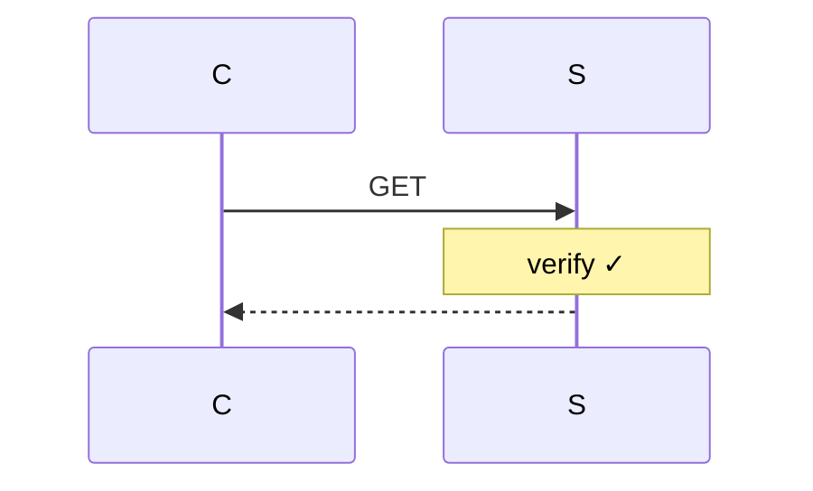
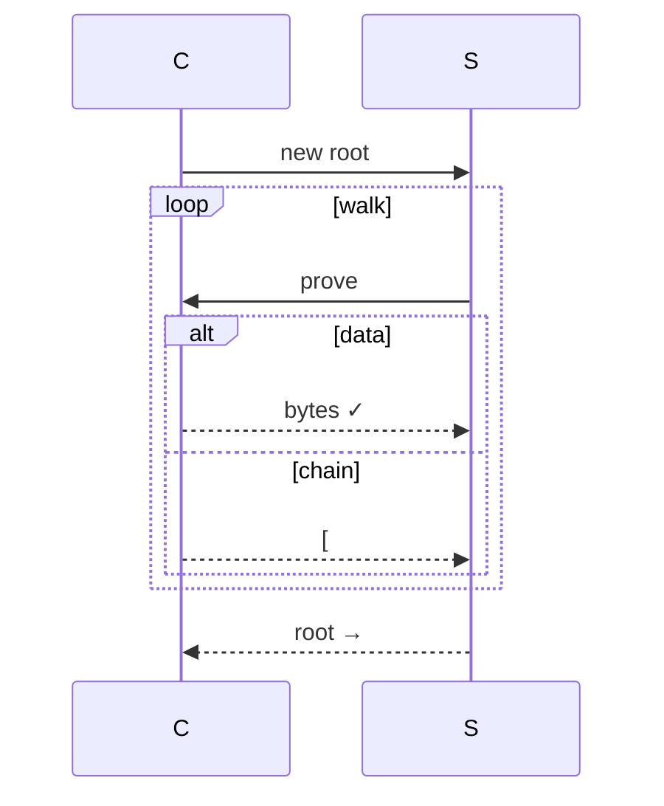

# Chapter 4: Authorization

Chapter 3 gave us stores — persistence and distribution across machines.
But stores don't care *who* is reading or writing. Any party with network
access can fetch any hash. In a single-user system, that's fine. In a
multi-user system, it's \"knowing a hash is authorization.\"

Dacite rejects this. This chapter adds **authorization** — proof of
possession, authenticated stores, and the GET/PUT protocols. Together they
give secure access control without ACLs or capabilities — just structural
proofs over the DAG.

## 4.1 Core Principle

**Knowing a hash does not authorize access to its value.**

Hashes leak — in logs, URLs, errors. A hash is an *address*, not a *key*.
Dacite's authorization is **structural**: prove you *possess* the data.

## 4.2 Proof of Possession

Every access requires proof of legitimate possession. Two forms:

### Data Possession

Produce the bytes; they hash correctly. Strongest proof.

### Structural Possession

Proof chain: `[root, h1, ..., target]`. Server verifies each parent→child
link in the DAG.

### Example

```mermaid
graph TD
    R[\"map (root) #R\"] --> E1[\"entry #E1\\n'name' → 'Alice'\"]
    R --> E2[\"entry #E2\\n'scores' → vector\"]
    E2 --> V2[\"vector #V2\"]
    V2 --> S1[\"10\"]
    V2 --> S2[\"20\"]
    V2 --> S3[\"30 #S3\"]
    style R fill:#4a9,stroke:#333,color:#fff
    style S3 fill:#49a,stroke:#333,color:#fff
```

Chain `[#R, #E2, #V2, #S3]`; three lookups confirm reachability.

## 4.3 Two Kinds of Stores

Breaks proof chain circularity:

### Unauthenticated, Read-Only (Session Stores)

No identity; immutable; hold proof chains/metadata.

### Authenticated, Modifiable (Main Stores)

Identity-bound; root-managed; user data.

| Store | Auth | Contents |
|-------|------|----------|
| Session | Unauth RO | Proofs/metadata |
| Main | Auth mod | Data |

## 4.4 Reading (GET)

Structural possession only:



Stateless/scoped by DAG.

## 4.5 Writing (PUT)

Full possession (data or structural from *old* root).

### Hash Capture Problem

Alice learns Bob's root `#RB`, declares it — gains his tree.

### Solution: Prove Possession of New Root

Server challenges each hash in new root. Client responds data/chain.



Server has all prior-tree data; partitions cleanly. Hash capture fails.

| Client sends | Server state |
|--------------|--------------|
| Data | New |
| Chain | Already has |

GET ⊂ PUT.

## 4.6 Garbage Collection

Liveness = reachable from authorized roots.

Semi-space collector (two strategies, equivalent):

| | Migration | Color Mark |
|--|-----------|------------|
| Mark | Copy to B | Current color |
| Dead | Absent B | Old color |
| Reclaim | Discard A | Delete old |

Online; cost ∝ live data; preserves sharing.

## 4.7 API Surface

### Primitives

| Fn | Sig | Desc |
|----|-----|------|
| `verify-chain` | `(Store, [Hash]) → bool` | Link-by-link |
| `challenge` | `(Store, old-root, hash) → ProofReq` | PoP req |
| `verify-proof` | `(Store, hash, Proof) → bool` | Data/chain |
| `transition-root` | `(Store, old, new) → Store` | Atomic swap |

### Properties

- Chain verifies reachability
- PUT ∀ hashes possessed
- Invariant: server has all reachable-from-old data
- GC: live = root-reachable

**Depends on 1–3.** Verification logic atop stores.

## 4.8 What This Layer Provides

1. **Secure stores** — PoP prevents hash-as-capability
2. **Stateless auth** — roots + chains, no sessions
3. **Uniform PoP** — GET/PUT/GC from one concept
4. **Peer-ready** — both directions use same proofs

Chapter 5 adds sharing conventions: shares map atop authorized stores.
