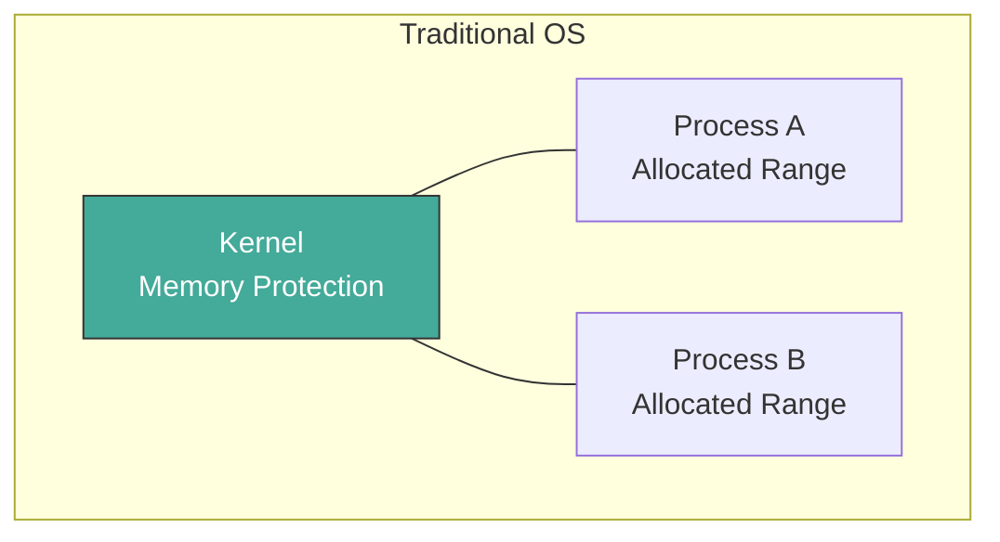
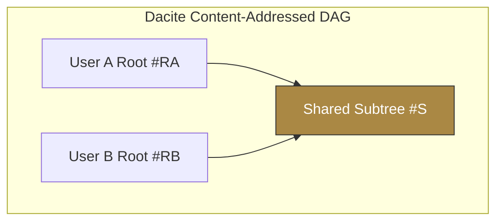
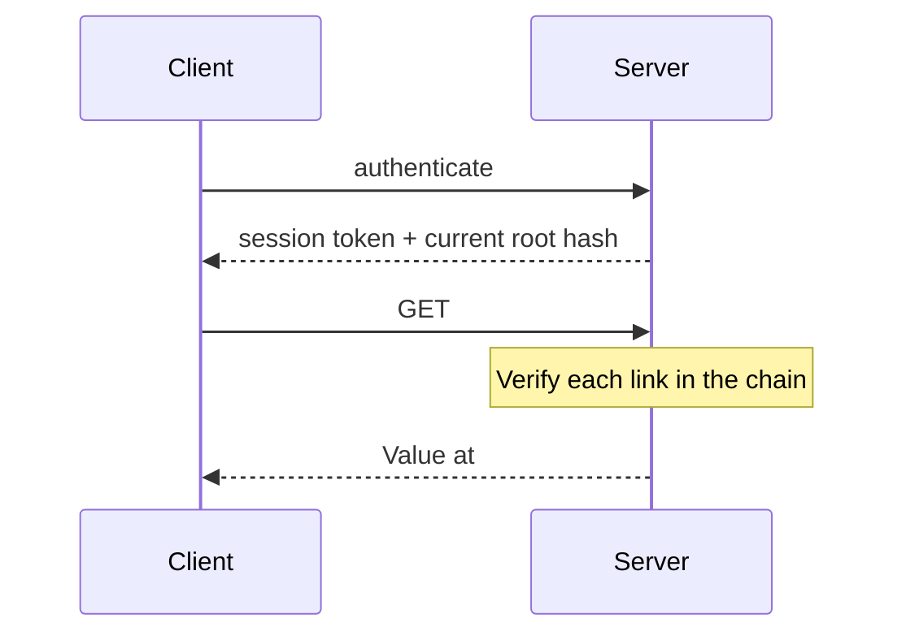
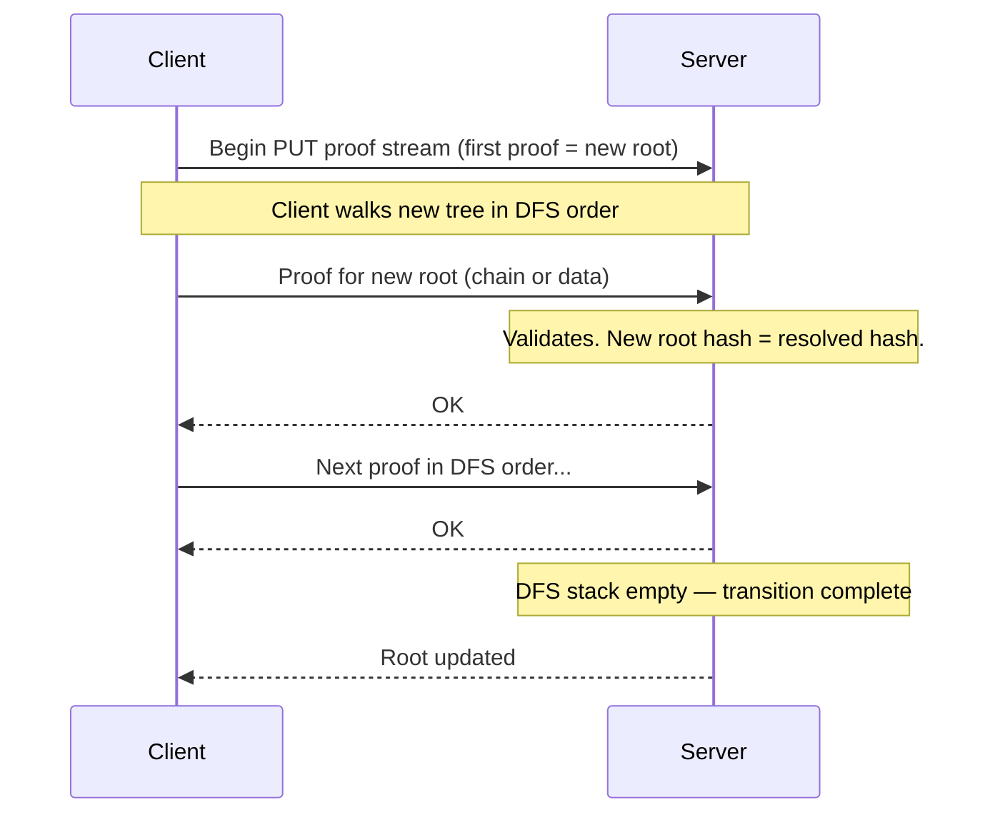

# Chapter 4: Authorized Stores

Chapter 3 gave us stores — persistence and distribution across machines. Every store has a root. But Chapter 3's stores are **unauthorized**: anyone with access can fetch any hash. In a single-user system, that's fine. In a multi-user system, it's "knowing a hash is authorization."

Dacite rejects this. This chapter introduces **authorized stores** — stores that require **proof of possession** before they will fetch or store a node. The mechanism is structural proofs over the DAG: data proofs and chain proofs. Together they give secure access control without ACLs or capabilities — just roots and the paths between them.

The authorized store protocol builds directly on the unauthorized store from Chapter 3. The difference is that `fetch` and `store` now require proof. All interaction still flows through `get-root` and `set-root`, but the store verifies that every accessed node is structurally reachable from an authorized root.

## 4.1 The Authorization Challenge

In a conventional operating system, memory protection is relatively straightforward. The kernel allocates regions of RAM to a process and uses hardware memory management units (MMUs) to prevent that process from reading or writing addresses outside its allocation. A memory address is only meaningful *within* a protected context.



Dacite faces a fundamentally harder problem.

All data is **content-addressed**. A hash is not a private location granted by a central authority — it is a globally unique, publicly shareable pointer into an immutable DAG that may be referenced by many users simultaneously. Knowing a hash gives you an address, but there is no kernel standing behind it to enforce ownership.



Because hashes are public and data is immutable and widely shareable, we cannot rely on simple address-based protection. We must prove **legitimate structural possession** — that a requester can demonstrate they are authorized to access a value from *their own* authorized root.

This chapter introduces the mechanisms Dacite uses to solve this problem: proof chains, authenticated stores, and the GET/PUT protocols built on structural proofs.

## 4.2 Core Principle

**Knowing a hash does not authorize access to its value.**

Hashes leak — in logs, URLs, errors. A hash is an *address*, not a *key*.
Dacite's authorization is **structural**: prove you *possess* the data.

## 4.3 Proof of Possession

Every access in Dacite requires a proof of legitimate possession. There are two fundamental forms of proof:

### Data Proof

The client sends the raw bytes. The server hashes them and confirms the hash matches the requested address. This is the most direct form of proof — the client is demonstrating it physically holds the data.

### Chain Proof (Structural Possession)

When the client does not want to send the full data (or the data is very large), it can send a **chain proof** — an ordered list of hashes from an authorized root down to the target value.

A chain proof has the form:

`[#R, #h1, #h2, ..., #target]`

For each consecutive pair in the chain, the server verifies that the parent node *actually contains* the child hash. This proves the target is reachable from the root through a valid path in the DAG.

**Example Chain Proof**


A client wanting value `#S3` can send the chain `[#R, #E2, #V2, #S3]`. The server performs three lookups to confirm each link is valid.

**Chain proofs** allow efficient verification without sending large subtrees. Together with **data proofs**, they form the foundation of both reading and writing in Dacite.

## 4.4 Reading (GET)

Reading is the simpler case. A client authenticates and receives its current root hash. To read a value, it sends a proof chain from that root to the desired target.



The server only needs to validate the chain — it does not need to trust the client beyond that. This gives strong, stateless authorization.

## 4.5 Writing (PUT / Root Update)

Writing is expressed as a **root replacement**. The client does not send a separate “new root” declaration. Instead, it begins a proof stream whose *first proof* is for the new root itself.

- If the first proof is a **chain proof**, the last hash in the chain becomes the new root.
- If the first proof is a **data proof**, the hash of that node becomes the new root.

The client then walks the *new* tree in deterministic DFS order (via `child-hashes`). For each node encountered, it sends either:
- A **data proof** for newly created or modified nodes, or
- A **chain proof** from the *old* authorized root for unchanged subtrees.

The server validates each proof as it arrives. When the DFS traversal completes (the stack is empty), the server atomically updates the user’s root to the new hash.

This approach eliminates a round-trip and removes special-case logic. Because every node in the new tree must be proven from either new data or a valid chain from the client’s *current* root, hash-capture attacks are prevented.



| Client sends     | Server action                                      |
|------------------|----------------------------------------------------|
| Data proof       | Verify hash, store node, push children onto stack |
| Chain proof      | Verify chain from old root, skip subtree           |

GET is a strict subset of this PUT protocol.

## 4.6 Client-Side Proof Caching

The GET and PUT protocols place the burden of proof on the client. The server is stateless: it validates proofs but does not track paths or sessions. This section describes how clients efficiently generate the chain proofs required by these protocols.

### Chain Proofs as Cached Path Information

A chain proof is a Dacite Vector of hashes `[#R, #h1, ..., #target]` representing a path from an authorized root to a target node. During normal operation, clients build and cache these proofs naturally:

**During GET:** A client requests node `#A` with chain proof `Ac = [#R, ..., #A]`. The server returns the value. The client now knows that every child hash of `A` is reachable via `(conj Ac child-hash)`. These extended proofs can be cached for future use.

**During PUT:** A client constructs new node `#B` that reuses child `#c` from a previous GET. Rather than rebuilding a path from scratch, the client looks up `#c` in its cache, finds its chain proof, and emits it directly.

### The Cache Structure

The client maintains a map from hash to chain proof:

```clojure
;; hash → [root-hash ... target-hash]
{hash-a [root-hash mid1 hash-a]
 hash-b [root-hash mid1 mid2 hash-b]}
```

- **Population:** Lazily, during GET responses. Each fetched node extends its proof with its children.
- **Lookup:** O(1) for any cached hash. A chain proof for a child is `(conj parent-proof child-hash)`.
- **Growth:** Bounded by the set of nodes the client has fetched in its current session.

### Root Changes and Invalidation

When the client's primary root is successfully updated via PUT, chain proofs based on the old root become invalid for future GETs and PUTs. However:

1. The client just walked the new tree during the PUT protocol. It knows the new structure.
2. For unchanged subtrees, the client can re-derive chain proofs by following the same paths under the new root.
3. Chain proofs based on **shared roots** (read-only, see Chapter 5) remain valid across primary root updates.

The client must track which root each cached chain proof is based on (primary vs. shared) and invalidate accordingly.

### The Inverted Client/Server Relationship

Because chain proofs are represented as Dacite Vectors, they are themselves storable values. During a PUT, the client provides the server with an **unauthorized store** containing just the chain proofs it wishes to use. The server fetches these proofs as ordinary Dacite values to verify them.

This is not a new mechanism — it is a natural consequence of the client's existing cache. The same chain proofs the client builds for its own efficient operation are precisely what the server needs to verify. The client cache serves dual purpose: it enables fast chain proof generation for the client's own use, and it provides the proofs the server needs during PUT verification.

### Design Notes

- **Deferred:** Cache size bounds and eviction policies are left for future work. For now, the cache is session-scoped and unbounded.
- **Required for PUT:** The client's chain proof cache is not merely an optimization — it is the mechanism by which the server verifies PUT requests. The client must provide chain proofs as Dacite Vectors for the server to fetch and validate.

## 4.7 Garbage Collection (Future)

> **Not yet implemented.** This section describes the target design.

Liveness is defined as reachability from any authorized root.

We plan to use a semi-space collector with two equivalent strategies:

| Strategy     | Mark               | Dead               | Reclaim             |
|--------------|--------------------|--------------------|---------------------|
| Migration    | Copy to space B    | Absent from B      | Discard space A     |
| Color Mark   | Current color      | Old color          | Delete old color    |

The collector runs online, cost is proportional to live data, and structural sharing is preserved.

## 4.8 API Surface

### Implemented

| Function                | Signature                                      | Description                                      |
|-------------------------|------------------------------------------------|--------------------------------------------------|
| `build-proof-chain`     | `(Store, root, target) -> [Hash] or nil`       | BFS path from root to target                     |
| `verify-proof-chain`    | `(Store, [Hash]) -> bool`                      | Link-by-link chain verification                  |
| `dedicated-store`       | `(Store, [Hash]) -> Store`                     | Scoped store with only chain nodes               |
| `validate-proof`        | `(Store, valid-roots, hash, Proof) -> Value?`  | Verify one proof (chain or data)                 |
| `verify-transition`     | `(Store, valid-roots, prover) -> Result`       | DFS walk validating proofs                       |
| `apply-transition`      | `(Store, valid-roots, prover) -> Result`       | Verify + merge new nodes and update root         |

The `prover` is a function `(fn [hash] -> {:type :chain, :chain [...]} | {:type :data, :value ...})`.

### Supporting (Layer 2)

- `child-hashes` — returns ordered vector of child hash references for any node type.

### Key Properties

- Proof chains verify structural reachability
- PUT requires full possession (data or chain from current root)
- Server maintains invariant: it holds all data reachable from authorized roots
- DFS order is deterministic based on `child-hashes`
- Garbage collection will be based on root reachability

**Depends on Layers 1–3.** All verification logic is built on top of the store abstraction.

## 4.9 What This Layer Provides

1. **Secure stores** — proof of possession prevents “hash-as-capability” attacks
2. **Stateless authorization** — roots + chains, no server-side session state required
3. **Uniform proof model** — GET, PUT, and future GC all derive from the same concept
4. **Peer-ready** — the same proof protocol works in both directions
5. **Client-driven** — the server validates; the client controls proof ordering and tree shape

Chapter 5 builds on this foundation by introducing sharing conventions (shares map, groups, and delegation) layered atop authorized stores.
