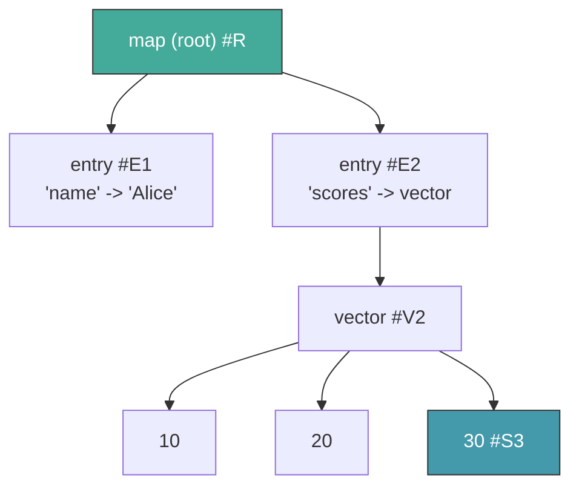
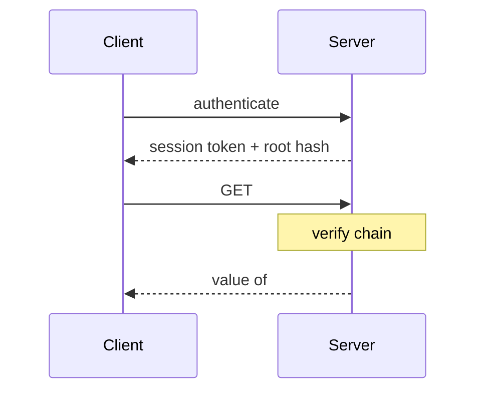
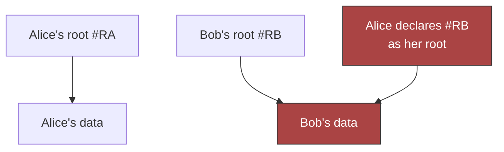
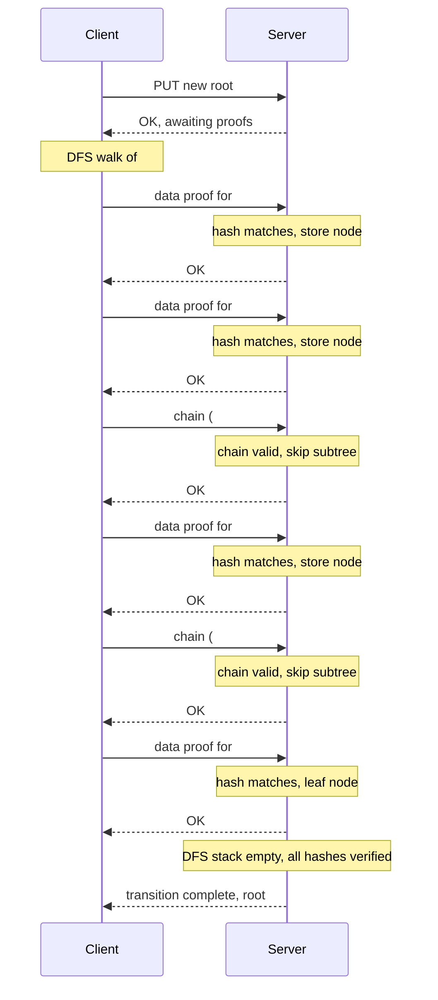

# Chapter 4: Authorization

Chapter 3 gave us stores -- persistence and distribution across machines.
But stores don't care *who* is reading or writing. Any party with network
access can fetch any hash. In a single-user system, that's fine. In a
multi-user system, it's "knowing a hash is authorization."

Dacite rejects this. This chapter adds **authorization** -- proof of
possession, authenticated stores, and the GET/PUT protocols. Together they
give secure access control without ACLs or capabilities -- just structural
proofs over the DAG.

## 4.1 Core Principle

**Knowing a hash does not authorize access to its value.**

Hashes leak -- in logs, URLs, errors. A hash is an *address*, not a *key*.
Dacite's authorization is **structural**: prove you *possess* the data.

## 4.2 Proof of Possession

Every access requires proof of legitimate possession. Two forms:

### Data Possession

Produce the bytes; they hash correctly. Strongest proof.

### Structural Possession

Proof chain: `[root, h1, ..., target]`. Server verifies each parent-to-child
link in the DAG.

### Example

Chain `[#R, #E2, #V2, #S3]`; three lookups confirm reachability.

## 4.3 Two Kinds of Stores (Future)

> **Not yet implemented.** This section describes the target design.

Breaks proof chain circularity:

### Unauthenticated, Read-Only (Session Stores)

No identity; immutable; hold proof chains/metadata. In the current
implementation, `dedicated-store` serves this role -- a scoped mem-store
containing only nodes along a proof chain.

### Authenticated, Modifiable (Main Stores)

Identity-bound; root-managed; user data.

| Store | Auth | Contents |
|-------|------|----------|
| Session | Unauth RO | Proofs/metadata |
| Main | Auth mod | Data |

## 4.4 Reading (GET)

Structural possession only:

Stateless/scoped by DAG.

## 4.5 Writing (PUT)

Full possession (data or structural from *old* root).

### Hash Capture Problem

Alice learns Bob's root `#RB`, declares it -- gains his tree.

### Solution: Client-Driven Proof Stream

The client walks its new root tree in DFS order and sends proofs
sequentially. The server validates each proof as it arrives and responds
OK. If any proof fails, the server rejects and the transition aborts.

For each hash in the new tree, the client sends one of:
- **Data proof** -- the serialized node (new data the server doesn't have)
- **Chain proof** -- a proof chain `[#R, ..., #H]` from the old root (unchanged subtree; cuts off descent)

The server doesn't need to request specific hashes -- both sides walk the
same deterministic DFS over ordered `child-hashes`, so the sequence of
proofs is implicit.

Chain proofs cut off entire unchanged subtrees -- only the modified
spine needs data proofs. The server maintains a DFS stack; each proof
either resolves a hash (chain) or resolves it and pushes its children
(data). When the stack is empty, the transition is complete.

| Client sends | Server action |
|--------------|---------------|
| Data proof | Verify hash, store node, push children |
| Chain proof | Verify chain from old root, skip subtree |

Hash capture fails: declaring Bob's root as your own requires proving
every hash in Bob's tree, which requires either the data or a chain
from *your* old root -- neither of which an attacker has.

GET is a subset of PUT.

## 4.6 Garbage Collection (Future)

> **Not yet implemented.** This section describes the target design.

Liveness = reachable from authorized roots.

Semi-space collector (two strategies, equivalent):

| | Migration | Color Mark |
|--|-----------|------------|
| Mark | Copy to B | Current color |
| Dead | Absent B | Old color |
| Reclaim | Discard A | Delete old |

Online; cost proportional to live data; preserves sharing.

## 4.7 API Surface

### Implemented

| Function | Signature | Description |
|----------|-----------|-------------|
| `build-proof-chain` | `(Store, root, target) -> [Hash] or nil` | BFS path from root to target |
| `verify-proof-chain` | `(Store, [Hash]) -> bool` | Link-by-link chain verification |
| `dedicated-store` | `(Store, [Hash]) -> Store` | Scoped mem-store with chain nodes only |
| `validate-proof` | `(Store, valid-roots, hash, Proof) -> Value or nil` | Verify one proof (chain or data) |
| `verify-transition` | `(Store, valid-roots, new-root, prover) -> Result` | DFS walk, validate proofs via prover fn |
| `apply-transition` | `(Store, valid-roots, new-root, prover) -> Result` | Verify + merge new nodes into store |

The `prover` argument is `(fn [hash] -> {:type :chain, :chain [...]} | {:type :data, :value ...})`.
In Layer 4, `valid-roots` is `#{user-root}`. Layer 5 extends this with share roots.

### Supporting (Layer 2)

| Function | Description |
|----------|-------------|
| `child-hashes` | Ordered vector of child hash references for any node type |

### Properties

- Chain verifies reachability
- PUT requires all hashes possessed (data or structural)
- Invariant: server has all data reachable from old root
- DFS order is deterministic from `child-hashes` ordering
- GC: live = root-reachable (future)

**Depends on Layers 1-3.** Verification logic atop stores.

## 4.8 What This Layer Provides

1. **Secure stores** -- proof of possession prevents hash-as-capability
2. **Stateless auth** -- roots + chains, no session state
3. **Uniform proof model** -- GET/PUT/GC all derive from one concept
4. **Peer-ready** -- both directions use same proof protocol
5. **Client-driven** -- server validates, client controls proof ordering

Chapter 5 adds sharing conventions: shares map atop authorized stores.
