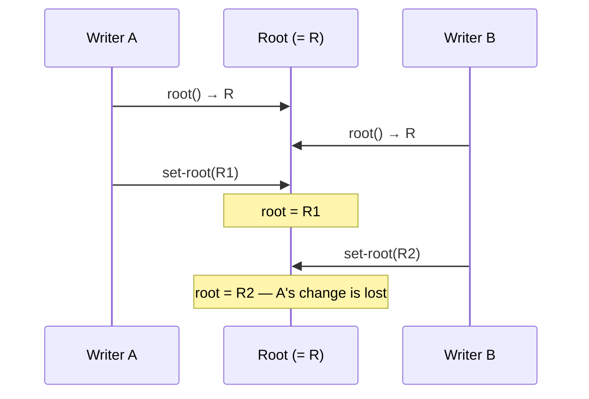

# Chapter 4: Rooted Stores

Writing an application? Use `root-ref` / `ref-swap!` — see
[Commit loops](../guide/commit.md). This chapter is the rooted-store
contract (CAS, watches, GC).

The first three chapters describe an entirely immutable world. A content store (Chapter 1) is a dictionary that only grows; hash fusion (Chapter 2) gives every piece of content a permanent identity; values (Chapter 3) are trees of nodes stored under those hashes. Nothing there ever changes — a value, once stored, is stored forever.

But useful systems change over time. A configuration is edited, a document is revised, a peer learns that "the current state" is now something new. Dacite expresses all of that with **one** mutable cell layered on top of the immutable world:

> A **rooted store** wraps a content store and adds a single mutable **root** — a reference to one hash in the store.

Everything underneath stays immutable. The root is the only thing that moves. "Changing" the data means computing a new value (a new tree of immutable nodes, sharing all the unchanged ones) and then moving the root to its hash.

A rooted store is also a content store: it answers all the content operations of Chapter 1 by delegating to the store it wraps. So it is a drop-in wherever a content store is expected, while additionally exposing the root.

Because a root may be **shared** — several writers, and often across a network — its update contract is the heart of this chapter. That contract is **compare-and-set**.

## 4.1 The Root and Its Operations

A rooted store adds one mutable cell holding a root hash (or *none*, before anything has been stored). Two operations form the **required core** — the entire portable contract, and all that even a remote store must implement:

| Core operation | Meaning |
|---|---|
| `root(store)` | Read the current root hash, or *none*. |
| `cas-root(store, expected, new)` | Atomically set the root to `new` **iff** it currently equals `expected`. Return whether it succeeded. |

`root` is the read; `cas-root` is the one update primitive. Everything else is an **optional convenience** — available on a local store, but constrained or absent for a remote one:

| Optional operation | Meaning | Remote status |
|---|---|---|
| `update-root(store, f)` | Read-modify-write retry loop around `root` + `cas-root`. | **Client-side.** The loop and `f` run on the client using only the two core ops; no new server capability is needed. A *server-side* apply would require shipping `f` to the server to evaluate — a future capability, not offered now. |
| `set-root(store, new)` | Unconditionally set the root. | **Local only.** Unconditional overwrite is unsafe under sharing, so it is deliberately not offered for remote stores. |
| `watch-root(store, key, cb)` / `unwatch-root(store, key)` | Observe root transitions; `cb` receives `(old, new)`. | **Local via callbacks.** A remote implementation needs a push transport (long polling, websockets, SSE) and is therefore protocol-specific and optional. |
| validator | A predicate consulted before a new root is installed. | **Local only.** Enforcing it remotely means evaluating the predicate on the server — the same future code-as-data capability — so it is not offered now. |

Note the deliberate minimalism: there is exactly **one** moving value — a hash — and only **two** operations you must implement to have a working rooted store, remote included.

> The root holds a **hash**, not a materialized value. `root(store)` returns a hash; to see the value it names, hand that hash to the value layer (Chapter 3). Keeping the mutable surface to a single hash is precisely what makes remote roots and synchronization tractable — you coordinate on 32 bytes, not on a whole tree.

## 4.2 Compare-and-Set Is the Core Update

Why single out `cas-root` instead of a plain "set the root"? Because an unconditional set loses updates whenever the root is contended.

Consider two writers that both read root `R`, each build a successor, and each install it:



Whoever writes last wins, and the other writer's change vanishes silently. `cas-root` prevents this: each writer installs `new` only if the root is still the `expected` value it built upon. The loser's CAS fails — the root has already moved — so it must **rebuild on the new root and retry**:

```
update-root(store, f):
    loop:
        old = root(store)
        new = f(old)                     # build a successor value; store its nodes
        if cas-root(store, old, new):
            return new                   # success
        # else: someone moved the root — loop, re-read, rebuild on the new old
```

This read-modify-write-retry loop touches only the two core operations — `root` and `cas-root` — so `update-root` is a client-side convenience, not a capability the store (or a server) must provide specially. It is also the *only* safe way to evolve a shared root. `set-root` is merely the degenerate case where you know there is no contention (a fresh store, a single writer, initialization); it is a local convenience and is not offered for remote stores. Everything else — concurrent local writers, and especially **remote** stores — goes through CAS.

For a **remote** store, `root` is a network read and `cas-root` is an operation the **server performs atomically** against its authoritative root: the client sends `(expected, new)`, the server compares and swaps under its own lock, and reports success or a conflict. The correctness of the whole distributed picture rests on that single server-side compare-and-set. An unconditional remote "set root" cannot be made safe under concurrency; it is not offered as the primitive for that reason.

## 4.3 Building a Successor

"Changing" data means computing a new immutable value and moving the root to it. Expressed with `update-root`:

```
update-root(store, fn(old):
    m  = value-at(store, old)       # Chapter 3: rehydrate the value at the root
    m' = assoc(m, "count", 42)      # structural edit — new nodes stored, unchanged nodes shared
    return hash-of(m'))             # the successor root hash
```

Because the value layer stores every node it builds *before* returning the successor hash, by the time `cas-root` runs, all nodes the new root reaches are already present in the content store. Installing the root is the final, atomic step — the store never points at content that isn't there.

Replacing the root does not delete the old tree; nodes unique to it become detached (§4.6). And if a concurrent writer moved the root first, the CAS fails and the whole function re-runs against the new root — automatically rebasing the edit onto the latest state.

## 4.4 Observing Changes

Because the root is a single observable cell, others can react to its transitions:

- **Locally**, register a callback that fires on each successful root change with `(old, new)`.
- **Remotely**, subscribe to the server's root stream — an optional capability whose exact shape depends on the transport (long polling, websockets, server-sent events).

```
watch-root(store, :sync, fn(old, new):
    log("root moved", old, "->", new))
```

Observation is what makes a rooted store *reactive*: a root move can drive a re-render, a log entry, or a push to a peer (§4.7). Both observation forms are optional — local callbacks come for free, while remote subscription is protocol-specific.

A store may also guard transitions with a **validator** — a predicate consulted before a new root is installed, rejecting ones that fail it. A validator runs wherever the commit is decided, so it is a **local-only** convenience for now; enforcing one on a remote store would mean evaluating the predicate server-side, a future code-as-data capability.

## 4.5 Durability: the Root Cell

The root must outlive the process. A rooted store persists it through a small abstraction, the **root cell**, which knows only how to load and store a single hash:

- **memory root cell** — holds the hash in memory; ephemeral, for tests and REPL use.
- **LMDB root cell** — persists the hash in the LMDB meta database, reusing the same environment as an LMDB content store.

```
rooted-store(content-store)                       # ephemeral root (default)
rooted-store(content-store, lmdb-root-cell(lmdb)) # durable root beside LMDB content
```

On construction the store seeds its in-memory root from the cell; on every successful update it flushes the new root back to the cell. Reopening the store recovers the last root.

Note the clean separation of responsibilities: the **content store** persists nodes; the **root cell** persists the one hash that says which node is current. They may share a backend (LMDB), but they are distinct concerns.

## 4.6 Detached Nodes and Garbage Collection

Any entry reachable from the current root is **live**. Entries that were reachable under a previous root but are not part of the current tree are **detached**. They remain in the content store until garbage collection removes them.

GC is fundamentally a value-aware traversal, and it needs both halves of this layering: the **root** (this chapter) as the starting point, and the **value model** (Chapter 3) to deserialize a node and discover its child references. Starting from `root(store)`, mark every reachable node; anything unmarked is detached and may be reclaimed. The content store itself knows nothing about reachability — it only maps hashes to values — which is exactly why GC lives up here with roots and values rather than down in the content store.

## 4.7 Sync Between Stores

Synchronization copies one store's root onto another. Framed in terms of §4.2, moving `target` to `source`'s root is a **compare-and-set on the target**:

```
push(source, target):
    cas-root(target, root(target), root(source))
```

Because the target may itself be changing, a push can lose the CAS and need to be reconciled just like any other update — there is no privileged "force set" for a shared target. Push deliberately transfers only a **hash**; the underlying content must already be present at the target or be synced separately. Deciding when to push, and how to move the content a new root depends on, are application concerns; the rooted store provides only the atomic root move.

This is the seam through which peers coordinate: a source installs a new root (via CAS), then pushes that hash; subscribers on the target observe the new root and fetch whatever content they lack.

## 4.8 What This Layer Provides

1. A single mutable **root** — one hash — over an immutable content store.
2. A **two-operation portable core** — `root` and `cas-root` — sufficient for any store, local or remote; `cas-root` is the one update primitive.
3. Optional conveniences over the core: `update-root` (a client-side retry loop), `set-root` (local, uncontended), observation via `watch-root` (local callbacks; remote is transport-specific), and validators (local for now).
4. **Durable roots** via a root cell, kept separate from content persistence.
5. **Content-store delegation**, so a rooted store is a drop-in content store that also has a root.
6. **Push** as an atomic, CAS-based sync primitive between stores.

With this, Dacite has both halves of its model: an immutable world of content-addressed values, and one mutable pointer — governed by compare-and-set — that lets that world evolve and be shared. Future work (see the roadmap) builds distribution and event flows on exactly this root-and-CAS foundation.

## Reference Implementation (Clojure)

The abstract operations above are language-neutral; a port to any language need only provide the **core** two. The Clojure reference implementation surfaces the operations through Clojure's standard reference protocols, so a *local* rooted store behaves like an idiomatic mutable reference:

| Concept (§4.1) | Clojure surface | Tier |
|---|---|---|
| `root(store)` | `@store` / `(deref store)` — `IDeref` | **core** |
| `cas-root(store, expected, new)` | `(compare-and-set! store expected new)` — `IAtom` | **core** |
| `update-root(store, f)` | `(swap! store f)` — `IAtom`, a CAS retry loop | optional (client-side) |
| `set-root(store, new)` | `(reset! store new)` — `IAtom` | optional (local) |
| `watch-root` / `unwatch-root` | `(add-watch store k cb)` / `(remove-watch store k)` — `IRef` | optional (local; remote = transport) |
| validator | `(set-validator! store pred)` — `IRef` | optional (local) |

A **local** rooted store implements the whole set (`IDeref`, `IRef`, `IAtom2`) for free — `compare-and-set!` *is* the core primitive of §4.2 and `swap!` *is* its retry loop. A **remote** rooted store need implement only the core two (`deref` and `compare-and-set!`); it does not offer `reset!` (`set-root`) or validators, realizes `swap!` (`update-root`) as a client-side loop over the core, and exposes watches only if its transport supports them. The value never escapes being a single root hash, so these interfaces stay a thin, faithful skin over the language-neutral contract — not a dependency of it.
