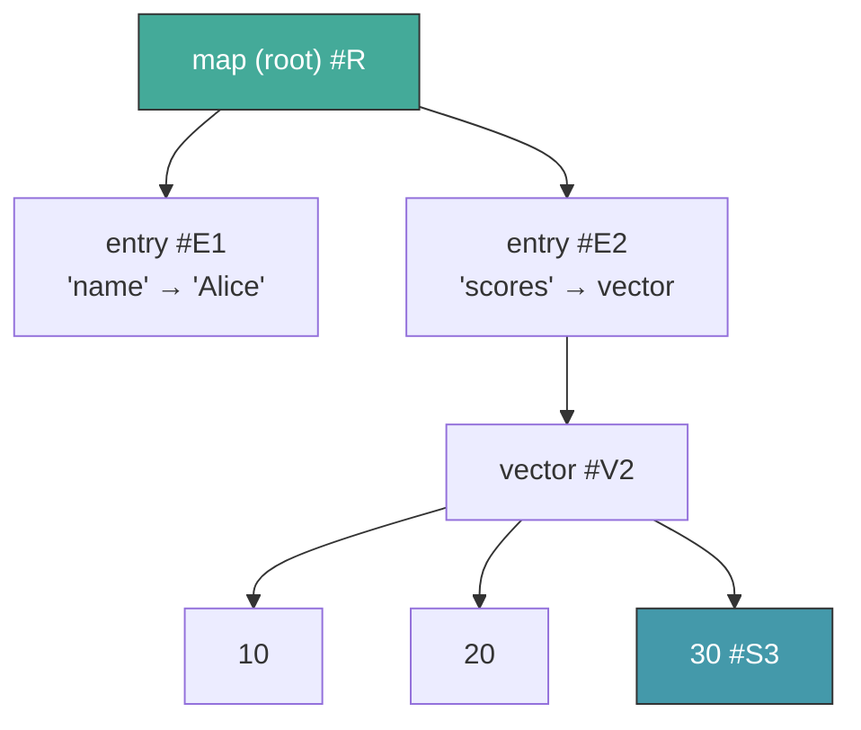
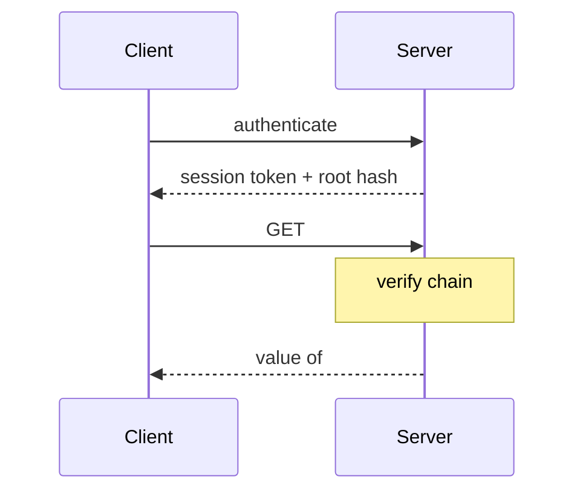
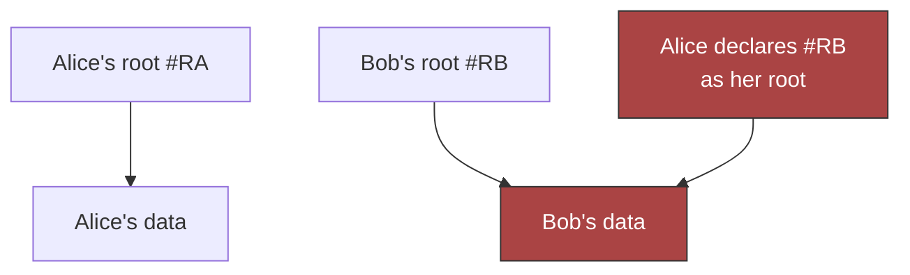
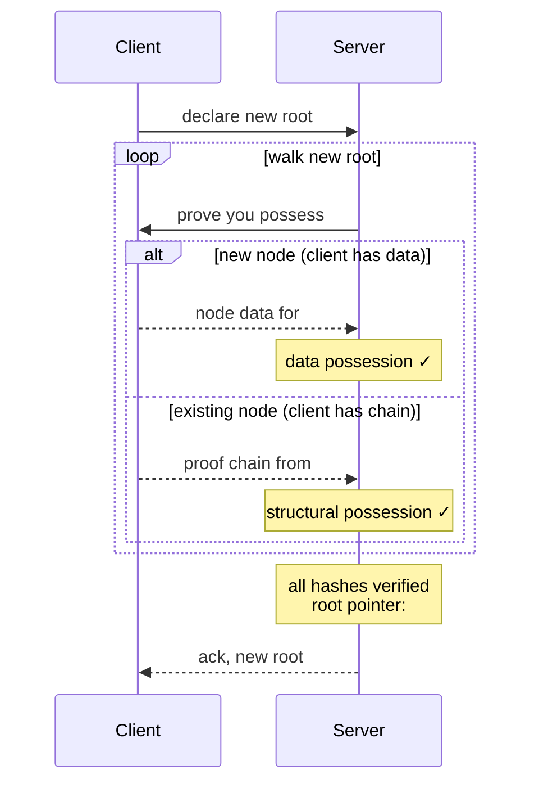
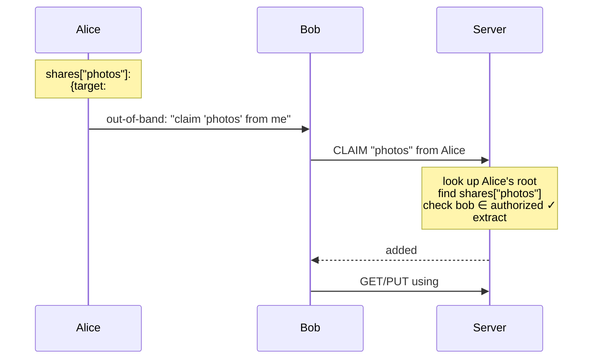
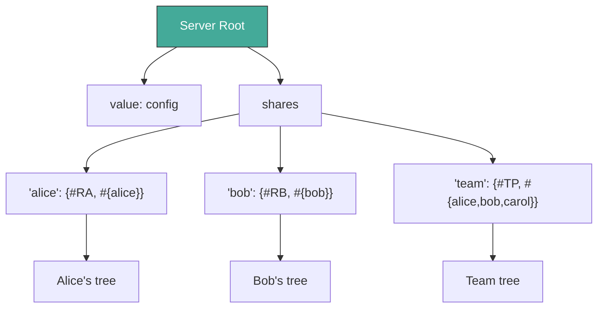
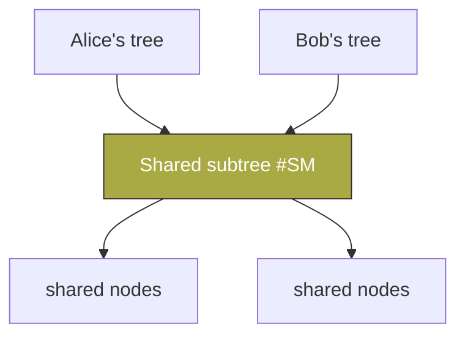

# Chapter 4: Sharing

Chapter 3 gave us stores — persistence, distribution, and lazy loading
across machines. But stores don't care *who* is reading or writing.
Any party with network access to a store can fetch any hash. In a
single-user system, that's fine. In a multi-user system, it's a
security model that says "knowing a hash is authorization."

Dacite rejects this. This chapter adds **sharing** — the authorization
layer. It introduces one concept (proof of possession), one convention
(the shares map), and one protocol (claim). Together they give
multi-user access control without ACLs, tokens, or capabilities —
just values in stores.

## 4.1 Core Principle

**Knowing a hash does not authorize access to its value.**

Content-addressed systems tempt you into treating hash-knowledge as
a capability. If you know the hash, you can ask for the data — and
since hashes are unforgeable, doesn't that prove you're entitled?

No. Hashes leak. They appear in logs, in URLs, in error messages. A
hash is an *address*, not a *key*. Conflating the two is the
content-addressed equivalent of security through obscurity.

Dacite's authorization is **structural**: you prove you *possess* the
data, not merely that you know where it lives.

## 4.2 Proof of Possession

Every access — read or write — requires the requester to prove they
legitimately possess the data in question. There are exactly two forms.

### Data Possession

You have the actual bytes. You can produce the value, and it hashes
to the claimed address. This is the strongest form — if you can hand
someone the data, you obviously possess it.

### Structural Possession

You can prove the hash is **reachable** from a root you're authorized
to access. The proof is a **proof chain**: an ordered sequence of
hashes from root to target where each step is a parent→child
relationship in the DAG.

```
proof_chain = [root, h1, h2, ..., target]
```

The server verifies each link: the node at `h_n` must contain a
reference to `h_{n+1}`. If every link checks out, the requester has
proven structural possession of the target.

### Example

Consider a map `{"name" "Alice", "scores" [10, 20, 30]}`:



To prove possession of `30` (#S3), the proof chain is
`[#R, #E2, #V2, #S3]`. Verification:

| Link | Check | Result |
|------|-------|--------|
| #R → #E2 | #R contains #E2? | ✓ (entry child of map) |
| #E2 → #V2 | #E2 contains #V2? | ✓ (value ref of "scores") |
| #V2 → #S3 | #V2 contains #S3? | ✓ (element of vector) |

Three lookups. The DAG structure *is* the access control.

## 4.3 Two Kinds of Stores

Authorization creates a bootstrapping problem: proof chains themselves
need to be exchanged, but requiring proof chains to access proof chains
is circular. Dacite breaks the cycle by distinguishing two store types.

### Unauthenticated, Read-Only Stores

- No identity required — any party with access can read
- Immutable — values are written once, never modified
- Limited scope — hold proof chains, session metadata, coordination
- Purpose — facilitate authorization without circular dependencies

### Authenticated, Modifiable Stores

- Identity required — bound to an authenticated session
- Root-managed — a service layer maintains root hash pointers
- General purpose — hold all user data (Dacite values)
- Purpose — the primary data store

Every read requires structural possession (proof chain from the user's
root). Every write requires full possession (data or structural).

### How They Compose

| Store | Auth Level | Contents |
|-------|-----------|----------|
| Session store | Unauthenticated, read-only | Proof chains, metadata |
| Main store | Authenticated, modifiable | User data |

The session store holds the authorization data itself. The main store
holds the data being authorized. This separation is what makes the
system non-circular.

## 4.4 Reading (GET)

Reading requires **structural possession only** — a proof chain from
the reader's authorized root to the target hash.



The server verifies each link against its own store. If valid, it
serves the node.

**Properties:**

- **Stateless verification.** The server needs no per-session state
  beyond the user's root hash. Any server with the main store can
  verify any proof chain.
- **Scoped by construction.** A proof chain can only reach nodes
  structurally below the root. No ACLs needed — the DAG structure
  *is* the access control.

## 4.5 Writing (PUT)

Writing requires **full proof of possession** — both forms. This is
strictly stronger than reading, because the writer must account for
every hash referenced by the new root.

### The Problem: Hash Capture

Without PUT-side authorization, a shared store is exploitable.



If Alice learns Bob's root hash `#RB`, she declares it as her own
root. The server accepts — it has all the nodes. Alice now has a
structurally valid proof chain from "her" root to everything in
Bob's tree. **Knowing a hash has become a capability.**

### The Solution: Prove You Had It

When a client declares a new root, every referenced hash must be
**legitimately possessed**. The server walks the new root and, for
each hash, issues a uniform challenge:

**"Prove you possess #H."**

The server does not reveal whether it already has the data. The
client responds with whichever form of proof it has:

- **Data possession** — send the bytes. The server verifies the hash.
- **Structural possession** — send a proof chain from the *old* root.
  The server verifies each link.

The client's choice is natural: if it created the node, it sends
the data (it has no chain). If the node existed in its previous
tree, it sends a chain (cheaper than retransmitting).

### Root Transition Protocol

The old root remains valid until the new root is fully verified.
The transition is atomic.



The server never discloses its internal state. The client cannot
deduce which hashes the server already has.

### The Server Always Has Structurally-Proven Data

A subtle but critical property: if the client sends a structural
proof chain (from old root to #H), the server is **guaranteed to
already have the data at #H**.

Why? The chain proves #H is reachable from the client's old root.
The server stored the old root's entire reachable tree — that's
what the previous PUT ensured. So every hash reachable from the
old root is already in the server's store.

The two proof forms partition cleanly:

| Client sends | Meaning | Server's state |
|---|---|---|
| Node data | Client created this node | Server gets new data |
| Proof chain | Node existed in previous tree | Server already has it |

There is no case where the client sends a valid proof chain for data
the server lacks. The invariant is maintained inductively: each
verified PUT ensures the server has all reachable data, which makes
the next PUT's structural proofs sound.

### Why Hash Capture Fails

When Alice pushes a root referencing Bob's hash `#BD`:

1. The server challenges: "prove you possess `#BD`"
2. Alice cannot provide the data — she doesn't have Bob's bytes
3. Alice cannot provide a chain — no path from her old root to `#BD`
4. **PUT rejected.**

Alice never learns whether the server had `#BD` or not. The challenge
is the same either way.

### Why Structural Sharing Works

When Alice mutates her own data (`assoc "key" new-value`), the new
root shares most subtrees with the old root. For shared subtrees,
Alice proves reachability from her old root — trivially valid. For
new nodes, she provides the data. No retransmission of unchanged
subtrees.

### GET vs PUT

| | GET (Read) | PUT (Write) |
|---|---|---|
| **Proves** | Structural possession only | Full possession (both forms) |
| **Mechanism** | Proof chain from current root | Data OR chain from old root |
| **Prevents** | Reading outside your tree | Capturing data outside your tree |

GET is a subset of PUT. Both are applications of proof of possession.

## 4.6 The Shares Map

So far, each user has a single root that scopes their access. But
multi-user systems need sharing — Alice wants to give Bob read
access to her photos without giving him her entire tree. Earlier
chapters established the tools; this section shows how sharing
emerges from a naming convention on top of them.

### Root Structure Convention

Every participant (user or server) uses the same root structure:

```
root: {
  "value":  <the participant's own data>
  "shares": {<name>: {target: #hash, authorized: #{...}}, ...}
  "groups": {<name>: #{...}, ...}
}
```

- **`"value"`** — the participant's application data. The sharing
  mechanism never touches this.
- **`"shares"`** — a map of named share entries. Each entry has:
  - **`target`** — the hash of the shared subtree
  - **`authorized`** — the set of identities who may claim this share
- **`"groups"`** — reusable authorization sets (see §4.8)

All three fields are ordinary Dacite values, managed through normal
PUTs. No new primitives. No new protocols.

### The Claim Protocol

Sharing requires two things: a share entry in the sharer's root,
and an out-of-band exchange of the share name.



**Steps:**

1. **Alice** creates a share entry via normal PUT:
   `shares["photos"] = {target: #T, authorized: #{bob}}`
2. **Alice → Bob** (out-of-band): the share name `"photos"` and
   Alice's identity. A text message, QR code, email — anything.
3. **Bob → Server**: `CLAIM "photos" from Alice`.
4. **Server**: looks up Alice's root, navigates to
   `shares["photos"]`, checks Bob is in the `authorized` set,
   extracts `#T`, adds it to Bob's valid roots.
5. **Bob**: uses `#T` as a proof root for GET (read shared data)
   or PUT (incorporate into his own tree via structural proofs).

### The Server Uses Shares Too

The server is not special. It uses the same shares map to manage
user access:

```
Server's root: {
  "value":  <server config/metadata>
  "shares": {
    "alice":        {target: #RA, authorized: #{alice}}
    "bob":          {target: #RB, authorized: #{bob}}
    "team-project": {target: #TP, authorized: #{alice, bob, carol}}
  }
}
```

User authentication is **claiming your share from the server.** There
is no separate concept of a user table or service root map. The
server is a participant that shares subtrees with its users using
the same mechanism it provides to them.



One mechanism everywhere. Turtles all the way down.

## 4.7 Shares Are Read-Only

A claimed share grants **read access only**. The claimant can GET
data under the shared target hash and can use it as a proof root
to incorporate data into their own tree via PUT. But the claimant
cannot modify the sharer's tree — writes go to the claimant's own
root.

To propose changes back, the claimant creates their own share entry
pointing to their modified version. Alice shares a document with Bob.
Bob claims it, edits it, then shares his version back with Alice.
Two participants, same mechanism, no special "write-back" protocol.

## 4.8 Named Groups

Authorization sets can be defined once and referenced by name:

```
root: {
  "value":  <data>
  "shares": {
    "photos":  {target: #T1, authorized: "team"}
    "docs":    {target: #T2, authorized: "team"}
    "private": {target: #T3, authorized: "just-me"}
  }
  "groups": {
    "team":    #{alice, bob, carol}
    "just-me": #{alice}
    "public":  #{neg}
  }
}
```

The claim check resolves the `authorized` field: if it's a string,
look up the group in `"groups"` and check membership; if it's a set,
check membership directly.

**Properties:**

- **Update once, apply everywhere.** Add Dave to `"team"` → he can
  claim all team shares. One PUT.
- **Revoke once.** Remove Carol from `"team"` → all her team shares
  stop working.
- **Readable.** Share entries say *what* the group is, not who's in it.
- **Same machinery.** Groups are just another map in the root, managed
  via normal PUTs. No new protocol concepts.
- **Groups are values.** Alice can share her team group with Bob using
  the same shares mechanism — it's just data under her root.

## 4.9 Share Types

The authorized set naturally distinguishes sharing patterns. Since
authorized sets are Dacite sets, they support both positive
(enumerated) and negative (cofinite) forms:

| Pattern | Authorized set | Example |
|---------|---------------|---------|
| **Private** | `#{alice}` | Alice's personal data |
| **Direct** | `#{alice, bob}` | Alice shares with Bob |
| **Shared space** | `#{alice, bob, carol}` | Team project |
| **Public** | `#{neg}` | Open data, anyone can claim |
| **Public with exceptions** | `#{neg, eve}` | Everyone except Eve |

A **negative set** (Chapter 2, §2.4) represents "everyone except
these elements." The empty negative set `#{neg}` means "everyone is
authorized." This enables public sharing without enumerating all
possible users.

All patterns use the same mechanism. No special cases.

## 4.10 Named References

Share names are chosen by the sharer and serve as **named references**
under the sharer's control. Alice can:

- **Update the target** — point `"photos"` at a new hash on her next
  PUT. Bob claims again and gets the latest version. Living shared
  folder behavior, naturally — Alice is simply updating her own map.
- **Revoke access** — remove Bob from the authorized set, or remove
  the share entry entirely. Bob retains what he already incorporated
  (immutable data doesn't un-exist), but can no longer claim updates.
- **Expand access** — add Carol to the authorized set.

No protocol-level mutable references. Named references live in
participant data, managed via normal PUTs.

## 4.11 Common Patterns

**Alice shares photos with Bob.** Alice adds
`shares["photos"] = {#T, #{bob}}`. Tells Bob the name. Bob claims,
reads the photos. Alice updates the target when she adds new photos.
Bob re-claims to see updates.

**Bob edits Alice's document.** Alice shares a doc subtree with Bob.
Bob claims it, incorporates it into his tree, edits. Bob creates a
share entry pointing to the edited version, authorized for Alice.
Alice claims Bob's share and reviews. Two participants, same mechanism.

**Team shared space.** Server creates
`shares["team-project"] = {#TP, #{alice, bob, carol}}`. All three
claim and work with the subtree. Conflict resolution (simultaneous
PUTs) is a policy concern, not a protocol one.

**Public data.** Alice adds `shares["open-data"] = {#T, #{neg}}`.
Anyone can claim. No user enumeration needed.

**Revoking access.** Alice removes Bob from the authorized set via
normal PUT. Bob can no longer claim. No blacklists, no negative
permissions — Alice updated her own data.

## 4.12 Structural Sharing Across Users



When Alice shares a subtree with Bob and Bob incorporates it, both
roots reference the same underlying nodes. This is natural
content-addressed deduplication — no special mechanism. Each user
proves access through their own root. Neither can access the other's
unshared data.

## 4.13 Audit Trail

The sequence of proof chains submitted during a session forms a
natural audit trail: the server knows exactly which paths the client
walked. Proof chains are Dacite values (immutable, content-addressed)
and can be retained as access records.

No separate audit system. The authorization mechanism *is* the audit
mechanism.

## 4.14 Garbage Collection

Content-addressed stores are append-only. Mutations leave orphaned
nodes — subtrees no longer reachable from any participant's root.
Authorization defines what's "live": a node is live if and only if
it's reachable from some participant's root. Everything else is
garbage.

Dacite GC is a **semi-space collector** with two equivalent
strategies:

### Store Migration (Copying Collection)

1. Create a new empty store B
2. Walk from all live roots, copying reachable nodes from A to B
3. Swap B in for A; discard A

The mark is **presence in the new store.**

### Color Marking (Mark-and-Sweep)

1. Walk from all live roots, marking reachable nodes with the
   current color. New writes also use the current color.
2. Cull all nodes with the previous color.
3. Alternate colors each cycle.

The mark is **a color bit** (red or green).

### Equivalence

| | Store Migration | Color Marking |
|---|---|---|
| Mark live | Copy to new store | Set to current color |
| Identify dead | Absent from new store | Previous color |
| Reclaim | Discard old store | Delete previous-color nodes |
| Two spaces | Store A / Store B | Red / Green |

Both support online collection without pausing writes. Store
migration routes reads through both stores during copy; color marking
uses the live color for new writes while the background walk proceeds.

**Properties:**

- **No reference counting.** No per-node bookkeeping during normal
  operations.
- **Cost proportional to live data.** You pay for what you keep.
- **Structural sharing preserved.** Shared subtrees are visited once.

## 4.15 What This Eliminates

The shares map replaces several concepts that appeared in earlier
design iterations:

| Eliminated | Replaced by |
|------------|------------|
| Grants with lifecycle management | Share entries in participant data |
| Scoped delegation sessions | Not needed — claimant gets a valid root |
| Delegation as a distinct concept | Two-way shares |
| Hash-pinned vs path-pinned debate | Named refs in participant's own map |
| Server-side gift tables or PR queues | Sharer's root read at claim time |
| Service root map as special concept | Server's own shares map |

## 4.16 API Surface

### Primitives (Authorization Protocol)

| Function | Signature | Description |
|----------|-----------|-------------|
| `verify-chain` | `(Store, [Hash...]) → bool` | Verify a proof chain link by link |
| `challenge` | `(Store, Hash, Hash) → Proof` | Request proof of possession for a hash |
| `verify-proof` | `(Store, Hash, Proof) → bool` | Verify data or structural proof |
| `transition-root` | `(Store, Hash, Hash) → Store` | Atomic root transition after full verification |

### Primitives (Sharing Protocol)

| Function | Signature | Description |
|----------|-----------|-------------|
| `claim` | `(Server, identity, sharer, name) → Hash` | Claim a named share |
| `resolve-authorized` | `(Root, authorized) → Set` | Resolve string→group or pass-through set |
| `authorized?` | `(Root, name, identity) → bool` | Check if identity can claim a share |

### Derived

| Function | Derivation | Description |
|----------|------------|-------------|
| `get-shared` | `claim` + `verify-chain` + `get` | Read from a claimed share |
| `share` | `hamt-assoc` on shares map | Create/update a share entry |
| `unshare` | `hamt-dissoc` on shares map | Remove a share entry |
| `add-to-group` | `hamt-assoc` on groups map | Add identity to a named group |
| `remove-from-group` | `hamt-dissoc` on groups map | Remove identity from group |

### Properties

- `verify-chain(store, [r, ..., t])` ⟹ `t` is reachable from `r`
- `claim` succeeds iff `identity ∈ resolve-authorized(root, shares[name].authorized)`
- PUT succeeds iff every hash in new root is provably possessed
- Hash capture is impossible: no chain from old root → no data → PUT rejected
- Server root uses same structure as user roots
- Proof chains are Dacite vectors — values, storable, auditable
- GC preserves all nodes reachable from any live root
- `share` + `claim` composes: Bob can re-share anything under his root

**This layer depends on Layers 1–3.** It introduces no new data
structures — only conventions (root structure, claim protocol) and
verification logic on top of existing stores and values.

## 4.17 What This Layer Provides

1. **Authorization without ACLs** — proof of possession scopes
   access structurally. The DAG *is* the permission model.
2. **Multi-user sharing** — the shares map, named groups, and claim
   protocol give flexible access control using only values in stores.
3. **Uniform mechanism** — users share with users, the server shares
   with users, all using the same root structure and protocol.
4. **No new primitives** — Layer 4 is entirely conventions and
   verification logic. The shares map is a Dacite map. Groups are
   Dacite sets. Proof chains are Dacite vectors.
5. **Clean layering** — hash fusion → values → stores → sharing.
   Each layer is independently implementable and testable.

This is the top of the stack. Four layers, one primitive operation,
and a system that scales from a single-user data structure library
to a distributed multi-user platform.
