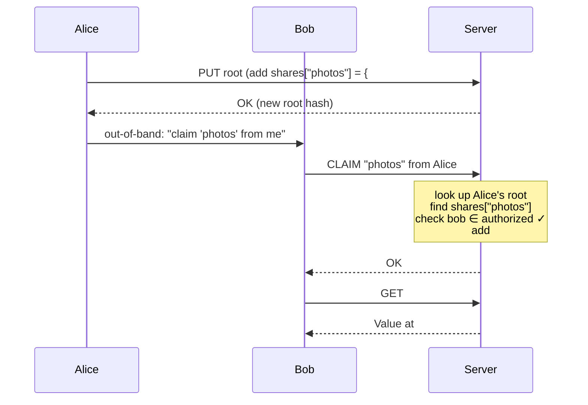
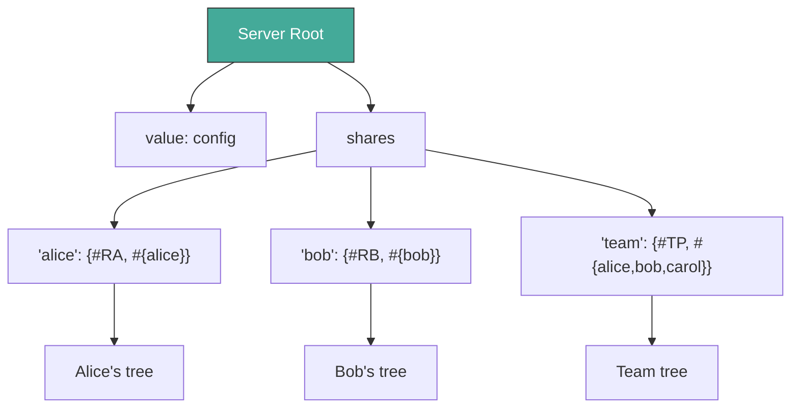
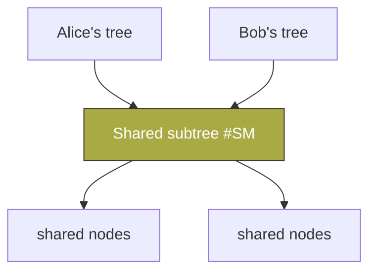

# Chapter 5: Sharing

Chapter 4 gave us authorized stores. Every user has their own root, and access to any node must be proven from that root. This works well for private data. But it creates a practical question: how does Alice give Bob read access to just one subtree without handing over her entire root?

The answer is surprisingly simple. We do not add new primitives to the store or the authorization protocol. Instead, we establish a convention inside every root and a small `claim` protocol that lets one user ask the server for access to a subtree that someone else has offered. Users share with users, and the server shares with users, all through the same mechanism.

## 5.1 Claim Protocol

Let us walk through a concrete example. Alice has a collection of photos stored under her root. She wants to share just that collection with Bob, but she does not want to give him access to anything else she owns.

First, Alice updates her root to record the offer. She adds an entry in a `shares` map that says, in effect, "I am offering the subtree at hash `#T` to Bob." She does this with a normal PUT, the same operation she uses for any other change to her data.

Next, Alice tells Bob about the offer through some out-of-band channel. She might send him a message that says, "claim the photos share from me." Bob does not yet have the hash `#T`. He only knows the name Alice gave the share.

Bob now contacts the server and says, "I would like to claim the share named `photos` from Alice." The server looks up Alice's current root, finds the `shares` entry for `photos`, checks whether Bob is in the authorized set, and if so, adds the target hash `#T` to Bob's session-scoped set of claimed roots. From that moment on, Bob can issue GET requests against `#T` (and any subtree under it) using the normal proof chain mechanism. His access is strictly read-only: he may not replace the value at `#T` itself. He may, however, create new values under his own primary root that reference or incorporate content reachable from `#T`.



The sequence is straightforward once you see it in action. Alice offers. Bob claims. The server validates the claim against Alice's current root and grants Bob an additional valid root for the duration of his session. No special server state is required beyond what is already stored in Alice's root. The set of claimed roots lasts only for the current session. Bob must re-claim any shared roots in each new session. This keeps the server stateless with respect to long-lived claims.

A subtle but important point: Alice is sharing a specific value (the immutable content reachable from `#T`), not an ongoing pointer to a location that might change. Because Dacite values are content-addressed and immutable, once Bob receives `#T` he has permanent access to that exact value and everything it contains. If Alice later wants Bob to see an updated version of the photos, she must create a new value at a new hash and either update the target in her existing share or create a fresh share entry. There is no way for her to retroactively alter what Bob already received.

One alternative design would have been to record claimed roots persistently in a `claims` map inside Bob's root, similar to how `shares` records offers. This would let Bob work with only a single root and would make shared access survive across sessions. However, it would require the server (or the client convention) to decide where received shares live in the user's tree. An inbox? A Downloads-style directory? A special `received` subtree? Different applications would naturally want different organizations, and enforcing one canonical location would make the sharing layer more opinionated than necessary. By keeping claimed roots session-scoped, the mechanism stays lightweight and the client is free to incorporate shared data into its own tree however it chooses.

## 5.2 Root Structure Convention

The `shares` map lives inside the root alongside the user's actual application data. A typical root looks like this:

```
root = {
  "value": <app data>,
  "shares": {name: {target: #H, authorized: Set}, ...},
  "groups": {name: Set, ...}
}
```

The `value` field holds whatever the application cares about. The `shares` field records offers the user has made to others. The `groups` field lets the user define named sets of identities so that a single share can be offered to an entire group without listing every member.

All of this is ordinary data. Alice modifies her shares map the same way she modifies any other part of her tree. The server never interprets the contents of `value`. It only looks at `shares` and `groups` when processing a claim request.

## 5.3 Server Uses Shares

The server participates in the same sharing model. When a user first authenticates, the server looks up that user's entry in its own root's `shares` map. That entry contains the user's root hash and the set of identities authorized to claim it. The user is effectively claiming their own identity from the server.

This uniformity is deliberate. There is no special server-side session table or capability list. The server root is just another Dacite root, and the same claim protocol that lets Bob access Alice's photos also lets Alice access her own data after authentication.

```
server-root.shares = {
  "alice": {#RA, #{alice}},
  "team": {#TP, #{alice,bob}}
}
```

In this example, Alice can claim `#RA` for herself, and both Alice and Bob can claim the team root `#TP`. The server does not need to maintain any additional state beyond its own root.



## 5.4 Read-Only Access and Write-Back

When Bob claims a share from Alice, he receives a read-only view. He can traverse the subtree at `#T` and he can incorporate any of its contents into his own tree, but he cannot modify Alice's data directly. If he wants to propose changes, the natural pattern is for him to create his own version of the subtree and then share that version back to Alice. Alice can then review the changes and merge them if she chooses.

This keeps the protocol simple. There is no write-back delegation or complex merge negotiation at the store level. Users collaborate by sharing data, modifying it in their own trees, and sharing the results back.

## 5.5 Named Groups

The `groups` map inside a root lets a user define named sets of identities. Instead of listing every member in the `authorized` set of a share, Alice can write `authorized: "team"`. The server resolves that name against Alice's `groups` map at claim time.

Updating the group updates access everywhere the group name is used. This is ordinary data manipulation, not a special administrative operation.

Public sharing is also supported through a convention. The set `#{neg}` means "everyone except the listed members." A share with `authorized: #{neg}` is effectively public. The cofinite set convention was introduced in Chapter 2 as part of the set type and is reused here without any new machinery.

## 5.6 Share Types

The same `shares` structure supports several common patterns:

- **Private**: `#{me}` — only the owner can claim it.
- **Direct**: `#{me, bob}` — the owner plus one other party.
- **Shared**: `#{team}` — any member of a named group.
- **Public**: `#{neg}` — anyone at all.

Because the `authorized` field is just a set, any of these patterns is expressed the same way. The server does not treat them differently.

## 5.7 Named Refs and Revocation

A share records a target hash. If Alice later updates the content behind that hash, Bob will still see the old version unless he re-claims the share. This gives Alice a natural way to publish updates: she changes the target in her `shares` entry, and anyone who re-claims receives the new hash.

Revocation is similarly straightforward. Alice can remove Bob from the `authorized` set, or she can remove the share entry entirely. The next time Bob attempts to claim, the server will refuse. There is no need for a separate revocation list or lifecycle protocol. The share simply ceases to exist or ceases to include Bob.

## 5.8 Common Patterns

Several usage patterns emerge naturally from this model.

For a photo album, Alice keeps the target hash up to date. When she adds new photos, she updates the subtree and changes the share target. Bob re-claims to see the latest version.

For collaborative editing, Bob reads Alice's subtree, makes changes in his own tree, and shares the modified subtree back to Alice. Alice reviews the changes and can merge them into her version if she wishes.

For a team workspace, the team root is shared with a group. Any member can read and, if they have write permission on the share, can also update the shared content. The group membership is managed in one place, the owner's `groups` map.

## 5.9 Cross-User Sharing and Deduplication

When multiple users share the same subtree, they all reference the same content hashes. Dacite's content addressing means the underlying nodes are stored only once. The sharing mechanism does not create copies. It simply gives multiple roots permission to reach the same nodes.



This is the same structural sharing that Dacite provides within a single tree, extended across users.

## 5.10 Audit

Every access is accompanied by a proof chain. The server can record which root was used for each request, and the chain itself shows the path from that root to the accessed node. This provides a natural audit trail without any additional logging mechanism.

## 5.11 Eliminated Concepts

The sharing design removes several ideas that were considered earlier:

- Grants with explicit lifecycles are replaced by ordinary shares that live in the data.
- Gift queues and pending offers are replaced by the claim-time lookup against the current root.
- A special service root or capability table is replaced by the server's own use of the shares map.

All of these simplifications follow from the same principle: keep the protocol uniform and let the data carry the policy.

## 5.12 API Surface

The new operations are minimal.

### Primitives

| Fn            | Signature                                      | Description                              |
|---------------|------------------------------------------------|------------------------------------------|
| `claim`       | `(Server, id, sharer, name) → #H`              | Attempt to claim a named share           |
| `authorized?` | `(Root, name, id) → bool`                      | Check whether an identity may claim      |

### Derived Operations

The functions `share`, `unshare`, and `add-group` are ordinary HAMT operations on the root map. They require no special protocol support.

Zero new primitives are added to the store or authorization layers. Sharing is a convention built on top of Chapter 4.

## 5.13 What This Provides

1. **Subtree sharing** — Access is scoped by construction to whatever the sharer puts under the target hash.
2. **Uniform mechanism** — The server and ordinary users participate in the same protocol.
3. **Mutable references** — The target of a share can be updated through normal PUT operations.
4. **Composability** — A user can re-share data they received from someone else, creating chains of delegation without any special support.

The top of the stack is now complete: hash fusion, values, stores, authorized stores, and sharing conventions. Each layer adds capability without introducing new primitives at the layers below.