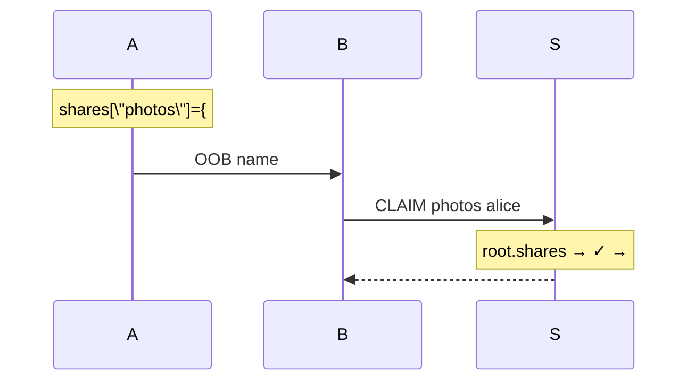

# Chapter 5: Sharing

Chapter 4 gave us authorization — authenticated stores where access is
proven structurally from roots. Each user has a scoped tree. How does
Alice give Bob read access to a *subtree* without her full root?

No new primitives. Just a **shares map convention** in every root,
plus a `claim` protocol. Users share with users; server shares with
users — uniform mechanism.

## 5.1 Root Structure Convention

```
root = {
  \"value\": <app data>,
  \"shares\": {name: {target: #H, authorized: Set}, ...},
  \"groups\": {name: Set, ...}
}
```

Managed via PUTs.

## 5.2 Claim Protocol

1. Alice PUTs `shares[\"photos\"] = {#T, #{bob}}`
2. Alice → Bob OOB: \"claim photos from me\"
3. Bob → Server: `CLAIM \"photos\" alice`
4. Server: Alice root → shares[\"photos\"] → bob ∈ auth? → #T to Bob roots
5. Bob GET/PUT from #T (read-only on Alice's tree)



## 5.3 Server Uses Shares

```
server-root.shares = {
  \"alice\": {#RA, #{alice}},
  \"team\": {#TP, #{alice,bob}}
}
```

Auth = claim server share. No special server state.

```mermaid
graph TD
    SR[\"Server Root\"] --> SS[\"shares\"]
    SS --> SA[\"alice: {#RA, #{alice}}\"]
    SA --> RA[\"Alice tree\"]
```

## 5.4 Read-Only + Edit Flow

Claim → read/incorporate → *your* share back. Bidirectional, no write-back.

## 5.5 Named Groups

`authorized: \"team\"` → root.groups[\"team\"] = #{alice,bob}

Update once → everywhere.

`\"public\": #{neg}` — cofinite (Ch2).

## 5.6 Share Types

| Type | Auth Set |
|------|----------|
| Private | `#{me}` |
| Direct | `#{me,bob}` |
| Shared | `#{team}` |
| Public | `#{neg}` |

## 5.7 Named Refs

Alice updates target → Bob reclaims latest. Revoke: dissoc/auth change.

## 5.8 Patterns

Photos: update target. Edits: re-share modified. Team: multi-auth share.

## 5.9 Cross-User Sharing

```mermaid
graph TD
    AE[\"Alice\"] --> SM[\"#SM shared\"]
    BE[\"Bob\"] --> SM
```

Deduplication natural.

## 5.10 Audit

Proof chains = trail.

## 5.11 Eliminated Concepts

| Old | New |
|----|-----|
| Grants/lifecycle | Shares in data |
| Gift queues | Claim-time lookup |
| Service root | Server shares |

## 5.12 API Surface

### Primitives

| Fn | Sig |
|----|-----|
| `claim` | `(Server, id, sharer, name) → #H` |
| `authorized?` | `(Root, name, id) → bool` |

### Derived

`share`, `unshare`, `add-group` — hamt ops.

**Zero new primitives** — conventions atop Ch4.

## 5.13 What This Provides

1. **Subtree sharing** — scoped by construction
2. **Uniform** — server/users same root/protocol
3. **Mutable refs** — via normal PUTs (no protocol mutability)
4. **Composability** — re-share received data

Top of stack: hash → values → stores → auth → sharing.
