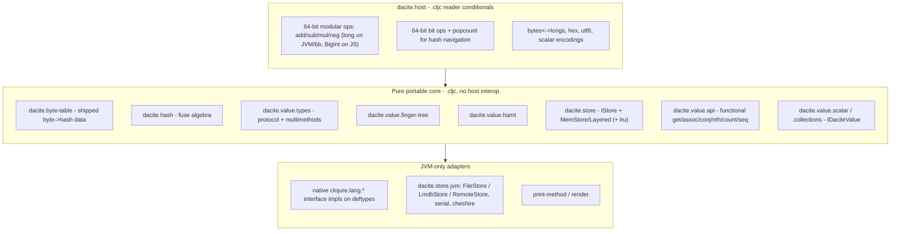

# Portable Core & Host Compatibility Layer

**Status:** DONE — Dacite's Clojure reference implementation runs unchanged on
the JVM, [babashka](https://babashka.org), and [nbb](https://github.com/babashka/nbb)
from a single `.cljc` source tree. All three hosts compute byte-for-byte
identical root hashes.

This document is the **portability contract**: the specification a future
Python / C / C++ port implements to interoperate with the Clojure reference
implementation.

---

## Goal

Run the Dacite value model on any host behind a small, explicit compatibility
layer, so that:

1. The same Clojure code runs on the JVM and on SCI hosts (babashka, nbb).
2. The boundary between "pure portable core" and "host-specific glue" is a
   single namespace (`dacite.host`) plus a handful of conventions — the exact
   surface a non-Clojure port must reimplement.
3. Every host (and every future language port) produces **identical hashes**
   for identical inputs.

Durability backends (files, LMDB, remote) are intentionally *not* portable;
the portable core ships with an in-memory store only.

---

## Architecture



Three layers:

- **Host layer** (`dacite.host`) — the *only* place platform interop lives.
- **Portable core** — plain `.cljc` built entirely on `dacite.host`; no
  `java.*`, no `js/*`, no host interop.
- **JVM-only adapters** — native collection interfaces, durable stores,
  serialization, printing. Guarded by reader conditionals so SCI never loads
  them.

---

## The host contract (`dacite.host`)

A port must provide the equivalents of these operations over a native
**unsigned 64-bit integer** ("word") type.

### Word representation

| Host | Word type | Notes |
|------|-----------|-------|
| JVM / babashka | native signed `long` | Modular 2^64 arithmetic *is* `unchecked-*`. Bit patterns are two's-complement. |
| nbb (ClojureScript) | `BigInt` normalized with `BigInt.asUintN(64, …)` | Same bit patterns as the JVM longs, so serialized bytes and hex match. |
| Future ports | any exact 64-bit integer | Must reproduce two's-complement bit patterns and wraparound. |

Bytes are represented portably as **plain integers 0..255** (vectors of ints),
never host byte arrays. This keeps the core free of `java.nio` / JS typed
arrays.

### Required operations

**Modular arithmetic (mod 2^64):** `add64`, `sub64`, `mul64`, `neg64`.

**Bit operations:** `band64`, `bor64`, `bxor64`, `bnot64`, `shl64`,
`ushr64` (logical right shift), `popcount`.

**Coercions / helpers:** `word`, `word->int`, `->int32` (fold to signed 32-bit
for `hashCode`), `low32`, `word-zero?`, and the constants `zero-word` /
`zero-hash`.

**Byte / hex conversion:** `word->bytes` / `bytes->word` (8 big-endian bytes),
`longs->bytes` / `bytes->longs` (a hash is 4 words = 32 bytes), `byte->hex`,
`longs->hex`, `hex->longs`.

**Canonical scalar encodings (big-endian, portable byte vectors):**
`int->bytes-be` (i8..i64 / u8..u64), `f32->bytes` / `f64->bytes` (IEEE-754),
`utf8-bytes` / `utf8-decode`.

Get all of these exactly right and the fuse algebra, HAMT, finger-tree, and
value hashing above them are automatically identical across hosts.

---

## Byte→hash table shipped as data

The fuse algebra is seeded by `sha256(byte)` for each of the 256 byte values.
Rather than require a crypto primitive on every host, the 256-entry table is
**precomputed once and shipped as a Clojure data resource**
(`dacite.byte-table/hex-table`, generated file). The core loads it directly.

- SHA-256 stays **JVM-only**, as a regeneration tool:
  `clojure -X:dev dacite.dev.gen-byte-table/generate!`.
- A port either ships the same 256 hex strings verbatim, or regenerates them
  with its own SHA-256 — the values are identical either way.

This removes `MessageDigest` from the core and guarantees identical seeds
across all hosts and future language ports.

---

## The functional API (`dacite.value.api`)

`dacite.value.api` is the **canonical, cross-language surface** over Dacite
collections. On the JVM, Dacite collections *also* implement the native
`clojure.lang.*` interfaces, so plain `get`/`conj`/`nth`/`count` work; but on
SCI hosts those interfaces are unavailable, so all portable code — and any
future port — uses this API:

```
count  empty?  seq  nth  get  contains?
assoc  dissoc  conj  peek  pop  keys  vals
realize  value-type  dacite-value?
```

Each takes a Dacite value first and dispatches on its `value-type` (`"vector"`,
`"map"`, `"set"`, `"string"`, `"blob"`). Accessors return **wrapped** Dacite
values; call `realize` to recover native content.

```clojure
(require '[dacite.value.api :as d]
         '[dacite.value :as v])

(let [xs (-> (v/vector) (d/conj 1) (d/conj 2) (d/conj 3))]
  (d/count xs)          ; => 3
  (d/realize (d/nth xs 0)))  ; => 1
```

The native `clojure.lang.*` integration is a **JVM-only adapter**; ports expose
the functional API only.

---

## Store protocol (`dacite.store`)

`IStore` is the portable storage interface: `s-get`, `s-put`, `s-has?`,
`s-delete`, `s-snapshot`, `s-merge`, `s-reset`. The portable core ships
`MemStore` (atom-backed), `LayeredStore`, and `LruStore` (`dacite.store.lru`).
Durable backends (`FileStore`, `LmdbStore`, `RemoteStore`) live in
`dacite.store.jvm` / `dacite.store.remote` and are never loaded on SCI.

> **Note on map keys:** on the JVM a hash is a vector of `long`s and is used
> directly as the `MemStore` map key. On ClojureScript a hash is a vector of
> `BigInt`s, which cannot be a map key (BigInt is a primitive), so `MemStore`
> keys internally by the canonical hex string. Store contents are never
> compared across hosts (only root hashes are), so this internal difference is
> invisible.

---

## SCI conventions (babashka + nbb)

Writing `.cljc` that loads under SCI as well as on the JVM requires a few
rules, learned during bring-up:

- **No top-level `(do …)` that defines vars.** SCI does not splice a top-level
  `do` into separate top-level forms, so `defn`s nested in one are *not*
  promoted to namespace vars. Write each `defn` as its own top-level form with
  the host branch *inside* its body:
  ```clojure
  (defn add64 [a b]
    #?(:clj (unchecked-add (long a) (long b)) :cljs (u64 (+ a b))))
  ```
- **No `js*`.** nbb's interpreter has no compile-time `js*`. Use ClojureScript
  core fns and interop that work directly on `BigInt` (`+`, `bit-and`,
  `bit-shift-left`, `(.asUintN js/BigInt 64 x)`, …). Ensure both operands of a
  shift are `BigInt`.
- **Guard native interface impls.** `deftype` bodies implement `IDaciteValue`
  portably and fence the ~12 `clojure.lang.*` interfaces behind
  `#?@(:bb [] :clj [ … ])` (explicit empty `:bb` so babashka, which matches
  `:clj`, still skips JVM-only interfaces). `print-method` is likewise guarded.
- **Bytes are ints 0..255,** never host byte arrays, throughout the core.

---

## Running on each host

```bash
# JVM
clojure -Sdeps '{:paths ["impl/clojure/src" "examples"]}' -M -m dacite.examples.todo

# babashka (uses bb.edn)
bb todo

# nbb (uses nbb.edn; nbb installed via package.json)
npx nbb -m dacite.examples.todo
```

Portable examples live in [`examples/dacite/examples/`](../../examples/dacite/examples):
`todo.cljc` (functional API + mem-store) and `parity.cljc` (canonical root hash).

---

## Verification: cross-host hash parity

The portability guarantee is checked mechanically. `parity.cljc` builds a
canonical value and prints its 64-char root hash; `bin/hash-parity.sh` runs it
on every available host and asserts the hashes are byte-for-byte identical:

```bash
bin/hash-parity.sh
#   JVM      : b403ad76…60d7
#   babashka : b403ad76…60d7
#   nbb      : b403ad76…60d7
#   OK: identical root hash on all 3 host(s)
```

The full JVM test suite (`clojure -M:dev:test`) must also stay green after any
change to the core or host layer.

---

## Contract for future ports (Python / C / C++)

To interoperate with the Clojure reference implementation, a port must:

1. Implement the **`dacite.host` operations** over a native 64-bit integer,
   reproducing two's-complement bit patterns and mod-2^64 wraparound.
2. Ship (or regenerate) the **256-entry byte→hash table** identically.
3. Implement the **fuse algebra** (`dacite.hash`), **HAMT**, and **finger-tree**
   on top of the host ops — these are pure and translate directly.
4. Implement the canonical **scalar encodings** (big-endian ints, IEEE-754
   floats, UTF-8) and the **value hashing** rules in `dacite.value.types`.
5. Expose the **functional API** surface (`get`/`assoc`/`conj`/`nth`/`count`/
   `seq`/…) and an **`IStore`**-equivalent with at least an in-memory backend.

If steps 1–4 match, the port's root hashes will match the reference
implementation's — which is exactly what `bin/hash-parity.sh` verifies across
JVM, babashka, and nbb today.
