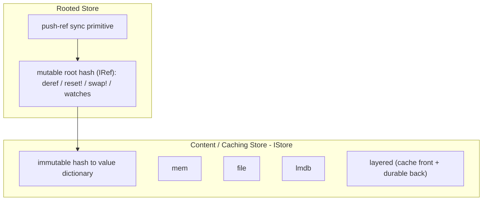

# Stores Phase 1: Two-Layer Redesign

**Status:** ON HOLD — deferred pending code review after Phase 0 / 0.5.

**Prerequisites (done):**
- Phase 0 — legacy `dacite.value.*` and cache retired; `dacite.value` is canonical; `store.clj` is cache-free.
- Phase 0.5 — merged to `main`.
- Mechanical rename — `dacite.value2` → `dacite.value` (commit `9484603`).

**Start when:** review pass is complete and you explicitly authorize Phase 1. Begin on a fresh branch off `main`.

---

## Goal

Split Stores into two layers, aligning implementation with [Chapter 1](../book/01-stores/chapter.md):

1. **Content / caching store** — immutable `hash → value` dictionary (`IStore`). Cache-only fronts never use a root.
2. **Rooted store** — wraps a content store and adds one mutable root hash for communicating state changes to peers/clients via watches + push.

Today the "root" lives in `service.clj` (`:root-hash` atom + `load-root` / `save-root!` over the LMDB meta-db), not in the store layer. Phase 1 moves root semantics down into a first-class `RootedStore`.



A `RootedStore` also implements `IStore` (delegating to its inner content store), so it is drop-in wherever a store is expected (`store/*store*`, service `main-store`).

---

## Scope refinements (confirmed)

- **Constructors are per-store; docs follow the code.** Keep separate constructor fns (`mem-store`, `file-store`, `lmdb-store`, `layered-store`, `rooted-store`). Do **not** adopt the book's unified `dacite/store {:backend ...}` form. Rewrite Chapter 1 constructor sections to match the actual API.
- **Layered store keeps a single write policy** (write-to-all). Defer `:push-all` / `:top-only` / custom-fn policy machinery.

---

## Work items

### 1. Layered store read-through (`layered-cache`)

Keep `IStore` and `mem` / `file` / `lmdb` as-is. Make the caching layer real:

- **Read-through population** in `LayeredStore/s-get` (today a `;; TODO` at `store.clj` ~line 281): on a slower-layer hit, backfill faster layers.
- **Single write policy**: keep current write-to-all behavior. No policy machinery in this phase.

### 2. Root cell abstraction (`root-cell`)

```clojure
;; IRootCell — durable root persistence behind the rooted store's atom
;; Implementations:
;;   mem-root-cell     — atom only (ephemeral)
;;   lmdb-root-cell    — reuses lmdb-get-meta / lmdb-put-meta!
;;   file-root-cell    — optional, if needed
```

Seed the in-memory root atom from the cell on construction; flush to the cell on mutation.

### 3. Rooted store (`rooted-store`)

```clojure
(defrecord RootedStore [content root]   ; content: IStore, root: atom of hash
  IStore                                  ; delegate the six ops to `content`
  clojure.lang.IDeref                     ; @store => current root hash
  clojure.lang.IRef                       ; add-watch / remove-watch / validators
  clojure.lang.IAtom2)                    ; reset! / swap! delegate to root, then persist
```

Constructors:

- `(rooted-store content-store)`
- `(rooted-store content-store root-cell)`

Internal `root` atom provides watches/validators; `reset!` / `swap!` write-through to durable storage via the root cell.

### 4. Push-ref sync (`push-ref`)

```clojure
(push-ref source target)
```

Reads `@source` and `(reset! target @source)`. Target watches fire (book §1.7). Content is assumed present or synced separately.

### 5. Service migration (`service-rooted`)

Replace `main-store` + `:root-hash` + `load-root` / `save-root!` with a `RootedStore`:

- `get-root-hash` → `@store`
- root transitions → `reset!` / `swap!`
- durability via `lmdb-root-cell`

Delete the bespoke meta-db root code in `service.clj`.

### 6. Tests (`stores-tests`)

Extend `store_test.clj`:

- Rooted: `deref` / `reset!` / `swap!` / watch / validator / durability
- `push-ref`
- Layered read-through (write-to-all only)

### 7. Documentation (`docs`)

**Done (book restructure, ahead of code):** Chapter 1 was split into two
chapters so the book mirrors the two-layer design:

- `docs/book/01-stores/chapter.md` — now **Content Stores** only: immutable
  `hash → value` dictionary, `IStore`, per-store constructors (`mem-store`,
  `file-store`, `lmdb-store`, `layered-store`), layered read-through +
  write-to-all, softened "opaque bytes" wording.
- `docs/book/04-rooted-stores/chapter.md` — new **Rooted Stores** chapter:
  root ref (`deref`/`reset!`/`swap!`), watches/validators, root cell
  durability, detached-nodes/GC, `push-ref`. Describes the target API from
  work items 2–4.
- Preface + `PLAN.md` updated to the four-chapter structure.

**Remaining:** once the code lands, reconcile the Ch 1 / Ch 4 prose against
the final constructor names and signatures, and confirm the "opaque bytes"
representation note still matches the serialization appendix.

---

## Current gaps (implementation vs book)

| Book (Ch. 1) | Code today |
|---|---|
| Store implements `IRef` (`@store`, `reset!`, `swap!`) | No root at store layer; root in `service.clj` |
| Unified `dacite/store {:backend ...}` constructor | Per-store fns: `mem-store`, `file-store`, `lmdb-store`, `layered-store` |
| Layered read-through + configurable write policy | Read-through TODO; hardcoded write-to-all |
| Opaque byte arrays | EDN-serialized Clojure data (LMDB stores bytes of that) |

---

## Explicitly deferred (not Phase 1)

- Layered write policy machinery (`:push-all`, `:top-only`, custom fn)
- True opaque-byte storage (coupled to serial format / Chapter 2–3)
- LRU cache store, remote store (see `docs/roadmap.md`)
- `value2 → value` rename — **done** (no longer deferred)

---

## Suggested execution order

1. `layered-cache` — read-through in `LayeredStore`
2. `root-cell` — `IRootCell` + mem/lmdb implementations
3. `rooted-store` — `RootedStore` record + constructors
4. `push-ref` — sync primitive
5. `stores-tests` — green before service migration
6. `service-rooted` — migrate `service.clj`
7. `docs` — Chapter 1 rewrite (code-informed constructors)
