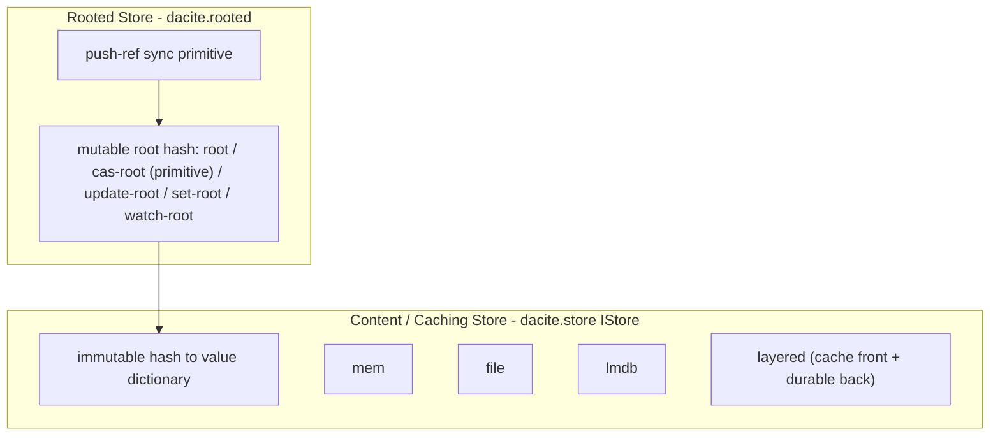

# Stores Phase 1: Two-Layer Redesign

**Status:** DONE — Phase 1 code landed on `main`.

**Prerequisites (done):**
- Phase 0 — legacy `dacite.value.*` and cache retired; `dacite.value` is canonical; `store.clj` is cache-free.
- Phase 0.5 — merged to `main`.
- Mechanical rename — `dacite.value2` → `dacite.value` (commit `9484603`).

**Start when:** review pass is complete and you explicitly authorize Phase 1. Begin on a fresh branch off `main`. (**Done** — implemented on `main`.)

---

## Goal

Split Stores into two layers, aligning implementation with the book
([Ch 1 Content Stores](../book/01-stores/chapter.md),
[Ch 4 Rooted Stores](../book/04-rooted-stores/chapter.md)):

1. **Content / caching store** (`dacite.store`) — immutable `hash → value` dictionary (`IStore`). Cache-only fronts never use a root.
2. **Rooted store** (`dacite.rooted`, new namespace) — wraps a content store and adds one mutable root hash, updated via **compare-and-set** (the primitive; `update-root`/`swap!` is its retry loop), for communicating state changes to peers/clients via watches + push. Kept in its own namespace so consumers (a future `dacite.service`) depend on `dacite.rooted`, not the content store.

Previously the "root" lived in `service.clj` (`:root-hash` atom + `load-root` / `save-root!` over the LMDB meta-db), not in the store layer. Phase 1 moves root semantics into a first-class `RootedStore` (`dacite.rooted`). `dacite.service` has been archived (see item 5) pending a service design doc; a future service will consume `dacite.rooted`.



A `RootedStore` also implements `IStore` (delegating to its inner content store), so it is drop-in wherever a store is expected (`store/*store*`). `dacite.rooted` requires `dacite.store`, not vice-versa.

---

## Scope refinements (confirmed)

- **Constructors are per-store; docs follow the code.** Keep separate constructor fns (`mem-store`, `file-store`, `lmdb-store`, `layered-store`, `rooted-store`). Do **not** adopt the book's unified `dacite/store {:backend ...}` form. Rewrite Chapter 1 constructor sections to match the actual API.
- **Layered store keeps a single write policy** (write-to-all). Defer `:push-all` / `:top-only` / custom-fn policy machinery.

---

## Work items

### 1. Layered store read-through (`layered-cache`) — **done**

Keep `IStore` and `mem` / `file` / `lmdb` as-is. Make the caching layer real:

- **Read-through population** in `LayeredStore/s-get` (today a `;; TODO` at `store.clj` ~line 281): on a slower-layer hit, backfill faster layers.
- **Single write policy**: keep current write-to-all behavior. No policy machinery in this phase.

### 2. Root cell abstraction (`root-cell`) — **done**

Lives in the new `dacite.rooted` namespace (with the rooted store and push).

```clojure
;; IRootCell — durable root persistence behind the rooted store's atom
;; Implementations:
;;   mem-root-cell     — atom only (ephemeral)
;;   lmdb-root-cell    — reuses store/lmdb-get-meta / store/lmdb-put-meta!
;;   file-root-cell    — optional, if needed
```

Seed the in-memory root atom from the cell on construction; flush to the cell on mutation.

### 3. Rooted store (`rooted-store`) — **done**

New namespace `dacite.rooted` (holds the root cell, rooted store, and push).

**Compare-and-set is the core update** (book Ch 4 §4.2). The **portable core is
just two operations**: `root` (read) and `cas-root` (the one update primitive) —
all a remote store must ever implement. The rest are **optional** conveniences:
`update-root` (a client-side CAS retry loop over the core), `set-root`
(unconditional; local-only, not offered remotely), `watch-root` (local
callbacks; remote is transport-specific), and validators (local-only). See Ch 4
§4.1 for the core-vs-optional split and remote status.

The **local** `RootedStore` still implements the full `IDeref`/`IRef`/`IAtom2`
surface (all of the above). A future **remote** rooted store implements only the
core two (`deref` + `compare-and-set!`), realizes `swap!` as a client-side loop,
and omits `reset!`/validators.

```clojure
(ns dacite.rooted
  (:require [dacite.store :as store]))

(defrecord RootedStore [content root-atom cell watches validator]  ; content: IStore, root-atom: atom of hash, cell: IRootCell
  IStore                                     ; delegate the six ops to `content`
  clojure.lang.IDeref                        ; @store => current root hash        (root)
  clojure.lang.IRef                          ; add-watch / remove-watch / validators (watch-root)
  clojure.lang.IAtom2)                       ; compare-and-set! / swap! / reset!  (cas-root / update-root / set-root)
```

The Clojure ref interfaces are a thin skin over the contract: `compare-and-set!`
= `cas-root` (the primitive), `swap!` = `update-root` (CAS retry loop), `reset!`
= `set-root`, `@store` = `root`, `add-watch`/`set-validator!` = observe/guard.

Constructors:

- `(rooted-store content-store)`                — ephemeral (mem-root-cell)
- `(rooted-store content-store root-cell)`      — durable

Implementation notes / trickiness to control:

- **Persist on success only.** Flush `@root` to the cell after a *successful*
  `compare-and-set!` / `reset!` / `swap!` (not on failed CAS attempts). `swap!`
  may re-run `f` several times; persist once after it returns.
- **Watch ref identity.** Watches should fire with the `RootedStore` as the ref
  (not the inner atom). Prefer managing watches explicitly over naive atom
  delegation so `(old, new)` and the ref arg are correct, and so durability can
  flush *before* external subscribers are notified.

### 4. Push sync (`push-ref`) — **done**

```clojure
(push-ref source target)   ; (cas-root target (root target) (root source))
```

Move `target`'s root to `source`'s root via **compare-and-set on the target**
(book §4.7): it can lose the CAS against a concurrently-moving target and be
reconciled like any other update — no privileged force-set. Transfers only a
hash; content assumed present or synced separately.

### 5. Archive the service (`service-archive`)

`dacite.service` is **not** rewritten in Phase 1. We first need a documented
definition of what a Dacite "service" is (design doc TBD). Until then, archive it:

- **Done:** moved `src/dacite/service.clj` → `archive/service.clj` and
  `test/dacite/service_test.clj` → `archive/service_test.clj`.
- The current `service/update-root` uses a non-atomic read-then-swap; the CAS
  semantics that would fix it now belong to `dacite.rooted` (item 3). A
  future `dacite.service` will **depend on `dacite.rooted`** and drive the
  root via `cas-root` / `update-root`, returning a conflict result on CAS failure
  so a remote client can rebuild and retry.
- **Fallout (resolved):** the networked example stack was archived alongside
  service — `examples/{server,main,client,cli}.clj` → `archive/examples/`, and
  the `:server` / `:cli` aliases were removed. `examples/cards.clj` (pure value
  usage) and `examples/config.clj` (a store-as-ref foil for the rooted-store
  API) remain.

> **Remote note (for the future service).** A remote `update-root` endpoint
> performs the compare-and-set **server-side** against its authoritative root
> and reports success or conflict. Unconditional remote "set root" is unsafe and
> is not offered. (Remote store impl is future work; Phase 1 lands the local CAS
> surface in `dacite.rooted` that a service and remote client build on.)

### 6. Tests (`stores-tests`) — **done**

Extend `store_test.clj` and add `rooted_store_test.clj`:

- Rooted: `root`/`@store`, `set-root`/`reset!`, `update-root`/`swap!`,
  **`cas-root`/`compare-and-set!` success + conflict**, watch, validator, durability
- `push-ref` (including a lost-CAS/conflict case)
- Layered read-through (write-to-all only)

### 7. Documentation (`docs`)

**Done (book restructure, ahead of code):** Chapter 1 was split into two
chapters so the book mirrors the two-layer design:

- `docs/book/01-stores/chapter.md` — now **Content Stores** only: immutable
  `hash → value` dictionary, `IStore`, per-store constructors (`mem-store`,
  `file-store`, `lmdb-store`, `layered-store`), layered read-through +
  write-to-all, softened "opaque bytes" wording.
- `docs/book/04-rooted-stores/chapter.md` — new **Rooted Stores** chapter:
  language-neutral root contract centered on **compare-and-set**
  (`root`/`cas-root`/`set-root`/`update-root`/`watch-root`), with a Clojure
  reference-implementation mapping (`IDeref`/`IRef`/`IAtom2`) as an appendix
  note; root cell durability, detached-nodes/GC, CAS-based push. Describes the
  target API from work items 2–4.
- Preface + `PLAN.md` updated to the four-chapter structure.

**Remaining:** none — constructor names in Ch 1 / Ch 4 match the code
(`mem-store`, `file-store`, `lmdb-store`, `layered-store`, `rooted-store`,
`mem-root-cell`, `lmdb-root-cell`).

---

## Current gaps (implementation vs book)

| Book | Code today |
|---|---|
| Rooted store: root via CAS (`compare-and-set!` / `swap!` / `@store`) | `dacite.rooted` — **done** |
| Per-store constructors (Ch 1) | Matches: `mem-store`, `file-store`, `lmdb-store`, `layered-store` |
| Layered read-through (Ch 1) | **Done** — slower-layer hits backfill faster layers |
| Opaque byte entries (Ch 1, softened) | EDN-serialized Clojure data (LMDB stores bytes of that) |

---

## Explicitly deferred (not Phase 1)

- Layered write policy machinery (`:push-all`, `:top-only`, custom fn)
- True opaque-byte storage (coupled to serial format / Chapter 2–3)
- LRU cache store, remote store (see `docs/roadmap.md`)
- `value2 → value` rename — **done** (no longer deferred)

---

## Suggested execution order

1. `layered-cache` — read-through in `LayeredStore` (`dacite.store`)
2. `root-cell` — `IRootCell` + mem/lmdb implementations (`dacite.rooted`)
3. `rooted-store` — `RootedStore` record + constructors (`dacite.rooted`)
4. `push-ref` — sync primitive (`dacite.rooted`)
5. `stores-tests` — green
6. `service-archive` — archive `dacite.service` (**done**); rewrite deferred until a service design doc exists
7. `docs` — reconcile Ch 1 / Ch 4 prose with final code
